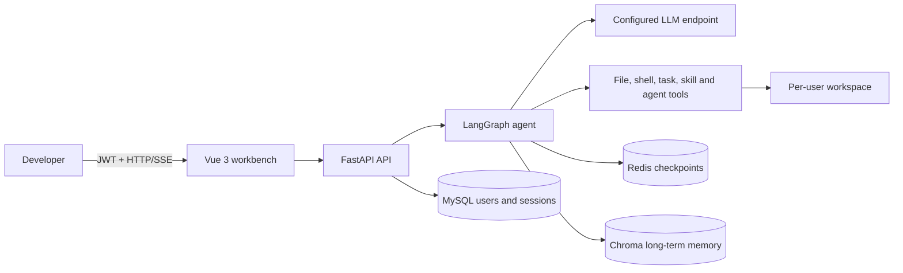
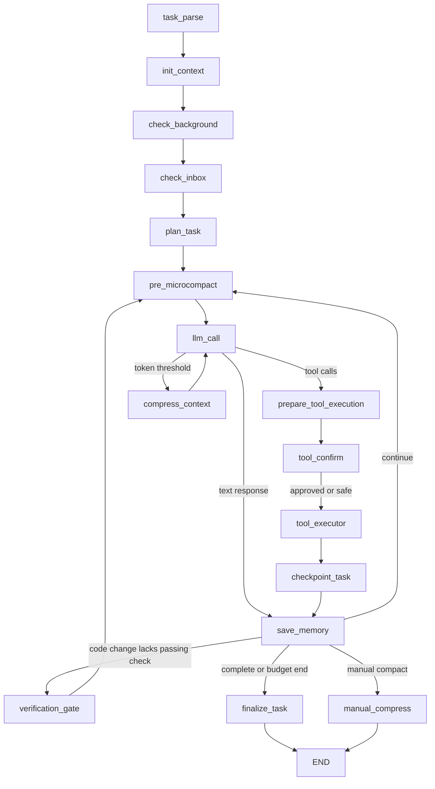
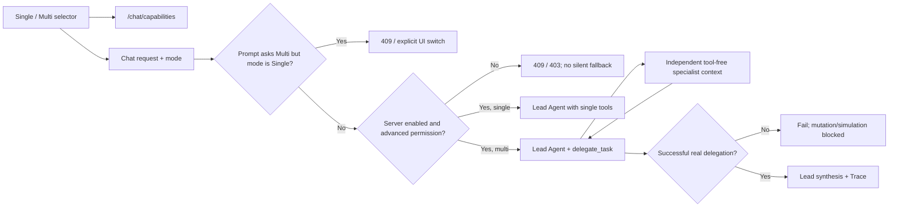
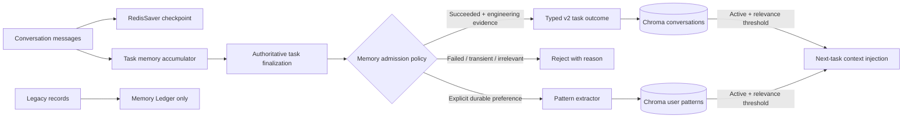

# Mini Claude Code Architecture

> Baseline date: 2026-07-17
> Scope: architecture as implemented on `feature/portfolio-hardening`; planned components are explicitly labelled.

## 1. System context

Mini Claude Code is a browser-based coding-agent platform intended for controlled intranet deployment. The backend owns authentication, user workspaces, model/tool orchestration, checkpoints, and long-term memory. The browser never receives direct host filesystem access.



## 2. Runtime components

| Component | Responsibility | Source of truth |
|---|---|---|
| Vue workbench | Login, chat/SSE, confirmations, file tree, memory view | `frontend/src/` |
| FastAPI | Authenticated API, session and workspace ownership boundary | `enterprise_agent/api/` |
| LangGraph | Stateful LLM/tool loop and Redis checkpoint recovery | `enterprise_agent/core/agent/graph.py` |
| Agent nodes | Context injection, model retry, tool execution, compaction, memory flush, HITL | `enterprise_agent/core/agent/nodes.py` |
| Tool registry | Tool discovery and coarse sensitive/safe classification | `enterprise_agent/core/agent/tools/__init__.py` |
| Workspace layer | Context-bound user directory and traversal prevention | `enterprise_agent/core/agent/tools/workspace.py` |
| MySQL | Users, API keys and conversation session metadata | `enterprise_agent/models/` |
| Redis | LangGraph checkpoints plus short-term memory helpers | `enterprise_agent/db/redis.py` |
| Chroma | Conversation summaries and user-pattern semantic retrieval | `enterprise_agent/memory/` |
| Trace store | Redacted task/node/model/tool events and metric aggregation | `enterprise_agent/observability/` |

## 3. Current Agent execution path

The current graph is a reactive tool loop. It already retries transient model failures, retries only idempotent tools, limits rounds, checkpoints state in Redis, and can pause at a LangGraph interrupt for sensitive-tool approval.



Current request sequence:

1. FastAPI authenticates the JWT and derives `user_id`.
2. The route validates the explicit `single_agent` / `multi_agent` mode against the server switch and the user's current database role, then invokes the graph with `thread_id=session_id`.
3. `init_context` restores/initializes task, todo and token-related state.
4. `llm_call` binds only current-role-permitted tools for the selected execution mode, calls the configured model, and accumulates per-task token usage.
5. Sensitive calls enter `tool_confirm` and pause through `interrupt()`.
6. `tool_executor` invokes tools, truncates output, counts calls and retries transient read-only failures.
7. The checkpoint and verification gate record file changes and require a successful relevant check before a code-modifying task can be marked successful.
8. `save_memory` accumulates a task-level summary; RedisSaver checkpoints graph state after nodes.
9. SSE exposes token deltas, tool start/result events, confirmation interrupts, cancellation, and completion.

These phases and the six-state task lifecycle are implemented. Their model-backed success rate remains unmeasured until the benchmark stage.

## 4. Tool and workspace boundary

All file tools resolve paths through `resolve_path()`, which canonicalizes the target and rejects paths outside the current user workspace. Shell commands execute with the workspace as `cwd`, an output limit, and a timeout.

Current properties and limitations:

- Every executable tool has one validated contract; legacy string outputs are retained for model compatibility but converted to normalized internal execution records.
- Current database-role permissions filter both model-bound tools and executor dispatch; JWT claims authenticate identity but are not the authorization source of truth.
- Unknown tools never reach risk resolution or execution. They are returned to the model and Trace as `unknown_tool`; known but unauthorized tools become `blocked/permission_denied`.
- Shell/background confirmation is resolved from concrete arguments: safe inspection/test/build calls skip HITL, review-level calls interrupt for the current batch, and dangerous calls bypass the approval UI because executor policy must block them.
- Shell safety is blacklist-based. A workspace `cwd` is not a process sandbox and does not by itself prevent absolute-path reads, network access, or child-process escape.

## 5. State and persistence

There are currently three different state concepts:

| State | Current implementation | Gap |
|---|---|---|
| Conversation session | MySQL `SessionStatus`: `active`, `archived`, `deleted` | This is lifecycle metadata, not task execution status |
| Agent checkpoint | `AgentState` persisted by RedisSaver | Six-state lifecycle, execution phase, mode, budgets, tool records and task-linked artifacts |
| Operational task board | JSON files under `<workspace>/.tasks/` | Supports pending/in-progress/completed/failed/cancelled; distributed storage remains future work |

The execution state machine validates `pending`, `running`, `waiting_confirmation`, `succeeded`, `failed`, and `cancelled` transitions without replacing conversation-session status. Failure and cancellation also close open Todo items and persistent task artifacts created by that run.

### 5.1 Explicit Multi-Agent boundary



The `delegate_task` path is a bounded real subagent call. Natural-language Multi execution intent cannot silently enter Single mode, and a Multi task cannot mutate the workspace or report success before one real delegation succeeds. `task_create` remains operational tracking only. The older teammate/message-bus tools remain experimental and are not required for the reliable specialist-delegation baseline.

## 6. Memory flow



Redis checkpoints and compression summaries are working/recovery memory and are never
automatically copied into Chroma. Chroma schema v2 stores admitted `task_outcome`
or explicit `user_note` records plus evidence-backed preferences. Existing schema-v1
records are classified as `legacy`: they remain visible/deletable but are excluded
from Agent retrieval. Persistence runs after `finalize_task`, so failed, cancelled,
unverified, creative, or evidence-free tasks cannot become Active memory.

## 7. Trace and metric flow

```mermaid
flowchart LR
    REQ[Authenticated task] --> TID[Trace ID]
    TID --> NODE[LangGraph node wrapper]
    TID --> MODEL[Model summary, tokens, retries]
    TID --> TOOL[Tool result, risk, duration]
    TID --> HITL[Confirmation decision]
    NODE --> JSON[Redacted atomic JSON trace]
    MODEL --> JSON
    TOOL --> JSON
    HITL --> JSON
    JSON --> API[/tasks APIs]
    API --> UI[Vue execution replay]
    JSON --> METRICS[Six aggregate metrics]
```

Trace files live under each authenticated workspace at `.agent/traces/`. Raw prompts/responses are not stored wholesale: summaries and structured metadata are size-limited, and credential-like keys/text are recursively redacted. This portable store is the local/single-process baseline; distributed deployments should replace the storage adapter with MySQL/PostgreSQL or OpenTelemetry-compatible infrastructure.

## 8. Authentication and tenant isolation

- JWT middleware resolves the authenticated user; active/superuser state is re-read from MySQL for each authorization decision.
- MySQL session list/read/delete routes check `Session.user_id`.
- File APIs and file tools derive a user-specific workspace.
- Long-term memory objects are cached per user.

Chat invoke/resume/cancel/confirmation routes verify MySQL ownership before touching Redis checkpoints. File, task, memory, and model-tool access remain bound to the authenticated user context.

## 9. Deployment topology

The Compose stack starts Vue/Nginx, API, MySQL, and Redis Stack. Chroma remains embedded in the API process. Frontend `/api/` traffic and SSE streams are reverse-proxied to FastAPI.

Current delivery controls:

- MySQL/Redis/API/frontend health checks enforce startup order.
- Workspace, Chroma data, and embedding-model cache use named durable volumes.
- The API image includes shared skills, runs as UID 10001, and uses the official CPU-only PyTorch index rather than CUDA wheels.
- MySQL and Redis host ports bind to loopback for local development.

Known deployment gaps:

- Database schema creation uses `create_all`; there is no migration tool/version history.
- The isolated four-service Compose smoke test passed on alternate host ports without touching existing local containers; API direct health and the Nginx `/api/health` proxy both reported MySQL/Redis ready.
- Health proves MySQL/Redis readiness, not model endpoint validity or a successful model call.

## 9.1 Evaluation path

```text
benchmarks/v1/cases.json
          |
          +--> platform backend --> real tools/policy/state/Trace --> deterministic assertions
          |
          +--> agent backend ----> InMemory LangGraph + configured LLM --> same assertions
                                                   |
                                                   +--> single first
                                                   +--> multi only for delegation_suitable cases
```

The platform backend answers whether tools, isolation, recovery, safety policy, and evaluators behave deterministically. Only the Agent backend measures autonomous model performance. Connection/provider failures are reported as `infrastructure_error` and excluded from the Agent-success denominator.

## 10. Baseline verification

Recorded on 2026-07-17:

| Check | Result |
|---|---|
| `uv run pytest -q` | 328 passed |
| `uv run python scripts/smoke_test.py` | 7/7 local checks passed |
| `npm run build` | Passed; largest JS chunk 76.99 kB, no size warning |
| `npm audit --json` | 0 known production/development vulnerabilities |
| `docker compose -f docker/docker-compose.yml config -q` | Passed |
| `./scripts/docker_smoke_test.sh` | Passed in an isolated Compose project; all four services healthy and both direct/proxied API health checks passed |
| Docker API/frontend builds | Passed; 464.5 MB / 21.9 MB final images |
| API image self-check | UID 10001, `torch 2.13.0+cpu`, CUDA false, app import passed |
| Browser Trace replay | Passed with a synthetic local user/trace: six metrics, run list, nine events, HITL, safety block and redacted detail rendered; no console warning/error |
| `ruff check enterprise_agent tests benchmarks scripts` | Passed, 0 findings |

Long-term-memory tests exercise real in-process Chroma collections with a deterministic offline embedding, including v2 admission, Legacy quarantine, pattern upsert, filtered semantic search, and local-first model initialization. The final locked-environment platform benchmark passed 10/10 task assertions with 84.8 ms average task duration; model-backed end-to-end success remains unmeasured.

## 11. Evolution constraints

1. Preserve `/chat`, `/sessions`, `/workspace`, and `/memory` contracts unless a compatible extension is possible.
2. Establish a reliable single-agent baseline before enabling multi-agent experiments.
3. Keep graph checkpoints backward-compatible where possible by adding optional state fields with safe defaults.
4. Record real measurements only; unexecuted benchmark cells remain `TBD`.
5. Prefer explicit policy and trace records over model-generated claims about what happened.
