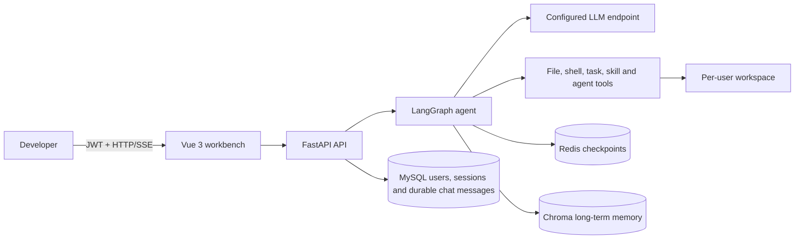
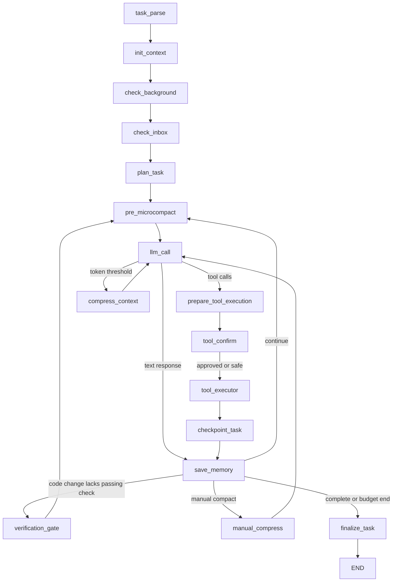
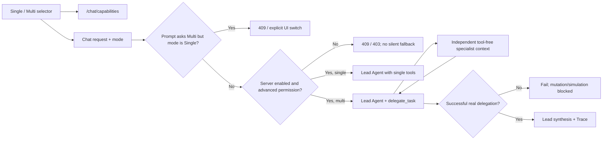
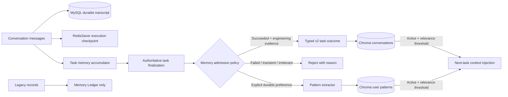
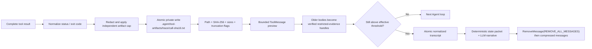

# Mini Claude Code Architecture

> Current implementation baseline: 2026-08-19
> Scope: architecture in the current implementation baseline; planned components are explicitly labelled.

## 1. System context

Mini Claude Code is a browser-based coding-agent platform intended for controlled intranet deployment. The backend owns authentication, user workspaces, model/tool orchestration, checkpoints, and long-term memory. The browser never receives direct host filesystem access.



## 2. Runtime components

| Component | Responsibility | Source of truth |
|---|---|---|
| Vue workbench | Login, chat/SSE, confirmations, file tree, guarded Preview/Edit, memory view | `frontend/src/` |
| FastAPI | Authenticated API, session and workspace ownership boundary | `enterprise_agent/api/` |
| LangGraph | Stateful LLM/tool loop and Redis checkpoint recovery | `enterprise_agent/core/agent/graph.py` |
| Agent nodes | Context injection, model retry, tool execution, compaction, memory flush, HITL | `enterprise_agent/core/agent/nodes.py` |
| Tool registry | Tool discovery and coarse sensitive/safe classification | `enterprise_agent/core/agent/tools/__init__.py` |
| Workspace layer | Context-bound user directory and traversal prevention | `enterprise_agent/core/agent/tools/workspace.py` |
| MySQL | Users, API keys, session metadata and durable user-visible chat transcript | `enterprise_agent/models/` |
| Redis | Short-lived LangGraph execution checkpoints plus short-term memory helpers | `enterprise_agent/db/redis.py` |
| Chroma | Conversation summaries and user-pattern semantic retrieval | `enterprise_agent/memory/` |
| Trace store | Redacted task/node/model/tool events and metric aggregation | `enterprise_agent/observability/` |

## 3. Current Agent execution path

The current graph is a reactive tool loop. It retries transient model failures, retries only idempotent tools, limits rounds, checkpoints state in Redis, supports sensitive-tool approval, and terminates a stopped Trace without resuming it.



Current request sequence:

1. FastAPI authenticates the JWT and derives `user_id`.
2. The route validates the explicit `single_agent` / `multi_agent` mode against the server switch and the user's current database role, then invokes the graph with `thread_id=session_id`.
3. `init_context` restores/initializes task, todo and token-related state.
4. `llm_call` binds only current-role-permitted tools for the selected execution mode, calls the configured model, and accumulates per-task token usage.
5. Sensitive calls enter `tool_confirm` and pause through a typed `tool_confirmation` interrupt.
6. `tool_executor` invokes tools, truncates output, counts calls and retries transient read-only failures.
7. The checkpoint and verification gate record file changes and require a successful relevant check before a code-modifying task can be marked successful.
8. `save_memory` accumulates a task-level summary; RedisSaver checkpoints graph state after nodes.
9. SSE exposes token deltas, tool start/result events, typed tool-confirmation interrupts, cancellation, and completion.

`plan_task` is a lifecycle marker rather than a separate deterministic planner. A fresh Trace's first LLM call performs the real planning from durable chat history, current workspace state and any continuation receipt left by a cancelled Trace.

## 4. Tool and workspace boundary

All file tools resolve paths through `resolve_path()`, which canonicalizes the target and rejects paths outside the current user workspace. Shell commands execute with the workspace as `cwd`, an output limit, and a timeout. Foreground and background execution share one interpreter selector: explicit Bash on POSIX and `cmd.exe` on Windows. The prompt exposes `.` rather than the tenant's absolute server path.

Current properties and limitations:

- Every executable tool has one validated contract; legacy string outputs are retained for model compatibility but converted to normalized internal execution records.
- Current database-role permissions filter both model-bound tools and executor dispatch; JWT claims authenticate identity but are not the authorization source of truth.
- Unknown tools never reach risk resolution or execution. They are returned to the model and Trace as `unknown_tool`; known but unauthorized tools become `blocked/permission_denied`.
- Shell/background confirmation is resolved from concrete arguments: safe inspection/test/build calls skip HITL, review-level calls interrupt for the current batch, and dangerous calls bypass the approval UI because executor policy must block them.
- Policy rejections return `policy_blocked` plus a safe remediation. Absolute paths point back to the existing workspace `cwd`, output suppression/FD merging points to captured streams, and `rm` points to recoverable `delete_paths`; non-zero program exits remain distinct `nonzero_exit` evidence.
- Shell safety is a parsed user-space policy, not a kernel sandbox. A workspace `cwd` and command validator do not provide the isolation of a rootless container, seccomp/AppArmor, resource limits, or an outbound-network policy; those remain explicit hardening work.
- Authenticated browser reads return a SHA-256 receipt. `PUT /workspace/write` accepts the same path, new content and `expected_sha256`; it atomically replaces the file only when the receipt still matches, otherwise returning a structured `409 version_conflict` instead of silently overwriting a concurrent change.
- Browser editing is deliberately narrower than Agent file tools: only an existing regular UTF-8 file of at most 1 MiB is writable. Sensitive names, Agent-owned operational directories, path escapes, symlinks and binary/oversized files are rejected. This is a direct user Workspace operation and is not presented as an Agent HITL or task Trace event.

## 5. State and persistence

There are currently four different state concepts:

| State | Current implementation | Gap |
|---|---|---|
| Conversation session | MySQL `SessionStatus`: `active`, `archived`, `deleted` | This is lifecycle metadata, not task execution status |
| Conversation transcript | MySQL `ChatMessage`, ordered by per-session record ID | Durable user/assistant history; legacy Redis-only gaps remain explicitly marked |
| Agent checkpoint | `AgentState` persisted by RedisSaver | Executable lifecycle, execution phase, mode, budgets, tool records and task-linked artifacts; legacy `paused` values are migration-only |
| Operational task board | JSON files under `<workspace>/.tasks/` | Supports pending/in-progress/completed/failed/cancelled; distributed storage remains future work |

The execution state machine validates `pending`, `running`, `waiting_confirmation`, `succeeded`, `failed`, and `cancelled` transitions without replacing conversation-session status. `TaskStatus.PAUSED` remains temporarily parseable only for rolling-migration compatibility and cannot be entered or resumed. Failure and cancellation close open Todo items and persistent task artifacts created by that run.

### 5.1 Redis-authoritative Stop/Cancel and fresh-Trace replan

RedisSaver checkpoints graph state under `thread_id=session_id`. Execution
ownership is separate: a Redis active-trace lease, cancel tombstone and runner
fence are scoped by `user_id + session_id + trace_id`. The process-local event
and active-Trace map are latency optimizations, never the authority.

```mermaid
sequenceDiagram
    participant UI as Frontend
    participant API as Task control API
    participant C as Redis lease and cancel control
    participant G as LangGraph
    participant S as RedisSaver
    participant DB as MySQL history

    UI->>API: POST /chat/stream/cancel(session_id, trace_id)
    API->>API: Verify user, session and exact active Trace
    API->>C: Atomically set exact cancel tombstone
    G->>C: Check before every tool and at model/stream boundaries
    G->>G: Stop foreground process group; terminate managed background jobs
    G->>S: Persist task_status=cancelled and close the stream
    G->>DB: Persist assistant tombstone and continuation receipt
    G->>C: Mark runner stopped, then release exact lease
    API-->>UI: status=cancelled for the exact Trace
    UI->>API: Send next message after authoritative cancellation
    API->>C: Claim a new active lease with a new trace_id
    API->>DB: Load trimmed/deduplicated durable history and receipt
    API->>G: Start a fresh invocation (never Command(resume))
```

Cancel is terminal and does not promise rollback of files or external effects
that already happened. A response remains `cancelling` while the old runner has
not acknowledged stop; the frontend stays locked and cannot start an overlapping
task. Only a stopped runner may release its exact lease. Runner/fence identity
also prevents late delta, tool, done or checkpoint callbacks from an old Trace
from mutating the new timeline.

Foreground POSIX Shell uses a process group and TERM/KILL escalation when
possible. Operations without an immediate interruption primitive are recorded
as best-effort cancellation. Managed `background_run` processes are terminated
for the exact Trace on Stop. Tool batches check Redis cancellation immediately
before every call.

Sensitive-tool confirmation remains the sole resumable interrupt. Approval,
rejection and timeout revalidate checkpoint identity, keep the original
`trace_id`, acquire the token-owned Redis resume lock, and use
`Command(resume=...)`. A Stop while waiting for confirmation terminalizes the
Trace instead of submitting a synthetic “Reject All” decision.

See [the two-phase rolling migration](docs/cancel-and-replan-rolling-migration.md)
for retirement of legacy `paused` checkpoints and `agent:pause:*` keys.

### 5.2 Explicit Multi-Agent boundary



The `delegate_task` path is a bounded real subagent call. Natural-language Multi execution intent cannot silently enter Single mode, and a Multi task cannot mutate the workspace or report success before one real delegation succeeds. `task_create` remains operational tracking only. The older teammate/message-bus tools remain experimental and are not required for the reliable specialist-delegation baseline.

Validation evidence is recorded independently from delegation evidence. In
particular, successful `python -m py_compile` runs count as code validation,
while arbitrary Python script execution does not. After finalization,
`AgentState.task_status` is the single terminal truth: Trace keeps
`succeeded/failed/cancelled`, while SSE and MySQL project those states to
`completed/failed/cancelled`. Transport exhaustion alone never implies success.

## 6. Memory flow



User-visible conversation messages are stored in MySQL. Redis checkpoints remain
24-hour working/recovery state; readable legacy transcripts are migrated at startup,
and an expired legacy-only session stays visible with an explicit history status.
Redis checkpoints and compression summaries are never
automatically copied into Chroma. Chroma schema v2 stores admitted `task_outcome`
or explicit `user_note` records plus evidence-backed preferences. Existing schema-v1
records are classified as `legacy`: they remain visible/deletable but are excluded
from Agent retrieval. Persistence runs after `finalize_task`, so failed, cancelled,
unverified, creative, or evidence-free tasks cannot become Active memory.

### 6.1 Artifact-first context compaction

Context management uses two levels. Cheap microcompaction runs first; full LLM
summarization runs only when the artifact-backed cleanup is still insufficient:



The executor normalizes the uncut result before creating the preview. This is
important for structured Shell JSON: a long non-zero result cannot lose its
`exit_code` merely because the model preview was clipped. Any tool body eligible
for later microcompaction is persisted first. If persistence fails, microcompact
keeps the existing body and records an error instead of creating a false handle.

A compacted model-facing message is evidence-bearing rather than generic:

```text
[tool output compacted; artifact: .agent/tool-artifacts/<trace>/<call>-<sha16>.txt;
 sha256=<digest>; original_chars=<count>]
```

Full compression does not rely on the model narrative as its only source of
truth. Goal, task status, failure, Todos, changed files, validations, counters and
recent tool receipts are rebuilt deterministically from `AgentState` into a
schema-v2 continuation packet. Under an exceptionally tight continuation budget,
the packet is explicitly marked truncated and degrades to its transcript handle;
it never claims that discarded fields remain present. The narrative is
supplemental. Transcript paths are workspace-relative, names are sanitized and
unique, and writes use fsync plus atomic replace. The summarizer input, bound
output and next main-model turn are budgeted separately, with growth headroom;
its model call is included in task/session budgets and Trace.

“Restricted original” deliberately means policy-limited and redacted evidence,
not an unconditional byte-for-byte copy of secrets or unlimited process output.
The default artifact cap is 2,000,000 characters and preserves head/tail with an
explicit `source_truncated` receipt when exceeded. `read_tool_artifact` performs
workspace ownership, path, SHA-256 and UTF-8-safe range checks; generic file and
Shell tools reject Agent-owned operational paths. These workspace artifacts are
debugging evidence, not a tamper-proof multi-replica audit backend; retention and
central object storage remain production work.

## 7. Trace and metric flow

```mermaid
flowchart LR
    REQ[Authenticated task] --> TID[Trace ID]
    TID --> NODE[LangGraph node wrapper]
    TID --> MODEL[Model summary, tokens, retries]
    TID --> TOOL[Tool result, risk, duration]
    TID --> HITL[Confirmation decision]
    NODE --> JSON[Redacted atomic JSON trace]
    MODEL --> JSON
    TOOL --> JSON
    HITL --> JSON
    JSON --> API[/tasks APIs]
    API --> UI[Vue execution replay]
    JSON --> METRICS[Six aggregate metrics]
```

Trace files live under each authenticated workspace at `.agent/traces/`. Raw prompts/responses are not stored wholesale: summaries and structured metadata are size-limited, and credential-like keys/text are recursively redacted. This portable store is the local/single-process baseline; distributed deployments should replace the storage adapter with MySQL/PostgreSQL or OpenTelemetry-compatible infrastructure.

## 8. Authentication and tenant isolation

- JWT middleware resolves the authenticated user; active/superuser state is re-read from MySQL for each authorization decision.
- MySQL session list/read/delete routes check `Session.user_id`.
- File APIs and file tools derive a user-specific workspace.
- Long-term memory objects are cached per user.

Chat invoke/resume/cancel/confirmation routes verify MySQL ownership before touching Redis checkpoints. File, task, memory, and model-tool access remain bound to the authenticated user context.

## 9. Deployment topology

The Compose stack starts Vue/Nginx, API, MySQL, and Redis Stack. Chroma remains embedded in the API process. Frontend `/api/` traffic and SSE streams are reverse-proxied to FastAPI.

Current delivery controls:

- MySQL/Redis/API/frontend health checks enforce startup order.
- Workspace, Chroma data, and embedding-model cache use named durable volumes.
- The API image includes shared skills, runs as UID 10001, and uses the official CPU-only PyTorch index rather than CUDA wheels.
- MySQL and Redis host ports bind to loopback for local development.

Known deployment gaps:

- Alembic is authoritative for deployed schema evolution; `create_all` remains only as a local-development compatibility fallback. Automated backup/restore drills are still pending.
- The isolated four-service Compose smoke test passed on alternate host ports without touching existing local containers; API direct health and the Nginx `/api/health` proxy both reported MySQL/Redis ready.
- Health proves MySQL/Redis readiness, not model endpoint validity or a successful model call.

## 9.1 Evaluation path

```text
benchmarks/v2/cases.json
          |
          +--> platform backend --> real tools/policy/state/Trace --> deterministic assertions
          |
          +--> agent backend ----> InMemory LangGraph + configured LLM --> same assertions
                                                   |
                                                   +--> single first
                                                   +--> multi only for delegation_suitable cases
```

The platform backend answers whether tools, isolation, recovery, safety policy, and evaluators behave deterministically. Only the Agent backend measures autonomous model performance. Connection/provider failures are reported as `infrastructure_error` and excluded from the Agent-success denominator. Stop/Cancel protocol correctness is established separately by deterministic API, state-machine, Redis lease/tombstone, runner-fence, and process-termination tests. The benchmark's cancel-and-replan task only measures whether the Agent can reconcile partial Workspace side effects; it does not replace those protocol tests.

## 10. Baseline verification

Current automated verification recorded on 2026-08-19; the latest retained official
model benchmark was generated on 2026-08-19:

| Check | Result |
|---|---|
| `uv run pytest -q` | 619 passed |
| `uv run python scripts/smoke_test.py` | 9/9 local checks passed; no external service or model call |
| `npm test --prefix frontend -- --run` | 93 passed |
| `npm run build --prefix frontend` | Passed; largest JS chunk 76.99 kB, no size warning |
| `npm audit --json` | 0 known production/development vulnerabilities |
| `docker compose -f docker/docker-compose.yml config -q` | Passed for the current Preview/Edit change |
| Docker runtime health | Current API/frontend images rebuilt; API, frontend, MySQL and Redis healthy; direct and proxied health returned MySQL/Redis `ok` |
| `./scripts/docker_smoke_test.sh` | Previous isolated four-service baseline passed; not rerun because the current existing-stack health path was used |
| API image self-check | UID 10001, `torch 2.13.0+cpu`, CUDA false, app import passed |
| Browser Preview/Edit smoke | Passed for Markdown Preview, Edit, dirty draft, draft Preview and Discard; no test draft was saved to the user's file |
| `ruff check enterprise_agent migrations tests benchmarks scripts` | Passed, 0 findings |

Long-term-memory tests exercise real in-process Chroma collections with a deterministic offline embedding, including v2 admission, Legacy quarantine, pattern upsert, filtered semantic search, and local-first model initialization. The final locked-environment platform benchmark passed 10/10 task assertions with 84.8 ms average task duration. The official `mini-claude-code-v2` real-model run used `deepseek-v4-flash` in single-Agent mode and passed 25/30 tasks: easy 9/10, medium 10/10, hard 6/10, with 87.5% tool success, 11.524 s average duration, 32,342.23 average tokens, 73.3% human intervention, 15 safety interceptions, and zero infrastructure or system errors. Its source artifact is `benchmarks/results/20260819T160324Z-agent-single.{md,json}`. Because v2 expands and rebalances the suite and strengthens evaluation relative to the old v1 8/10 run, the two scores are not a strict like-for-like improvement comparison. The 6-case single/multi comparison remains unmeasured.

## 11. Evolution constraints

1. Preserve `/chat`, `/sessions`, `/workspace`, and `/memory` contracts unless a compatible extension is possible.
2. Establish a reliable single-agent baseline before enabling multi-agent experiments.
3. Keep graph checkpoints backward-compatible where possible by adding optional state fields with safe defaults.
4. Record real measurements only; unexecuted benchmark cells must be labeled as not measured.
5. Prefer explicit policy and trace records over model-generated claims about what happened.
