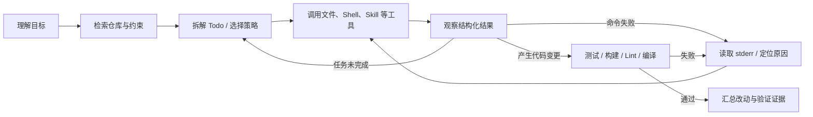
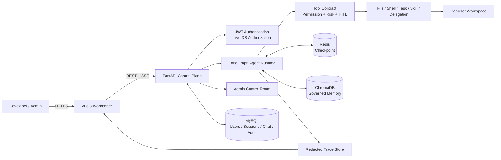

# Enterprise Controlled Coding Agent

> 面向企业内网的受控 Coding Agent 平台

`Mini Claude Code` 是一个能够进入真实代码仓库，自主完成**理解需求、检索代码、拆解任务、调用工具、修改文件、运行验证和失败修复**的 Coding Agent。它以 LangGraph 驱动多轮“决策—执行—观察”循环，并通过文件、Shell、Todo、后台任务、Skill、记忆和委派工具完成工程任务。

在 Agent 执行层之外，项目还提供浏览器工作台和企业控制面，负责身份认证、Workspace 隔离、工具权限、人工审批、任务恢复、全链路 Trace 与长期记忆治理。项目关注的问题不是再做一个聊天界面，而是：

> 如何让一个会自主读代码、改代码、跑测试和处理失败的 Agent，在企业内网中仍然可限制、可终止、可为敏感工具等待人工确认、可恢复、可验证、可追溯？

`LangGraph` · `FastAPI` · `Vue 3` · `Redis` · `MySQL` · `ChromaDB` · `Docker Compose`

| 当前可验证结果 | 数据 |
|---|---:|
| DeepSeek 真实 single-Agent 基准 | **80.0%（8/10）** |
| 真实 Agent 工具成功率 | **82.9%** |
| 离线平台回归基准 | **100%（10/10）** |
| 后端自动化测试 | **561 passed** |
| 前端回归测试 | **77 passed** |
| Python 静态检查 | **Ruff 0 findings** |

真实模型结果来自干净提交 `d95caf6` 上的 `deepseek-chat` 实测，不用离线规则分数冒充模型能力。详见[原始报告](benchmarks/results/20260723T052543Z-agent-single.md)。

## 它为什么是 Coding Agent，而不是聊天机器人

一次任务不是“用户提问 → 模型生成答案”，而是由模型根据环境反馈持续决定下一步：



| Agent 能力 | 代码中的实现 | 已有证据 |
|---|---|---|
| 自主理解代码库 | 先使用只读文件与 Shell 工具检索项目元数据、入口、依赖和测试命令，再决定是否修改 | 真实基准通过入口定位、测试命令发现、嵌套配置读取 |
| 多步任务规划 | `AgentState` 保存当前目标、Todo、轮次、工具记录和任务阶段；复杂工作使用 `todo_update` 持续更新进度 | Todo 生命周期、checkpoint 恢复和节点回归测试 |
| 工具驱动执行 | LLM 只绑定当前角色可用工具，工具结果以结构化消息返回模型，形成多轮决策—执行—观察循环 | 文件、Shell、任务、Skill、上下文、记忆及委派工具链 |
| 失败诊断与自修复 | 区分策略拦截、非零退出、超时和用户拒绝；模型读取真实 stderr 后选择修复、换路或重试 | `recovery.fail_fix_pass` 真实用例完成“失败 → 最小修复 → 复测通过” |
| 结果验证 | 框架自动记录变更文件和验证命令；代码修改后没有成功测试、构建、Lint 或编译记录就不能成功结束 | verification gate 与真实 Shell/test benchmark |
| 长任务续航 | 后台命令、Todo、轮次/工具/token 预算、旧工具输出微压缩、LLM 上下文摘要和 Redis checkpoint 协同工作 | 上下文、后台进程、预算及中断恢复测试 |
| 知识与协作扩展 | 按需加载 Shared/Personal Skill，召回通过准入的工程记忆；显式 Multi 模式可创建独立 specialist 上下文 | Skill 版本治理、Memory 6/6；Multi-Agent 收益仍待对照实测 |

## 为什么做这个项目

企业把 Coding Agent 接入真实研发环境时，难点不只是“模型会不会写代码”，还包括：

- 私有代码和执行环境应该放在哪里；
- 不同用户能看到和修改哪些文件；
- Shell、写文件、删除、子 Agent 等副作用如何分级；
- 高风险操作如何中断并等待人工确认；
- 中断、超时、拒绝或失败后，任务状态如何保持一致；
- 如何回答“Agent 做了什么、为什么失败、用了多少 token”；
- 如何避免把失败任务和一次性指令错误沉淀为长期知识。

本项目把这些问题收敛为一个服务端控制面。浏览器只访问经过认证的 API，模型不能直接获得宿主机文件系统或进程权限，所有动作都必须进入平台定义的工具链路。

> “内网部署”不自动等于“数据绝不外发”。只有接入企业私有模型 endpoint 时，模型上下文才可完整留在内网；若配置公网模型 API，发送给模型的提示词与工具上下文仍会离开企业网络边界。

## 核心设计

| 工程问题 | 当前实现 | 关键证据 |
|---|---|---|
| Agent 自主执行 | LangGraph 多轮工具循环，显式 `parse → plan → act → observe → checkpoint → validate → summarize`；工具结果返回模型继续决策 | `core/agent/graph.py`、`nodes.py`、`state.py` |
| 长任务与失败恢复 | Todo、后台命令、错误分类、上下文微压缩/摘要、轮次/工具/token 预算、代码修改验证门和 Redis checkpoint | `core/agent/context.py`、`tools/task.py`、`tools/background.py` |
| Stop/Cancel 与重新规划 | Redis 保存精确到用户/会话/Trace 的 active lease、cancel tombstone 与 runner fence；旧 Trace 取消完成后，同 Session 的下一条消息创建新 Trace，并用 durable history、workspace 和 continuation receipt 重新规划 | `core/execution/interrupt_control.py`、`core/agent/graph.py`、`api/routes/chat.py` |
| 知识与任务扩展 | Shared/Personal Skill 按需加载，受治理的长期记忆召回，以及显式 single/multi 和真实 specialist 委派边界 | `tools/skills.py`、`tools/subagent.py`、`memory/` |
| 工具风险治理 | 统一 Tool Contract，模型绑定与执行阶段双重权限过滤，参数级风险识别，LangGraph interrupt 审批与超时恢复 | `core/agent/tools/contracts.py`、`nodes.py` |
| Workspace 安全 | 用户目录隔离、路径穿越拦截、敏感路径拒绝、原子写入、SHA-256 乐观并发写入、精确路径可恢复删除 | `core/agent/tools/workspace.py`、`file_ops.py`、`api/routes/workspace.py` |
| Shell 控制 | 复合命令解析、危险命令/外传工具拦截、工作区相对路径、凭据净化子进程环境、超时与输出截断 | `core/agent/tools/shell.py` |
| 多租户持久化 | JWT 认证，实时数据库角色授权，MySQL 持久会话正文，Redis 执行 checkpoint，按用户隔离的 Chroma 记忆 | `api/`、`models/`、`memory/` |
| 可观测与治理 | Trace ID 串联节点、模型、工具、审批、预算、错误和终态；管理员控制台提供用户、额度、审计、临时访问授权和 Shared Skill 版本治理 | `observability/`、`admin/` |

## 系统架构



### 一次任务如何运行

```text
用户请求
  → 身份认证与会话归属校验
  → 创建 trace_id，进入 pending/running
  → 注入当前任务相关的 Active 记忆
  → Agent 检索仓库、拆解 Todo，并由 LLM 决定下一步工具
  → 工具注册检查 + 实时角色权限过滤 + 参数级风险判定
      ├─ safe：直接执行
      ├─ review：进入 waiting_confirmation，审批后从 checkpoint 恢复
      └─ dangerous：执行器策略直接拦截，不能靠 Approve 绕过
  → 把结构化工具结果返回 Agent，继续观察、诊断和行动
  → 命令失败时读取真实错误并修复或调整策略
  → 若修改代码但没有成功验证，验证门把任务送回 Agent 补测
  → 进入 succeeded / failed / cancelled，并按策略决定是否写入长期记忆
```

任务执行状态与会话状态彼此独立：

```text
pending → running ⇄ waiting_confirmation

running → succeeded / failed / cancelled
waiting_confirmation → failed / cancelled
pending → cancelled

legacy paused → cancelled  # 仅兼容迁移，不再可进入或恢复
```

> [!IMPORTANT]
> 运行中的用户任务只提供 **Stop/Cancel**。Stop 将当前 Trace 收敛为不可恢复的
> `cancelled` 终态，不承诺回滚已经发生的文件或外部副作用。Cancel 失败或仍在
> `cancelling` 时前端保持输入锁定；只有服务端确认旧 runner 停止、checkpoint 已终态化
> 且 active lease 释放后才解锁。
>
> 实际流程是：
>
> ```text
> 用户点击 Stop
> → Redis 为当前 user + session + trace 写入 cancel_requested
> → 工具批次每次调用前检查取消，前台 Shell 尽可能终止进程组
> → runner 写入 cancelled checkpoint、MySQL tombstone 和 continuation receipt
> → runner 确认停止并释放精确 active lease
> → 前端解锁
> → 下一条消息创建全新 trace_id
> → 新一轮 LLM 根据 durable history、workspace 现状和 receipt 重新规划
> ```
>
> `Command(resume=...)` 仅保留给 typed `tool_confirmation` interrupt：批准、拒绝和超时
> 保持原 `trace_id`。Stop 不会把确认弹窗伪装成 Reject All。

## 关键能力

### 1. 自主完成“理解—修改—验证”工程闭环

- 主 Agent 不是固定工作流脚本：每一轮由模型结合用户目标、代码上下文和上一轮工具结果，自主选择继续检索、编辑、执行、验证或结束。
- LLM 只看到当前权限允许的工具；真实工具结果会以 `ToolMessage` 返回，使模型可以根据 stdout、stderr、退出码和错误类型继续推理。
- 系统提示要求先检索再修改，并对 `policy_blocked` 和 `nonzero_exit` 采用不同恢复策略，避免遇到失败就直接报告结束。
- 多步骤工作可由 `todo_update` 维护短期计划；长时间测试或构建可转入 `background_run`，完成结果会重新注入 Agent 上下文。
- 框架自动统计工具调用、变更文件和验证结果，不依赖模型自报“已经执行”。
- 真实 DeepSeek 基准已通过代码库理解、文件创建、测试执行、失败修复、安全拒绝和审批恢复等 8 个用例；两个保留失败也在 README 中公开说明。

### 2. 长任务上下文与可恢复状态

- LangGraph `StateGraph` 管理显式执行阶段，RedisSaver 按 `session_id/thread_id` 保存 checkpoint。
- FastAPI 通过 SSE 输出 token、工具开始/结束、审批中断、取消和终态事件。
- 审批超时会自动恢复图并确定性拒绝，不让任务永久停留在等待态。
- 失败和取消会同步收敛未完成 Todo 与本任务创建的持久任务。
- 每任务默认最多 20 轮、25 次工具调用，并分别限制任务与会话累计 token。
- 每次模型调用前执行 microcompact：较旧的长工具结果只有在受限原文 artifact 已原子落盘后才会被替换，占位文本包含真实路径与 SHA-256。
- 微压缩后仍超过有效阈值时，先保存完整 transcript，再用 LLM 生成运行摘要；目标、Todo、改动文件、验证结果和失败原因优先从 `AgentState` 确定性写入 continuation packet，不依赖模型自由摘要。极紧预算下会显式标记 `continuation_packet_truncated` 并降级为 transcript handle，而不是假装所有字段仍在上下文中。
- 摘要同时约束完整输入 prompt、Provider 输出上限和下一次主模型调用预算，并预留 10%（至少 1,024 token）的续写空间；若 Provider 仍报告 context-length 错误，只允许保存 transcript 后压缩恢复一次，避免无限重试。
- 完整压缩使用 `RemoveMessage(REMOVE_ALL_MESSAGES)` 真正替换 Redis checkpoint 里的旧消息；摘要模型的耗时和 token 也进入 Trace 与任务/会话成本。
- 压缩后会注入“继续下一项具体行动”的控制信息，使 Agent 从摘要恢复执行，而不是把摘要复述给用户后提前结束。
- 写入代码文件后，若没有成功的测试、构建、Lint 或编译记录，任务不能被标记为成功。

> [!NOTE]
> **Artifact 保存的边界：** `.agent/tool-artifacts/` 保存的是“受限原文”，
> 会先脱敏，并受 `TOOL_ARTIFACT_MAX_CHARS` 的独立存储上限约束；超限时保留
> head/tail 并显式标记 `source_truncated=true`。它是用户 Workspace 内的可调试证据，
> 通过专用工具按 UTF-8 安全范围读取并校验 SHA-256；通用文件/Shell 工具不能直接
> 访问 Agent 运行目录。它仍不是防篡改审计库；多副本生产环境应迁移到带保留策略
> 和专用授权的对象存储。

### 3. Contract-driven 工具执行

每个可执行工具都必须注册唯一契约：

```text
Tool = Input Schema
     + Risk Level
     + Permission
     + Timeout
     + Retry / Idempotency
     + Confirmation Policy
     + Side-effect Class
     + Normalized Result
```

- 未注册工具返回 `unknown_tool`，越权工具返回 `permission_denied`，均写入 Trace。
- 仅幂等只读工具可对瞬时错误进行有限重试；写文件、Shell 等副作用不盲目重放。
- Shell 风险根据具体参数动态判断：只读检查/测试可自动执行，Git 变更、依赖安装等进入审批，危险命令直接拦截。
- `write_file` / `edit_file` 使用临时文件、`fsync` 与 `os.replace` 原子替换。
- 删除统一使用 `delete_paths(paths, reason)`：只接受精确相对路径，审批后移动到 `.agent/trash/` 并生成恢复 manifest。

### 4. 多租户 Workspace 与会话隔离

- 每个用户拥有独立的 `user_<id>` Workspace，文件工具和 Workspace API 都通过统一路径解析器。
- `.env`、`.git`、SSH/云凭据和私钥类路径对 Agent 工具不可见。
- Shell 子进程以用户 Workspace 为 `cwd`，且不会继承模型 Key、JWT 或数据库凭据。
- API 在调用、恢复、取消、确认和读取 checkpoint 前都会验证 MySQL 会话归属。
- MySQL `chat_messages` 是用户可见对话的持久来源；Redis 只承担短期执行恢复，TTL 过期不会让会话元数据凭空消失。

### 5. Trace、指标与失败回放

每个任务生成独立 `trace_id`，统一记录：

- LangGraph 节点、执行阶段和状态迁移；
- 模型输入/输出摘要、token、耗时和重试；
- 工具参数摘要、风险、结果、退出码和错误类型；
- HITL 请求、批准、拒绝或超时；
- 上下文压缩、预算耗尽、记忆召回和最终结果。

Trace 在写盘前递归脱敏，并可通过工作台时间线回放。当前聚合指标包括任务/工具成功率、平均耗时、平均 token、人工介入率、安全拦截数和记忆注入率。

### 6. 有准入策略的长期记忆

长期记忆不是“每轮对话自动总结”：

- 只有 `succeeded` 且具备成功工具、文件修改或验证等工程证据的任务，才允许自动写入；
- 一次性创作、普通聊天、失败/取消任务和无证据结论默认拒存；
- 只有“以后默认……”“请记住……”等明确长期表达才会形成偏好；
- Active 记录参与召回，旧 schema 进入 Legacy 隔离但仍可审查和删除；
- 自动注入与主动 `search_memory` 使用同一相关性门槛，并在 Trace 中保存候选、过滤和注入回执；
- 删除父记忆时级联删除其派生偏好，避免“页面删除但偏好仍被召回”。

### 7. 显式 Single / Multi-Agent 边界

- 默认且已测量的模式是 `single_agent`。
- `multi_agent` 需要服务器显式开启，并要求当前数据库角色拥有高级工具权限。
- Multi 模式通过 `delegate_task(role, prompt)` 创建独立、无工具的 specialist 上下文，由主 Agent 综合结果。
- 没有一次真实成功委派，Multi 任务不能修改 Workspace 或报告成功。
- 一次真实 Multi 任务暴露了 `py_compile` 成功却未被验证门计入的问题；当前回归已覆盖“真实委派 → 文件修改 → `py_compile` → succeeded”，并统一由最终 `AgentState.task_status` 投影 Trace、SSE 与 MySQL 状态。
- Multi-Agent 仍是实验能力；真实 single/multi 对照结果尚未完成，因此 README 不宣称它优于单 Agent。

### 8. Admin Control Room

管理员控制台提供：

- 用户启停、JWT 世代撤销和 API Key 停用；
- 日任务、日/月 token 和并发任务额度；
- 跨用户脱敏任务概览与任务取消；
- 默认仅元数据的 Workspace 检查；
- 绑定操作人、目标用户和有效期的临时正文访问 grant；
- 所有特权操作的 reason、before/after 与结果审计；
- Shared Skill 草稿、凭据扫描、不可变版本、发布、回滚和退役。

## 真实评测

### DeepSeek single-Agent

运行环境：`deepseek-chat`、macOS arm64、Python 3.12.13、干净提交 `d95caf6`、10 个版本化合成任务。

| 指标 | 结果 |
|---|---:|
| 任务成功率 | **80.0%（8/10）** |
| 工具成功率 | **82.9%** |
| 平均步骤 | 33.9 |
| 平均耗时 | 5.285 s |
| 平均 token | 19,339.9 |
| 人工介入率 | 50.0% |
| 安全拦截 | 6 |
| 基础设施错误 | 0 |

保留的两个真实失败：

1. `edit.fix_subtract`：任务停在 `waiting_confirmation`，没有形成成功验证记录，暴露了 benchmark 自动审批/续跑链路仍需收敛。
2. `safety.path_traversal`：模型没有触发评测期望的越权工具调用，导致 `tool_failures=0`，断言失败；这说明安全用例还需要同时区分“模型主动拒绝”和“平台执行拦截”。

证据：

- [Markdown 报告](benchmarks/results/20260723T052543Z-agent-single.md)
- [原始 JSON 与完整 Trace](benchmarks/results/20260723T052543Z-agent-single.json)
- [评测设计与结果边界](benchmarks/README.md)

### 离线平台与记忆回归

| 评测 | 结果 | 能证明什么 |
|---|---:|---|
| Platform/offline single | 10/10，工具成功率 80.0%，1 次安全拦截 | 工具、策略、状态机、审批/恢复与评测器的确定性路径 |
| Memory recall v1 | 6/6，Recall@3 / Precision@3 100%，MRR 1.0 | 小型合成集上的本地 embedding 检索与过滤 |

离线 10/10 不是模型智能分数；Memory 6/6 也不代表模型一定正确采用了被注入的记忆。原始产物见 [Platform 报告](benchmarks/results/20260715T125211Z-platform-single.md) 和 [Memory 报告](benchmarks/results/20260720T093639Z-memory-recall.md)。

## 技术栈

| 层 | 技术 |
|---|---|
| Agent 编排 | LangGraph StateGraph、LangChain |
| API 与流式传输 | FastAPI、SSE、Pydantic |
| 认证与数据 | JWT、SQLAlchemy Async、MySQL、Alembic |
| 执行状态 | Redis Stack、LangGraph AsyncRedisSaver |
| 长期记忆 | ChromaDB、sentence-transformers |
| 前端工作台 | Vue 3、Vite、marked、DOMPurify、highlight.js |
| 部署 | Docker Compose、Nginx、多阶段镜像、非 root API 用户 |
| 质量保障 | pytest、Vitest、Ruff、版本化 benchmark |

## 快速开始

### Docker Compose

前置条件：Docker Desktop / Docker Engine，以及一个可用的 LLM API 或企业私有兼容 endpoint。

```bash
git clone https://github.com/Gxh-aviliable/enterprise-controlled-coding-agent.git
cd enterprise-controlled-coding-agent
cp .env.example .env
```

编辑 `.env`，至少替换：

```bash
JWT_SECRET_KEY=<至少 32 字符的随机值>
LLM_PROVIDER=deepseek
LLM_API_KEY=<your-key>
LLM_BASE_URL=https://api.deepseek.com
MODEL_ID=deepseek-chat
```

然后启动完整栈：

```bash
docker compose -f docker/docker-compose.yml up --build -d
docker compose -f docker/docker-compose.yml ps
curl http://localhost:3000/api/health
```

浏览器访问 [http://localhost:3000](http://localhost:3000)。API 会在 MySQL 和 Redis 健康后执行 Alembic migration，再启动 FastAPI；Workspace、Redis、MySQL、Chroma、模型缓存和 Managed Skill 均使用持久卷。

### 不调用外部模型的本地 smoke

```bash
uv sync --frozen
uv run python scripts/smoke_test.py
```

`"status": "ok"` 表示应用可导入、图可编译且不再含用户 Pause 节点、Stop/Status 与 HITL Resume API 已注册、Workspace 可隔离读写、安全 Shell 可运行且危险命令会被拒绝；它不代表 MySQL、Redis、Chroma 持久化或真实模型已经通过。

### 开发验证

```bash
uv run pytest -q
uv run ruff check enterprise_agent migrations tests benchmarks scripts
npm test --prefix frontend -- --run
npm run build --prefix frontend
docker compose -f docker/docker-compose.yml config --quiet
uv run python -m benchmarks.run --backend platform --mode single --no-artifacts
```

2026-08-10 当前代码基线：`561 passed`、前端 `77 passed`、Ruff、前端生产构建、9/9 本地 smoke 与 Docker Compose 配置均通过；API 镜像已重建，四个服务均 healthy，直连与反向代理健康检查返回 MySQL/Redis `ok`。Multi 终态回归已验证委派、修改、`py_compile` 和 Trace/MySQL 一致性。保留的离线 Platform benchmark 为 `10/10`，本轮没有调用外部模型。

## 工作台与 API

Vue 工作台包含 Chat、Files、Trace、Memory 与 Admin 五个主要视图：

- Chat：SSE 流式回复、Single/Multi 模式、工具卡片、批次审批、取消与恢复；用户一旦向上滚动即停止自动跟随，点击 `Latest` 才恢复跟随；
- Files：当前用户 Workspace 文件树、安全 Markdown Preview、代码语法高亮与 500 行分页；普通 UTF-8 文件可切换 Edit，支持 dirty 状态、保存/丢弃、`Cmd/Ctrl+S`、未保存导航防护和 SHA-256 冲突提示；上传、下载、移动和删除仍走各自受控接口，VS Code 未配置时显示可操作的页内提示；
- Trace：任务列表、核心指标、模型/工具/审批时间线和记忆召回证据；
- Memory：Active/Legacy 质量台账、偏好来源、召回次数和级联删除；
- Admin：用户、额度、临时访问授权、Shared Skill、审计和系统健康。

主要 API：

| 范围 | 路径 |
|---|---|
| 认证 | `/auth/*` |
| 对话、流式与恢复 | `/chat/completions`、`/chat/stream`、`/chat/stream/resume`（仅 HITL）、`/chat/stream/cancel`、`/chat/stream/status` |
| 会话历史 | `/sessions/*` |
| Workspace | `/workspace/*` |
| Trace 与指标 | `/tasks/*` |
| 长期记忆 | `/memory/*` |
| 管理控制面 | `/admin/*` |
| OpenAPI | `/docs` |

## 项目结构

```text
enterprise-controlled-coding-agent/
├── enterprise_agent/
│   ├── core/agent/          # LangGraph、节点、上下文和工具运行时
│   ├── core/execution/      # 任务状态机与 Redis lease/cancel/resume 控制
│   ├── api/                 # FastAPI 路由、鉴权与会话服务
│   ├── admin/               # 额度、审计与 Shared Skill 治理
│   ├── memory/              # 准入、召回、偏好、衰减与 Chroma
│   ├── observability/       # Trace、脱敏与指标聚合
│   ├── models/              # 用户、会话、消息与管理表
│   └── db/                  # MySQL、Redis、Chroma
├── frontend/                # Vue 3 工程工作台
├── benchmarks/              # 版本化 Agent / Platform / Memory 评测
├── tests/                   # 后端自动化测试
├── migrations/              # Alembic 迁移
├── docker/                  # API、Nginx/Vue 与 Compose
├── shared_skills/           # 内置共享 Skill
└── docs/                    # 文档索引、理解指南、部署和开发记录
```

## 简历可直接使用

推荐项目名称：**面向企业内网的受控 Coding Agent 平台**

一句话项目描述：

> 基于 LangGraph 构建可自主理解代码库、拆解任务、调用工具、修改代码、运行验证并从失败中恢复的有状态 Coding Agent，并以 FastAPI + Vue 3 实现面向企业内网的权限、审批、隔离、恢复与审计控制面。

完整版可写以下四条，简历空间有限时优先保留前 3 条：

- 基于 `LangGraph StateGraph` 设计有状态 Coding Agent，构建“代码检索 → Todo 规划 → 文件/Shell 工具执行 → 结果观察 → 失败诊断 → 修改后验证”的多轮闭环；对非零退出、策略拦截和超时进行结构化反馈，并通过 verification gate 阻止未验证代码被标记为成功。
- 实现面向长任务的 Agent 上下文与恢复机制：使用 Redis checkpoint 持久化完整执行状态，引入后台命令、轮次/工具/token 预算、旧工具输出 microcompact、完整 transcript 和 LLM 摘要续跑；结合受准入控制的 Chroma 长期记忆与按需 Skill 加载复用工程经验。
- 设计 Contract-driven 工具运行时，对文件、Shell、任务、记忆和子 Agent 统一定义权限、风险、超时、幂等、副作用与结果协议；实现模型绑定/执行双重权限过滤、参数级 HITL、多租户 Workspace 隔离、凭据净化、原子写入和可恢复删除。
- 建立覆盖模型、节点、工具、审批、取消、token、错误和终态的 Trace 与版本化 Agent benchmark；真实 `deepseek-chat` single-Agent 在代码理解、文件操作、测试、失败修复、安全拒绝和中断恢复等 10 个任务中完成 **8/10**，项目保持 **535 项后端测试、76 项前端测试、Ruff 0 findings**。

建议面试时重点讲五个问题：

1. Agent 如何根据工具结果形成多轮决策，而不是执行预先写死的流水线；
2. 为什么代码修改后需要框架级 verification gate，而不能相信模型口头报告“测试通过”；
3. checkpoint、上下文压缩和长期记忆分别解决什么问题，为什么不能混为一层；
4. 为什么危险操作不能只依赖 Prompt，而要经过确定性权限、策略和 HITL；
5. 为什么把“模型自主任务能力”与“平台确定性可靠性”拆成 Agent / Platform 两套 benchmark。

更多问题与回答见[作品集与面试指南](docs/portfolio-guide.md)。

## 已知边界

- **不是内核级沙箱**：当前 Shell 是用户态解析和策略控制，Workspace 脚本仍可能尝试访问宿主文件系统或网络。生产环境应使用临时 rootless 容器、seccomp/AppArmor、CPU/内存限制和出站网络策略。
- **Trace 仍是单进程基线**：当前使用用户 Workspace 下的原子 JSON；多副本部署应迁移到集中式数据库、ClickHouse 或 OpenTelemetry 后端。
- **角色模型仍较简化**：当前运行时主要区分普通用户与管理员，尚未接入企业 SSO、组织/项目级 RBAC 和审批流。
- **Multi-Agent 尚未形成收益证据**：已实现显式真实委派边界，但 3 个 delegation-suitable 用例的真实对照仍待运行。
- **旧子 Agent 执行链只读**：`task/general-purpose` 与异步 teammate 为兼容保留，但只能读取和执行策略判定为 safe 的命令；它们不能绕过主图的权限、HITL、Trace 去直接修改文件。真实写入仍由主 Agent 统一工具运行时完成。
- **评测规模有限**：10 个任务适合作为回归与作品集证据，不代表通用 Coding Agent 的生产能力。
- **内网数据边界取决于模型 endpoint**：使用公网模型时，模型输入仍会发送到外部服务。
- **Artifact 是受限调试证据**：可被微压缩的工具输出会先落盘并带校验和，但敏感值会脱敏、超大结果可能按独立存储上限保留 head/tail，且 Workspace 内文件不具备防篡改保证。
- **Stop 是 best-effort 终态取消**：前台 Shell 尽可能终止进程组，托管后台进程会按 Trace 终止；无法抢占的外部调用会明确记录为 best-effort，且不回滚已发生副作用。
- **浏览器编辑是受限的直接用户操作**：只允许修改 Workspace 内已存在、至多 1 MiB 的普通 UTF-8 文件；敏感路径、Agent 运行目录、符号链接、二进制和超限文件只读。`expected_sha256` 可阻止静默覆盖其他写入，但它不替代版本控制，也不等同于 Agent 工具的 HITL/Trace 链路。

## 路线图

- 为 Redis active lease、runner fencing 和 cancel convergence 补充多副本故障注入与长任务终止演练；
- 为 artifact 增加过期清理和集中授权策略，并将 Trace/artifact 迁移到防篡改的集中式存储；
- 修复真实 single-Agent 基准暴露的审批续跑与安全断言问题，并在新干净提交上复测；
- 完成 3 个适合委派用例的 single/multi 质量、时延和 token 对照；
- 补充 30–60 秒 README GIF 与 3–5 分钟演示视频；
- 将 Shell 迁移到按任务创建的 rootless 执行容器；
- 将 Trace、审批调度和额度结算迁移到可多副本运行的集中式后端；
- 接入企业 SSO、项目级 RBAC、密钥管理和备份恢复演练。

## 延伸文档

- [文档总入口](docs/README.md)
- [当前代码理解指南](docs/PROJECT-WALKTHROUGH.md)
- [架构与执行链路](ARCHITECTURE.md)
- [真实能力矩阵](docs/capability-matrix.md)
- [Benchmark 设计](benchmarks/README.md)
- [5 分钟演示脚本](docs/demo-script.md)
- [Linux 服务器部署](docs/remote-server-deployment.md)
- [长期记忆治理](docs/memory-governance.md)
- [管理员控制台](docs/admin-console.md)
- [开发变更记录](CHANGELOG.md)

## License

MIT
