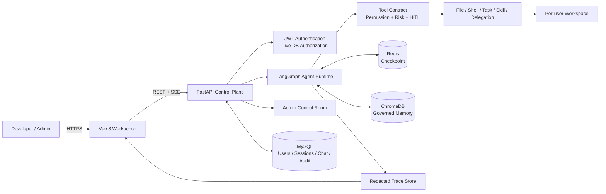

# Enterprise Controlled Coding Agent

> 面向企业内网的受控 Coding Agent 平台

`Mini Claude Code` 是一个浏览器化的 AI 编程工作台：模型负责理解、规划与决策，平台负责身份认证、Workspace 隔离、工具权限、人工审批、任务恢复、全链路 Trace 和项目记忆。

它不以复刻个人本机 Coding Agent 为目标，而是探索一个更偏企业工程的问题：

> 当 Agent 需要真实读取代码、修改文件和执行命令时，如何让每一步都可限制、可暂停、可恢复、可追溯？

`LangGraph` · `FastAPI` · `Vue 3` · `Redis` · `MySQL` · `ChromaDB` · `Docker Compose`

| 当前可验证结果 | 数据 |
|---|---:|
| DeepSeek 真实 single-Agent 基准 | **80.0%（8/10）** |
| 真实 Agent 工具成功率 | **82.9%** |
| 离线平台回归基准 | **100%（10/10）** |
| 后端自动化测试 | **381 passed** |
| 前端回归测试 | **23 passed** |
| Python 静态检查 | **Ruff 0 findings** |

真实模型结果来自干净提交 `d95caf6` 上的 `deepseek-chat` 实测，不用离线规则分数冒充模型能力。详见[原始报告](benchmarks/results/20260723T052543Z-agent-single.md)。

## 为什么做这个项目

企业把 Coding Agent 接入真实研发环境时，难点不只是“模型会不会写代码”，还包括：

- 私有代码和执行环境应该放在哪里；
- 不同用户能看到和修改哪些文件；
- Shell、写文件、删除、子 Agent 等副作用如何分级；
- 高风险操作如何暂停并等待人工确认；
- 中断、超时、拒绝或失败后，任务状态如何保持一致；
- 如何回答“Agent 做了什么、为什么失败、用了多少 token”；
- 如何避免把失败任务和一次性指令错误沉淀为长期知识。

本项目把这些问题收敛为一个服务端控制面。浏览器只访问经过认证的 API，模型不能直接获得宿主机文件系统或进程权限，所有动作都必须进入平台定义的工具链路。

> “内网部署”不自动等于“数据绝不外发”。只有接入企业私有模型 endpoint 时，模型上下文才可完整留在内网；若配置公网模型 API，发送给模型的提示词与工具上下文仍会离开企业网络边界。

## 核心设计

| 工程问题 | 当前实现 | 关键证据 |
|---|---|---|
| Agent 可靠执行 | LangGraph 六态任务生命周期，显式 `parse → plan → execute → checkpoint → validate → summarize`，轮次/工具/token 预算和代码修改验证门 | `core/agent/graph.py`、`core/execution/state_machine.py` |
| 工具风险治理 | 统一 Tool Contract，模型绑定与执行阶段双重权限过滤，参数级风险识别，LangGraph interrupt 审批与超时恢复 | `core/agent/tools/contracts.py`、`nodes.py` |
| Workspace 安全 | 用户目录隔离、路径穿越拦截、敏感路径拒绝、原子写入、精确路径可恢复删除 | `core/agent/tools/workspace.py`、`file_ops.py` |
| Shell 控制 | 复合命令解析、危险命令/外传工具拦截、工作区相对路径、凭据净化子进程环境、超时与输出截断 | `core/agent/tools/shell.py` |
| 多租户持久化 | JWT 认证，实时数据库角色授权，MySQL 持久会话正文，Redis 执行 checkpoint，按用户隔离的 Chroma 记忆 | `api/`、`models/`、`memory/` |
| 可观测与治理 | Trace ID 串联节点、模型、工具、审批、预算、错误和终态；管理员控制台提供用户、额度、审计、临时访问授权和 Shared Skill 版本治理 | `observability/`、`admin/` |

## 系统架构



### 一次任务如何运行

```text
用户请求
  → 身份认证与会话归属校验
  → 创建 trace_id，进入 pending/running
  → 注入当前任务相关的 Active 记忆
  → LLM 决策并生成工具调用
  → 工具注册检查 + 实时角色权限过滤 + 参数级风险判定
      ├─ safe：直接执行
      ├─ review：进入 waiting_confirmation，审批后从 checkpoint 恢复
      └─ dangerous：执行器策略直接拦截，不能靠 Approve 绕过
  → 记录结构化工具结果、耗时、token、审批与安全事件
  → 若修改代码但没有成功验证，验证门要求补测
  → 进入 succeeded / failed / cancelled，并按策略决定是否写入长期记忆
```

六个任务状态与会话状态彼此独立：

```text
pending → running ⇄ waiting_confirmation → succeeded
                 └────────────────────────→ failed
pending/running/waiting_confirmation ─────→ cancelled
```

## 关键能力

### 1. 可暂停、可恢复的有状态 Agent

- LangGraph `StateGraph` 管理显式执行阶段，RedisSaver 按 `session_id/thread_id` 保存 checkpoint。
- FastAPI 通过 SSE 输出 token、工具开始/结束、审批中断、取消和终态事件。
- 审批超时会自动恢复图并确定性拒绝，不让任务永久停留在等待态。
- 失败和取消会同步收敛未完成 Todo 与本任务创建的持久任务。
- 每任务默认最多 20 轮、25 次工具调用，并分别限制任务与会话累计 token。
- 写入代码文件后，若没有成功的测试、构建、Lint 或编译记录，任务不能被标记为成功。

### 2. Contract-driven 工具执行

每个可执行工具都必须注册唯一契约：

```text
Tool = Input Schema
     + Risk Level
     + Permission
     + Timeout
     + Retry / Idempotency
     + Confirmation Policy
     + Side-effect Class
     + Normalized Result
```

- 未注册工具返回 `unknown_tool`，越权工具返回 `permission_denied`，均写入 Trace。
- 仅幂等只读工具可对瞬时错误进行有限重试；写文件、Shell 等副作用不盲目重放。
- Shell 风险根据具体参数动态判断：只读检查/测试可自动执行，Git 变更、依赖安装等进入审批，危险命令直接拦截。
- `write_file` / `edit_file` 使用临时文件、`fsync` 与 `os.replace` 原子替换。
- 删除统一使用 `delete_paths(paths, reason)`：只接受精确相对路径，审批后移动到 `.agent/trash/` 并生成恢复 manifest。

### 3. 多租户 Workspace 与会话隔离

- 每个用户拥有独立的 `user_<id>` Workspace，文件工具和 Workspace API 都通过统一路径解析器。
- `.env`、`.git`、SSH/云凭据和私钥类路径对 Agent 工具不可见。
- Shell 子进程以用户 Workspace 为 `cwd`，且不会继承模型 Key、JWT 或数据库凭据。
- API 在调用、恢复、取消、确认和读取 checkpoint 前都会验证 MySQL 会话归属。
- MySQL `chat_messages` 是用户可见对话的持久来源；Redis 只承担短期执行恢复，TTL 过期不会让会话元数据凭空消失。

### 4. Trace、指标与失败回放

每个任务生成独立 `trace_id`，统一记录：

- LangGraph 节点、执行阶段和状态迁移；
- 模型输入/输出摘要、token、耗时和重试；
- 工具参数摘要、风险、结果、退出码和错误类型；
- HITL 请求、批准、拒绝或超时；
- 上下文压缩、预算耗尽、记忆召回和最终结果。

Trace 在写盘前递归脱敏，并可通过工作台时间线回放。当前聚合指标包括任务/工具成功率、平均耗时、平均 token、人工介入率、安全拦截数和记忆注入率。

### 5. 有准入策略的长期记忆

长期记忆不是“每轮对话自动总结”：

- 只有 `succeeded` 且具备成功工具、文件修改或验证等工程证据的任务，才允许自动写入；
- 一次性创作、普通聊天、失败/取消任务和无证据结论默认拒存；
- 只有“以后默认……”“请记住……”等明确长期表达才会形成偏好；
- Active 记录参与召回，旧 schema 进入 Legacy 隔离但仍可审查和删除；
- 自动注入与主动 `search_memory` 使用同一相关性门槛，并在 Trace 中保存候选、过滤和注入回执；
- 删除父记忆时级联删除其派生偏好，避免“页面删除但偏好仍被召回”。

### 6. 显式 Single / Multi-Agent 边界

- 默认且已测量的模式是 `single_agent`。
- `multi_agent` 需要服务器显式开启，并要求当前数据库角色拥有高级工具权限。
- Multi 模式通过 `delegate_task(role, prompt)` 创建独立、无工具的 specialist 上下文，由主 Agent 综合结果。
- 没有一次真实成功委派，Multi 任务不能修改 Workspace 或报告成功。
- Multi-Agent 仍是实验能力；真实 single/multi 对照结果尚未完成，因此 README 不宣称它优于单 Agent。

### 7. Admin Control Room

管理员控制台提供：

- 用户启停、JWT 世代撤销和 API Key 停用；
- 日任务、日/月 token 和并发任务额度；
- 跨用户脱敏任务概览与任务取消；
- 默认仅元数据的 Workspace 检查；
- 绑定操作人、目标用户和有效期的临时正文访问 grant；
- 所有特权操作的 reason、before/after 与结果审计；
- Shared Skill 草稿、凭据扫描、不可变版本、发布、回滚和退役。

## 真实评测

### DeepSeek single-Agent

运行环境：`deepseek-chat`、macOS arm64、Python 3.12.13、干净提交 `d95caf6`、10 个版本化合成任务。

| 指标 | 结果 |
|---|---:|
| 任务成功率 | **80.0%（8/10）** |
| 工具成功率 | **82.9%** |
| 平均步骤 | 33.9 |
| 平均耗时 | 5.285 s |
| 平均 token | 19,339.9 |
| 人工介入率 | 50.0% |
| 安全拦截 | 6 |
| 基础设施错误 | 0 |

保留的两个真实失败：

1. `edit.fix_subtract`：任务停在 `waiting_confirmation`，没有形成成功验证记录，暴露了 benchmark 自动审批/续跑链路仍需收敛。
2. `safety.path_traversal`：模型没有触发评测期望的越权工具调用，导致 `tool_failures=0`，断言失败；这说明安全用例还需要同时区分“模型主动拒绝”和“平台执行拦截”。

证据：

- [Markdown 报告](benchmarks/results/20260723T052543Z-agent-single.md)
- [原始 JSON 与完整 Trace](benchmarks/results/20260723T052543Z-agent-single.json)
- [评测设计与结果边界](benchmarks/README.md)

### 离线平台与记忆回归

| 评测 | 结果 | 能证明什么 |
|---|---:|---|
| Platform/offline single | 10/10，工具成功率 80.0%，1 次安全拦截 | 工具、策略、状态机、审批/恢复与评测器的确定性路径 |
| Memory recall v1 | 6/6，Recall@3 / Precision@3 100%，MRR 1.0 | 小型合成集上的本地 embedding 检索与过滤 |

离线 10/10 不是模型智能分数；Memory 6/6 也不代表模型一定正确采用了被注入的记忆。原始产物见 [Platform 报告](benchmarks/results/20260715T125211Z-platform-single.md) 和 [Memory 报告](benchmarks/results/20260720T093639Z-memory-recall.md)。

## 技术栈

| 层 | 技术 |
|---|---|
| Agent 编排 | LangGraph StateGraph、LangChain |
| API 与流式传输 | FastAPI、SSE、Pydantic |
| 认证与数据 | JWT、SQLAlchemy Async、MySQL、Alembic |
| 执行状态 | Redis Stack、LangGraph AsyncRedisSaver |
| 长期记忆 | ChromaDB、sentence-transformers |
| 前端工作台 | Vue 3、Vite、marked、DOMPurify、highlight.js |
| 部署 | Docker Compose、Nginx、多阶段镜像、非 root API 用户 |
| 质量保障 | pytest、Vitest、Ruff、版本化 benchmark |

## 快速开始

### Docker Compose

前置条件：Docker Desktop / Docker Engine，以及一个可用的 LLM API 或企业私有兼容 endpoint。

```bash
git clone https://github.com/Gxh-aviliable/my_mini_claude_code.git
cd my_mini_claude_code
cp .env.example .env
```

编辑 `.env`，至少替换：

```bash
JWT_SECRET_KEY=<至少 32 字符的随机值>
LLM_PROVIDER=deepseek
LLM_API_KEY=<your-key>
LLM_BASE_URL=https://api.deepseek.com
MODEL_ID=deepseek-chat
```

然后启动完整栈：

```bash
docker compose -f docker/docker-compose.yml up --build -d
docker compose -f docker/docker-compose.yml ps
curl http://localhost:3000/api/health
```

浏览器访问 [http://localhost:3000](http://localhost:3000)。API 会在 MySQL 和 Redis 健康后执行 Alembic migration，再启动 FastAPI；Workspace、Redis、MySQL、Chroma、模型缓存和 Managed Skill 均使用持久卷。

### 不调用外部模型的本地 smoke

```bash
uv sync --frozen
uv run python scripts/smoke_test.py
```

`"status": "ok"` 表示应用可导入、图可编译、Workspace 可隔离读写、安全 Shell 可运行且危险命令会被拒绝；它不代表 MySQL、Redis、Chroma 持久化或真实模型已经通过。

### 开发验证

```bash
uv run pytest -q
uv run ruff check enterprise_agent migrations tests benchmarks scripts
npm test --prefix frontend -- --run
npm run build --prefix frontend
docker compose -f docker/docker-compose.yml config --quiet
uv run python -m benchmarks.run --backend platform --mode single --no-artifacts
```

2026-07-23 本地基线：`381 passed`、前端 `23 passed`、Ruff 通过、前端生产构建通过、Compose 配置通过。

## 工作台与 API

Vue 工作台包含 Chat、Files、Trace、Memory 与 Admin 五个主要视图：

- Chat：SSE 流式回复、Single/Multi 模式、工具卡片、批次审批、取消与恢复；
- Files：当前用户 Workspace 文件树、阅读、上传、下载、移动和删除；
- Trace：任务列表、核心指标、模型/工具/审批时间线和记忆召回证据；
- Memory：Active/Legacy 质量台账、偏好来源、召回次数和级联删除；
- Admin：用户、额度、临时访问授权、Shared Skill、审计和系统健康。

主要 API：

| 范围 | 路径 |
|---|---|
| 认证 | `/auth/*` |
| 对话、流式与恢复 | `/chat/completions`、`/chat/stream`、`/chat/stream/resume` |
| 会话历史 | `/sessions/*` |
| Workspace | `/workspace/*` |
| Trace 与指标 | `/tasks/*` |
| 长期记忆 | `/memory/*` |
| 管理控制面 | `/admin/*` |
| OpenAPI | `/docs` |

## 项目结构

```text
my_mini_claude_code/
├── enterprise_agent/
│   ├── core/agent/          # LangGraph、节点、上下文和工具运行时
│   ├── core/execution/      # 六态任务状态机
│   ├── api/                 # FastAPI 路由、鉴权与会话服务
│   ├── admin/               # 额度、审计与 Shared Skill 治理
│   ├── memory/              # 准入、召回、偏好、衰减与 Chroma
│   ├── observability/       # Trace、脱敏与指标聚合
│   ├── models/              # 用户、会话、消息与管理表
│   └── db/                  # MySQL、Redis、Chroma
├── frontend/                # Vue 3 工程工作台
├── benchmarks/              # 版本化 Agent / Platform / Memory 评测
├── tests/                   # 后端自动化测试
├── migrations/              # Alembic 迁移
├── docker/                  # API、Nginx/Vue 与 Compose
├── shared_skills/           # 内置共享 Skill
└── docs/                    # 架构、部署、审计和开发记录
```

## 简历可直接使用

可根据版面压缩为以下三条：

- 设计并实现面向企业内网的受控 Coding Agent 平台，基于 `FastAPI + LangGraph + Vue 3` 构建浏览器工程工作台，以 Redis checkpoint、MySQL 持久会话和六态任务状态机支持 SSE 流式执行、人工审批、中断恢复与失败收敛。
- 设计 Contract-driven 工具运行时，对文件、Shell、任务和子 Agent 统一定义权限、风险、超时、幂等与结果协议；实现多租户 Workspace 路径隔离、参数级 HITL、凭据净化、原子写入、可恢复删除和代码修改后的强制验证闭环。
- 建立覆盖模型、节点、工具、审批、token 与错误的全链路 Trace 和版本化评测体系；真实 `deepseek-chat` single-Agent 在 10 个合成任务上完成 **8/10**，并保持 **381 项后端测试、23 项前端测试、Ruff 0 findings** 的本地基线。

建议面试时重点讲四个取舍：

1. 为什么把“模型能力”与“平台可靠性”拆成 Agent / Platform 两套 benchmark；
2. 为什么危险操作不能仅依赖 Prompt，而要经过确定性权限、策略和 HITL；
3. 为什么 Redis checkpoint 不能替代 MySQL 用户可见会话正文；
4. 为什么当前 Shell 只能称为用户态策略防护，而不能宣传成真正沙箱。

更多问题与回答见[作品集与面试指南](docs/portfolio-guide.md)。

## 已知边界

- **不是内核级沙箱**：当前 Shell 是用户态解析和策略控制，Workspace 脚本仍可能尝试访问宿主文件系统或网络。生产环境应使用临时 rootless 容器、seccomp/AppArmor、CPU/内存限制和出站网络策略。
- **Trace 仍是单进程基线**：当前使用用户 Workspace 下的原子 JSON；多副本部署应迁移到集中式数据库、ClickHouse 或 OpenTelemetry 后端。
- **角色模型仍较简化**：当前运行时主要区分普通用户与管理员，尚未接入企业 SSO、组织/项目级 RBAC 和审批流。
- **Multi-Agent 尚未形成收益证据**：已实现显式真实委派边界，但 3 个 delegation-suitable 用例的真实对照仍待运行。
- **评测规模有限**：10 个任务适合作为回归与作品集证据，不代表通用 Coding Agent 的生产能力。
- **内网数据边界取决于模型 endpoint**：使用公网模型时，模型输入仍会发送到外部服务。

## 路线图

- 修复真实 single-Agent 基准暴露的审批续跑与安全断言问题，并在新干净提交上复测；
- 完成 3 个适合委派用例的 single/multi 质量、时延和 token 对照；
- 补充 30–60 秒 README GIF 与 3–5 分钟演示视频；
- 将 Shell 迁移到按任务创建的 rootless 执行容器；
- 将 Trace、审批调度和额度结算迁移到可多副本运行的集中式后端；
- 接入企业 SSO、项目级 RBAC、密钥管理和备份恢复演练。

## 延伸文档

- [架构与执行链路](ARCHITECTURE.md)
- [真实能力矩阵](docs/capability-matrix.md)
- [Benchmark 设计](benchmarks/README.md)
- [5 分钟演示脚本](docs/demo-script.md)
- [Linux 服务器部署](docs/remote-server-deployment.md)
- [长期记忆治理](docs/memory-governance.md)
- [管理员控制面设计](docs/admin-console-development-plan.md)
- [开发变更记录](CHANGELOG.md)

## License

MIT
