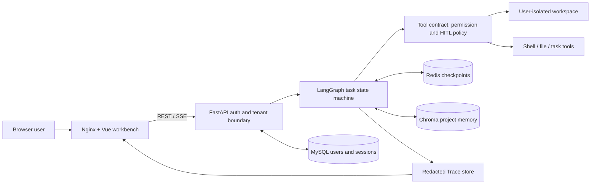

# Mini Claude Code — Enterprise Controlled Engineering Agent

面向企业内网部署的受控工程 Agent 平台。它不是要和 Claude Code、Codex、Cursor 在个人本机体验上正面竞争，而是把 AI 编程能力放进企业可治理的服务器环境中：代码不出内网，Agent 只在受控 workspace 中操作，敏感工具可审批，文件访问可隔离，长期项目知识可沉淀。

## 产品定位

企业内部往往不希望开发者在个人电脑上安装高权限 Agent，或把私有代码直接交给外部 SaaS。这个项目的目标是提供一个可部署在公司内网的工程 Agent 工作台：

- 开发者通过浏览器使用 Agent，不需要在个人电脑授予高权限。
- Agent 在服务器上的隔离 workspace 中读写代码、运行命令、查看文件、总结任务。
- 平台负责用户认证、权限边界、工具确认、会话管理、项目记忆和审计基础。
- 企业可以接入 DeepSeek、Qwen、GLM、OpenAI-compatible 或私有模型 endpoint。

一句话：

```text
一个部署在企业内网的安全工程 Agent 平台，让开发者在浏览器里让 Agent 受控地阅读、修改、测试和总结代码。
```

## 适用场景

- 企业内网代码助手：在公司服务器上统一部署 Agent，不把代码散落到个人本机插件。
- 受控代码修改：限制 Agent 只能访问当前用户或项目 workspace。
- 内部项目知识沉淀：保存项目约定、架构决策、问题排查记录和任务摘要。
- 安全工具执行：对 shell、文件写入、删除、子 Agent 等敏感操作进行确认和策略控制。
- 多用户工程工作台：每个用户独立 workspace，文件树、会话、长期记忆按用户隔离。
- 私有模型适配：支持多种 LLM provider 和企业自建 OpenAI-compatible 服务。

## 核心能力

### 1. 受控工程 Workspace

- 用户 workspace 隔离：`/workspaces/user_<id>` 或自定义服务器路径。
- 所有文件 API 和 Agent 文件工具都通过 workspace 路径解析，防止路径穿越。
- 支持文件树、文件阅读、上传下载、移动、删除和目录创建。
- 支持本地 VS Code / Web VSCode 打开当前用户 workspace。
- 自动为用户 workspace 初始化安全的 `.vscode/settings.json`，避免编辑器插件误读全局配置。

### 2. 有状态 Code Agent

- 基于 LangGraph StateGraph 构建有状态工程 Agent。
- 每个用户任务遵循 `解析 → 规划 → 执行 → 检查点 → 验证 → 总结`，并使用 `pending/running/waiting_confirmation/succeeded/failed/cancelled` 状态机。
- RedisSaver 按 `session_id/thread_id` 持久化会话状态。
- SSE 逐 token 流式响应，支持中断、取消和恢复。
- 工具统一声明输入 schema、风险级别、超时、重试、幂等性和结果规范；当前数据库角色权限在模型绑定与执行时双重过滤。
- 支持文件读写、shell、任务管理、上下文压缩和真实子 Agent 委派；默认选择单 Agent，Multi-Agent 只能由显式请求模式启用。
- 支持 Todo 跟踪和后台任务，适合多步骤工程任务。
- 修改代码后若没有成功测试/构建/检查记录，验证门会要求补充验证；超过预算则以失败状态结束而不是伪报成功。
- 未注册工具和越权工具会返回结构化 `unknown_tool` / `permission_denied` 记录，不再让确认节点异常退出；失败/取消时未完成 Todo 和本任务创建的持久任务会同步收敛到终态。

#### Single / Multi-Agent 模式

- 前端输入框上方固定提供 `Single` 与 `Multi EXP` 显式切换，默认始终是 `Single`；构建版本轮询会在页面过期时提示刷新，Nginx 不缓存 SPA 入口页。
- `/chat/capabilities` 根据服务器开关和当前数据库角色返回可用模式；请求体通过 `mode=single_agent|multi_agent` 明确本次任务模式。
- Multi-Agent 必须同时满足 `ENABLE_MULTI_AGENT=true` 和 `tools:advanced` 权限。不满足时 API 在创建任务前返回 409 或 403，不会静默退化成“单 Agent 假装多 Agent”。
- 如果用户在 Single 下明确要求“多智能体协作执行”，前端要求确认切换，后端也会拒绝 Single 请求；API 客户端不能绕过这条边界。
- `delegate_task(role, prompt)` 会启动独立、无工具的 specialist 模型上下文，适合规划、写作、评审等角色；主 Agent 负责综合真实返回结果。
- Multi 任务必须至少成功执行一次 `delegate_task` 才能成功结束；真实委派前不能先写文件、运行命令或创建任务来伪造协作。
- `task_create` 仅用于操作任务记录，不会启动 Agent；系统提示和执行门共同禁止通过编写随机脚本、模板类或模拟器冒充多 Agent 协作。

本地实验可在 `.env` 设置 `ENABLE_MULTI_AGENT=true`。出于权限安全，普通 `free` 账号仍不能使用 Multi-Agent，需要由管理员在用户管理/数据库侧授予管理员或高级工具权限；不要把该开关理解为自动提权。

### 3. 企业安全与治理基础

- JWT 认证，邮箱登录，刷新 token。
- 忘记密码流程，开发模式下验证码写入后端日志，可配置 SMTP 邮箱发送。
- 参数级 HITL：`pwd`、`ls`、`pytest`、`git status` 等安全 Shell 自动执行；Git 变更、依赖安装和复合命令仍需确认；策略判定为危险的命令不能通过确认放行，而是直接拦截并写入 Trace。
- 写文件、编辑文件、任务创建和子 Agent 等副作用工具继续走确认流；确认超时会自动拒绝并恢复任务。
- Shell 复合命令逐段解析，拦截绝对/越界/敏感路径、命令替换、嵌套 shell、内联代码、破坏性 Git 和下载/外传命令。
- Shell/后台子进程不继承模型、JWT 或数据库密钥；Agent 文件工具拒绝 `.env`/`.git`/私钥类路径，写入采用原子替换。
- 前端 Markdown 渲染使用 DOMPurify 做 XSS 清理。
- 会话和文件访问按用户隔离。

### 4. 可回放 Trace 与成本指标

- 每次用户任务生成独立 `trace_id`，串联 LangGraph 节点、模型摘要、工具调用、确认、预算、错误和最终状态。
- Trace 写入当前用户 workspace 的 `.agent/traces/`，递归脱敏密钥、token、密码和 Authorization 信息。
- `/tasks` API 和前端 Trace 页面可按时间线回放任务，并定位节点/工具耗时与失败原因。
- LangGraph 的 HITL interrupt 记录为 `waiting_confirmation/interrupted` 正常控制流，不再污染 Trace 的错误字段；工具卡只根据带调用 ID 的标准执行记录显示成功、失败、阻断或等待确认。
- 指标只从真实终态 Trace 计算：任务/工具成功率、平均耗时、平均 token、人工介入率和安全拦截数。

当前 JSON Trace 是便于本地复现的单进程基线；多副本生产环境应迁移到集中数据库或 OpenTelemetry 后端。

### 5. 企业项目记忆

当前长期记忆基于 ChromaDB，但不再把每次对话结束都等同于“值得记住”：

- **终态准入**：只在任务 `succeeded` 后评估写入；`failed/cancelled`、普通聊天、创作类一次性任务默认拒存。
- **工程证据**：自动记忆必须同时具有工程语义、足够重要性，以及成功工具调用、文件修改或验证结果等可复用证据。
- **强类型 v2**：新记录包含 `memory_type/schema_version/task_status/admission_reason/quality_status`，当前自动类型为 `task_outcome` 和显式 `user_note`。
- **偏好证据**：只有“以后、默认、我习惯、remember”等明确长期表达才允许提取偏好；“这次写一篇玄幻小说”不会变成永久偏好。
- **来源可追溯**：每条 Active 偏好必须记录来源 memory/trace/session；缺少来源的旧派生偏好自动进入 Legacy 隔离。
- **删除一致性**：删除一条长期记忆时会先删除由它派生的偏好，再删除父记录，并返回级联删除回执，避免“页面已删除但仍被偏好召回”。
- **Legacy 隔离**：旧数据保留在管理页供审查/删除，但不参与自动上下文注入，避免未经授权的数据清理。
- **相关性门槛**：普通任务只注入距离阈值内的 Active 记忆；移除了“搜不到就塞入一批旧摘要”的宽泛兜底。
- **统一召回审计**：自动上下文检索和模型主动调用 `search_memory` 使用相同的 Active/相关性门槛、召回计数与 Trace receipt。
- **可解释管理**：Memory Ledger 分开显示 Task outcomes / Preferences 的数量、来源、召回证据和隔离原因。

详细策略、真实数据审计和兼容迁移方案见 [`docs/memory-governance.md`](docs/memory-governance.md)。

### 6. 多模型与内网部署

- 支持 Anthropic、DeepSeek、GLM、OpenAI、MiMo 等 provider。
- 支持 `LLM_BASE_URL` 配置企业内网或私有模型 endpoint。
- Chroma embedding 使用本地 sentence-transformers；已有缓存优先离线加载，不会在每次进程启动时检查 Hugging Face。
- MySQL / Redis / Chroma 可部署在内网环境。

## 技术栈

| 层 | 技术 |
|---|------|
| Agent 引擎 | LangGraph StateGraph + LangChain |
| API | FastAPI + SSE + JWT |
| 前端 | Vue 3 + Vite + marked + DOMPurify + highlight.js |
| 会话状态 | Redis + LangGraph RedisSaver |
| 长期记忆 | ChromaDB + sentence-transformers |
| 认证/会话 | MySQL + SQLAlchemy async |
| Trace/指标 | 用户 workspace 原子 JSON + FastAPI 回放 API |
| 模型接入 | DeepSeek / Anthropic / GLM / OpenAI / MiMo / OpenAI-compatible |
| 部署 | Docker Compose |

## 架构图



任务内部严格遵循 `解析 → 规划 → 执行 → 检查点 → 验证 → 总结`；模型不直接拥有文件系统或进程权限，所有操作经过工具契约、JWT 权限和确认策略。

## 10 分钟快速启动

前置要求：Docker Desktop、Node.js 20.19+、Python 3.11+ 和 [uv](https://docs.astral.sh/uv/)。第一次下载 Python/模型依赖所需时间取决于网络。

先运行不依赖数据库、Redis、Chroma 模型和付费 LLM 的本地 smoke test：

```bash
git clone https://github.com/Gxh-aviliable/my_mini_claude_code.git
cd my_mini_claude_code
uv sync --frozen
uv run python scripts/smoke_test.py
```

看到 `"status": "ok"` 代表应用可导入、LangGraph 可编译、隔离 workspace 可读写、安全 shell 可执行且危险命令会被拒绝。它不代表外部服务或真实模型已经验证。

一键完整启动（Vue/Nginx + API + MySQL + Redis）：

```bash
cp .env.example .env
# 替换 JWT_SECRET_KEY（至少 32 字符）、LLM_API_KEY 和模型配置
docker compose -f docker/docker-compose.yml up --build -d
docker compose -f docker/docker-compose.yml ps
curl http://localhost:3000/api/health
# 浏览器打开 http://localhost:3000
```

API 等待 MySQL/Redis 健康后启动，前端再等待 API 健康；workspace、Chroma 和 Hugging Face 缓存均使用持久卷。首次启动可能需要下载 embedding 模型。

如需在不占用默认端口、不触碰已有容器的情况下复现完整交付验收，可运行隔离 smoke test。它默认使用独立 Compose project 和 `13000/18000/13307/16379` 端口，检查四服务健康状态、API 直连与 Nginx 反代，结束后自动移除测试容器但保留缓存卷：

```bash
./scripts/docker_smoke_test.sh
```

设置 `KEEP_STACK=1` 可保留验收栈用于调试。

如需分进程本地调试：

```bash
# 1. 配置环境变量
cp .env.example .env
# 至少替换 JWT_SECRET_KEY、LLM_API_KEY，并确认 provider/model 配置

# 2. 启动 MySQL 和 Redis Stack
docker compose -f docker/docker-compose.yml up -d mysql redis

# 3. 安装前端依赖
npm install --prefix frontend

# 4. 终端 A：启动后端
uv run uvicorn enterprise_agent.api.main:app --reload

# 5. 终端 B：启动前端
npm run dev --prefix frontend

# 6. 检查并访问
curl http://localhost:8000/health
# 浏览器打开 http://localhost:3000
```

最小任务验收：注册并登录后，在工作台发送“读取当前仓库 README，列出三个核心模块，不要修改文件”。安全只读 Shell 不弹确认；文件修改、Git 变更、安装依赖或子 Agent 等操作会按当前风险策略弹出人工确认。

## 本地开发与服务器部署

项目支持在 Windows、macOS 和 Linux 上开发，但 Agent 会根据后端实际运行系统提示模型使用对应 shell 命令：

- Windows：`dir`、`cd /d`、`python`
- macOS / Linux：`ls`、`pwd`、`mkdir -p`、`python3`

macOS 本地调试建议使用项目内 workspace，避免 `/workspaces` 权限问题：

```bash
WORKSPACE_BASE=./workspaces
FILE_OPEN_MODE=local-vscode
VSCODE_WORKSPACE_PATH=./workspaces
```

Linux 服务器或 Docker 部署建议使用固定服务器路径，并通过 Web VSCode / code-server 打开文件：

```bash
WORKSPACE_BASE=/workspaces
FILE_OPEN_MODE=web-vscode
VSCODE_WEB_BASE_URL=https://code.example.com
VSCODE_WORKSPACE_PATH=/workspaces
```

`local-vscode` 会生成 `vscode://file/...` 链接，适合浏览器和代码都在同一台开发机上的场景；远程服务器部署时应优先使用 `web-vscode`，否则用户本机 VS Code 无法直接打开服务器文件路径。

## 关键配置

```bash
# LLM
LLM_PROVIDER=deepseek
LLM_API_KEY=your-api-key
LLM_BASE_URL=https://api.deepseek.com/anthropic
MODEL_ID=deepseek-v4-pro

# Auth
JWT_SECRET_KEY=your-secret-key-change-in-production

# Workspace
WORKSPACE_BASE=./workspaces
FILE_OPEN_MODE=local-vscode
VSCODE_WEB_BASE_URL=
VSCODE_WEB_URL_TEMPLATE=
VSCODE_WORKSPACE_PATH=./workspaces

# Password reset email (optional)
SMTP_HOST=
SMTP_PORT=465
SMTP_USERNAME=
SMTP_PASSWORD=
SMTP_FROM_EMAIL=
SMTP_USE_SSL=true
```

## 项目结构

```text
my_mini_claude_code/
├── enterprise_agent/
│   ├── api/                       # FastAPI 路由、中间件、schemas
│   ├── auth/                      # JWT、密码、邮件验证码
│   ├── core/agent/                # LangGraph Agent 核心
│   │   ├── graph.py               # StateGraph + RedisSaver
│   │   ├── nodes.py               # LLM、工具执行、记忆保存、压缩节点
│   │   ├── state.py               # AgentState
│   │   └── tools/                 # 文件、shell、workspace、skills、team、memory 等工具
│   ├── core/execution/              # 六态任务状态机
│   ├── observability/               # Trace 事件、脱敏与指标聚合
│   ├── memory/                    # Chroma 长期记忆、重要性评分、衰减清理
│   ├── db/                        # MySQL / Redis / Chroma 连接
│   ├── models/                    # User、Session ORM 模型
│   └── config/settings.py         # 环境变量配置
├── frontend/                      # Vue 3 工程工作台
├── shared_skills/                 # 企业共享技能
├── tests/                         # pytest 测试
├── benchmarks/                    # 版本化用例、runner 与原始报告
├── docker/                        # Docker Compose
└── docs/                          # 架构、计划和审计文档
```

架构与改造依据：

- [后端项目现状、架构拆解与学习指南](docs/beginner/backend-project-status-and-learning-guide.md)：面向 vibe coding 开发者的当前进度判断、请求全链路拆解、学习路线与接手指南。
- [ARCHITECTURE.md](ARCHITECTURE.md)：当前真实架构、执行链路、边界与缺口。
- [当前能力矩阵](docs/capability-matrix.md)：区分已具备、部分具备和缺失。
- [作品集改造 Backlog](docs/portfolio-backlog.md)：按风险和阶段排序的验收项。
- [CHANGELOG.md](CHANGELOG.md)：每阶段的功能与真实验证记录。
- [Benchmark 说明](benchmarks/README.md)：版本化用例、双后端语义、运行命令与结果边界。
- [5 分钟演示脚本](docs/demo-script.md)：面试现场的稳定演示路径与备用证据。
- [作品集交付](docs/portfolio-guide.md)：改造前后、完成/待测项、简历描述与 20 个面试问答。
- [逐条验收审计](docs/acceptance-audit.md)：原始交付要求、权威证据、已证明/部分证明与唯一授权阻塞项。
- [远程服务器部署指南](docs/remote-server-deployment.md)：从 macOS 发布到 Linux、HTTPS、持久卷、更新、备份与回滚。
- [内网管理员控制台设计与开发方案](docs/admin-console-development-plan.md)：用户、额度、受控 Workspace 查看、Shared Skill 版本治理与审计的分阶段方案。

## API 概览

### 认证

| 方法 | 路径 | 说明 |
|------|------|------|
| POST | `/auth/register` | 注册用户 |
| POST | `/auth/login` | 邮箱登录 |
| POST | `/auth/refresh` | 刷新 token |
| POST | `/auth/forgot-password` | 请求邮箱验证码 |
| POST | `/auth/reset-password` | 验证码重置密码 |

### 对话与会话

| 方法 | 路径 | 说明 |
|------|------|------|
| POST | `/chat/completions` | 非流式对话 |
| POST | `/chat/stream` | SSE 流式对话 |
| POST | `/chat/stream/resume` | 工具确认后恢复 |
| POST | `/chat/stream/cancel` | 取消生成 |
| GET | `/sessions/` | 列出有历史消息的会话 |
| POST | `/sessions/` | 创建会话 |
| GET | `/sessions/{id}/messages` | 读取会话历史 |
| DELETE | `/sessions/{id}` | 删除会话 |

### Workspace

| 方法 | 路径 | 说明 |
|------|------|------|
| GET | `/workspace/tree` | 文件树 |
| GET | `/workspace/read` | 读取文件 |
| GET | `/workspace/open-url` | 打开当前用户 workspace 的 VSCode URL |
| GET | `/workspace/download` | 下载文件 |
| GET | `/workspace/download-zip` | 批量下载 |
| POST | `/workspace/upload` | 上传文件 |
| POST | `/workspace/mkdir` | 创建目录 |
| PUT | `/workspace/move` | 移动/重命名 |
| DELETE | `/workspace/delete` | 删除 |

### Memory

| 方法 | 路径 | 说明 |
|------|------|------|
| GET | `/memory/conversations` | 查看 Active/Legacy 任务记忆及准入元数据 |
| DELETE | `/memory/conversations/{doc_id}` | 删除记忆及其派生偏好，返回级联删除回执 |
| GET | `/memory/patterns` | 查看偏好证据、质量状态和更新时间 |
| DELETE | `/memory/patterns/{pattern_id}` | 删除用户模式 |

### Task Trace

| 方法 | 路径 | 说明 |
|------|------|------|
| GET | `/tasks` | 列出当前用户的任务运行记录 |
| GET | `/tasks/metrics` | 获取六项核心真实指标 |
| GET | `/tasks/{trace_id}` | 查看任务状态与聚合计数 |
| GET | `/tasks/{trace_id}/trace` | 回放脱敏事件时间线 |

## 与 Claude Code / Codex 的差异

这个项目不试图替代成熟的个人本机 Coding Agent。它的差异化是企业治理场景：

| 个人 Coding Agent | 本项目定位 |
|---|---|
| 本机运行，权限依赖个人环境 | 服务器内网运行，权限由平台治理 |
| 偏个人效率工具 | 偏企业受控工程工作台 |
| 代码和工具权限分散在个人电脑 | workspace、工具、会话集中管理 |
| 记忆偏个人上下文 | 记忆偏项目事实、团队约定、任务结果 |
| 审计能力依赖外部平台 | 可沉淀企业内部审计与操作记录 |

## 后续路线

- 在明确授权的模型 endpoint 运行 single/multi Agent 对照，不用 platform 分数代替模型成绩。
- 将 Shell 执行迁移到临时 rootless 容器，加入 seccomp/AppArmor、CPU/内存配额与出站网络策略。
- 将 JSON Trace 和确认超时调度迁移到集中式后端，支持多副本。
- 引入 Alembic、密钥管理和备份/恢复演练。
- Git 集成：分支创建、diff 展示、commit、PR、代码评审。
- CI/CD 集成：允许 Agent 在受控环境触发测试、构建、静态检查。
- 企业知识库：接入内部文档、规范、接口文档和故障手册。

## 测试

```bash
uv run pytest
uv run ruff check enterprise_agent tests
cd frontend && npm test
cd frontend && npm run build
docker compose -f docker/docker-compose.yml config -q
uv run python -m benchmarks.run --backend platform --mode single
HF_HUB_OFFLINE=1 TRANSFORMERS_OFFLINE=1 uv run python -m benchmarks.memory_recall
```

2026-07-20 当前验证：

| 检查 | 结果 |
|---|---|
| 后端 pytest | 343 passed |
| 前端回归测试 | 16 passed；覆盖历史恢复、Chat → File → Chat、模式传递/升级、能力禁用、HITL 拒绝、工具终态映射、流式生成滚动锁定、长期记忆治理、级联删除及 Recall receipt |
| 前端生产构建 | 通过；最大 JS chunk 76.99 kB，无大 chunk 警告 |
| Compose 配置解析 | 通过 |
| Docker 全栈 smoke | 通过；隔离 project 中 API、Vue/Nginx、MySQL、Redis 全部 healthy，API 直连与 `/api/health` 反代均通过 |
| Docker 镜像 | API/前端实际构建通过；API 以 UID 10001 运行，`torch 2.13.0+cpu` |
| 当前本机容器 | API、Vue/Nginx、MySQL、Redis 全部 healthy；入口页 `no-store`，版本清单与哈希 bundle 已实测 |
| Trace 浏览器 E2E | 通过；合成账号实际回放 memory retrieval，展示候选/过滤/注入/token/未归因边界，控制台 0 warning/error |
| Ruff | 全仓通过，0 项 |
| npm audit | 生产+开发依赖 0 个已知漏洞 |

长期记忆测试使用真实进程内 Chroma collection 与确定性离线 embedding，覆盖 v2 写入、偏好 upsert/证据累计、Legacy 隔离、语义检索和失败任务拒存，不需要联网下载模型。

### 评测结果

| 评测 | 任务成功率 | 工具成功率 | 平均耗时 | 平均 token | 人工介入率 | 安全拦截 |
|---|---:|---:|---:|---:|---:|---:|
| Platform/offline single | 100% (10/10) | 80.0% | 84.8 ms | 0 | 20.0% | 1 |
| LLM single Agent | **TBD** | **TBD** | **TBD** | **TBD** | **TBD** | **TBD** |
| LLM multi Agent（3 个适合委派的用例） | **TBD** | **TBD** | **TBD** | **TBD** | **TBD** | **TBD** |

Platform 结果来自 [原始 JSON](benchmarks/results/20260715T125211Z-platform-single.json) 和 [Markdown 报告](benchmarks/results/20260715T125211Z-platform-single.md)，只证明工具、状态机、安全策略、确认/恢复和评估器的确定性路径，不是 LLM 智能得分。工具成功率为 80% 是因为失败恢复用例中的预期失败以及安全拦截也计入调用总数。

长期记忆另有一组不调用聊天模型的本地 embedding 评测：

| Memory recall v1 | 结果 |
|---|---:|
| 用例通过 | 100% (6/6) |
| Recall@3 | 100% |
| Precision@3 | 100% |
| MRR | 1.000 |
| 无关负例误注入率 | 0% |
| Legacy/disabled 违规注入 | 0 |
| token 预算合规 | 100% |

结果来自 [原始 JSON](benchmarks/results/20260720T093639Z-memory-recall.json) 和 [Markdown 报告](benchmarks/results/20260720T093639Z-memory-recall.md)。修复前诊断基线只通过 5/6，Precision@3 为 27.78%，无关负例误注入率为 100%；评测器随后也加入“额外无关注入即失败”的严格判定。中文词法重排与相对门槛解决了该合成集上的泛召回。这个分数只证明本地检索与过滤，不证明 DeepSeek 实际采纳了被注入的记忆；当前指令覆盖长期偏好的模型行为仍为 **TBD**。

可回放的失败证据：`recovery.fail_fix_pass` 先记录失败测试，修复后再记录通过；危险 Shell 和路径越界作为预期工具失败保留在 Trace 中。评测器首轮还暴露了同秒改写等长 Python 文件可复用旧 `.pyc` 的非确定性，用例禁止写 bytecode 后重复稳定通过。

真实 Agent single/multi benchmark 已得到发送合成用例到所配置 DeepSeek endpoint 的用户授权，但本次故障修复没有重新发送 benchmark 或新增外部模型调用。模型质量、耗时和成本结果仍为 `TBD`，将在修复后的显式 Multi-Agent 流程完成独立实测后写入。

## 当前状态

项目已完成五阶段 MVP，并建立可靠单 Agent、显式受控 Multi-Agent、可回放 Trace、可复现 platform benchmark 和已通过隔离健康验收的四服务 Docker 交付基线。真实模型 single/multi 对照指标、内核/容器级 Shell 沙箱、多副本集中 Trace、数据库迁移和正式角色管理界面仍为明确待测/待实现项。

## License

MIT
