# Mini Claude Code 后端 Agent 从零精读指南

这是一份按“程序真正怎样运行”组织的源码学习文档。它不要求你事先理解 LangGraph、SSE、checkpoint 或 Agent 工具循环，而是从启动入口开始，沿着一次真实 Coding Agent 任务走完整条链路：

```text
用户提出修复需求
  → HTTP 客户端发送 SSE 请求
  → FastAPI 完成认证、会话和额度检查
  → 构造 AgentState
  → LangGraph 解析、规划并调用模型
  → 模型选择文件或 Shell 工具
  → 平台执行权限、风险和 HITL 检查
  → 修改文件并运行验证
  → 形成任务终态
  → 持久化聊天、Trace 和合格的长期记忆
  → 向用户汇报结果
```

全文以这个任务为例：

> 阅读一个 Python 仓库，定位减法函数为什么测试失败，做最小修改，运行相关测试，并汇报修改文件和验证结果。

你应该先理解这条主链，再阅读管理员、完整多 Agent 消息总线等扩展能力。不要一上来顺序阅读 2,000 多行的 `nodes.py`，那样很容易看见很多局部实现，却不知道它们何时被调用、为什么存在。

---

## 0. 怎样使用这份文档

每个核心章节都回答八类问题：

1. 这部分解决什么问题；
2. 源码在哪里；
3. 输入是什么；
4. 中间做了什么；
5. 输出是什么；
6. 失败时怎样处理；
7. 哪些测试能证明；
8. 学完后你应该能独立回答什么。

建议同时打开三个窗口：

- 左侧：本文；
- 中间：当前讲到的源码；
- 右侧：对应测试或 Trace 页面。

本文引用“文件路径 + 函数/类名”，不绑定容易随编辑失效的固定行号。

### 0.1 先记住五句话

1. **模型不是系统控制者。** 模型只能提出工具调用，平台决定是否允许执行。
2. **AgentState 是一趟任务在图中的共享工作台。** 节点从中读取数据，并返回需要合并的更新。
3. **MySQL、Redis、Chroma 不是三份重复记忆。** 它们分别保存持久聊天、执行 checkpoint 和经过准入的长期知识。
4. **“模型说完成了”不等于任务成功。** 代码修改后必须存在成功验证记录。
5. **Multi-Agent 是实验模式。** 当前可量化基线是 single-Agent，不应先假设委派一定更好。

---

# 第零部分：后端逐代码块主线

这一部分是全文最适合第一次阅读的路线。先不要完整展开某一个大文件，而是按照后端真实调用顺序，一次只读一个关键代码块：

```text
pyproject.toml
  → api/main.py:run
  → FastAPI lifespan
  → api/routes/chat.py:chat_stream
  → api/routes/chat.py:_task_input
  → core/agent/graph.py:build_agent_graph
  → task_parse / init_context / plan_task
  → pause_*_gate / user_pause_* （安全边界协作式暂停）
  → llm_call
  → route_after_llm
  → prepare_tool_execution / tool_confirm
  → tool_executor
  → checkpoint_task / save_memory / route_after_tool
  → verification_gate / finalize_task
  → persist_memory
  → Redis checkpoint / Trace / MySQL assistant message
```

这里不讲 Vue 组件。你只需要把调用方理解为一个能够：

- 携带 JWT 调用 `/chat/stream`；
- 消费 `text/event-stream`；
- 在收到 `interrupt` 后调用 `/chat/stream/resume`；
- 通过 `/chat/stream/pause` 请求暂停，收到 `paused` 后通过 `/chat/stream/continue` 续跑同一 Trace；
- 在需要时调用取消接口；

的 HTTP 客户端。

## Z0. 怎样阅读下面的代码块

每个站点都用同一个顺序：

1. **先看位置**：知道代码属于哪一层；
2. **再看摘录**：只保留决定控制流的语句，`...` 表示省略非关键分支；
3. **逐句解释**：明确每行为什么存在；
4. **看状态变化**：输入和输出是什么；
5. **看失败出口**：异常会被谁处理；
6. **设置断点**：真正调试时从哪里停住。

代码摘录用于学习控制流，不应从文档复制回源码。实现真相始终以对应文件中的完整函数为准。

贯穿示例仍然是：

> 读取一个 Python 仓库，定位减法函数测试失败的原因，做最小修改，执行测试并汇报结果。

---

## Z1. 后端进程入口：从 `serve` 到 FastAPI

### 源码位置

- `pyproject.toml:[project.scripts]`
- `enterprise_agent/api/main.py:run`

### 关键代码块

```toml
[project.scripts]
serve = "enterprise_agent.api.main:run"
```

```python
def run():
    import uvicorn
    uvicorn.run(
        "enterprise_agent.api.main:app",
        host=settings.API_HOST,
        port=settings.API_PORT,
        reload=settings.DEBUG,
    )
```

### 逐句解析

1. 安装当前 Python 包后，会生成一个名为 `serve` 的命令。
2. `serve` 不包含业务逻辑，只定位到 `enterprise_agent.api.main:run`。
3. `run()` 交给 Uvicorn 启动 ASGI 应用。
4. 字符串 `"enterprise_agent.api.main:app"` 表示 Uvicorn 会重新导入模块并查找全局 `app`。
5. host、port 和 reload 都来自 `settings`，因此本地、Docker 和服务器不需要改源码。

### 输入、输出和断点

| 项目 | 内容 |
|---|---|
| 输入 | 环境变量、`.env` 和 Settings 默认值 |
| 输出 | 监听 HTTP 请求的 Uvicorn 进程 |
| 常见失败 | 端口占用、配置校验失败、模块导入失败 |
| 第一个断点 | `enterprise_agent/api/main.py:run` |

### 关键理解

`run()` 是“进程入口”，`app` 是“Web 应用对象”。面试时不要把它们说成 Agent 入口；Agent 直到聊天路由调用 `get_agent_graph()` 时才真正进入执行链。

---

## Z2. 应用启动：`lifespan()` 为什么先于聊天请求

### 源码位置

- `enterprise_agent/api/main.py:lifespan`

### 关键代码块

```python
@asynccontextmanager
async def lifespan(app: FastAPI):
    settings.validate_runtime_security()
    await init_db()
    init_chroma()

    from enterprise_agent.core.agent.graph import setup_checkpointer
    await setup_checkpointer()

    cleanup_task = get_or_start_cleanup_task()
    yield

    await _drain_memory_flush_tasks()
    cleanup_task.cancel()
    await close_db()
    await close_redis()
```

### 逐句解析

1. `validate_runtime_security()` 在接收流量前拒绝明显不安全的生产配置。
2. `init_db()` 建立 MySQL 连接并保证基础表可用。
3. `init_chroma()` 初始化长期记忆向量存储；首次运行可能加载 embedding 模型。
4. `setup_checkpointer()` 为 LangGraph 的 Redis checkpointer 创建所需索引。
5. `yield` 是启动和关闭的分界：它之前属于 startup，之后属于 shutdown。
6. 关闭时先等待尚未完成的记忆写入，再关闭数据库连接。

实际源码还会尝试把仍可读取的旧 Redis 聊天记录迁移到 MySQL。迁移失败只记录 warning，不阻止服务启动，因为旧 Redis fallback 仍可能可读。

### 为什么顺序重要

```text
如果先接请求，再初始化 Redis：
chat_stream
  → graph.astream
  → checkpointer 尚未 setup
  → 第一次任务在运行时失败
```

把依赖初始化放在 lifespan 中，能够让健康检查和容器编排明确区分：

- 进程已经启动；
- 应用依赖已经就绪；
- 应用可以接收任务。

### 输入、输出和断点

| 项目 | 内容 |
|---|---|
| 输入 | MySQL、Redis、Chroma 配置 |
| 输出 | 可接收请求的 FastAPI 应用 |
| 常见失败 | 数据库不可达、Redis 索引初始化失败、安全配置不合格 |
| 建议断点 | `lifespan()` 中的 `await setup_checkpointer()` |

---

## Z3. 路由注册：聊天请求怎样找到 `chat_stream`

### 源码位置

- `enterprise_agent/api/main.py:app`
- `enterprise_agent/api/main.py` 中的 `include_router`
- `enterprise_agent/api/routes/chat.py:router`

### 关键代码块

```python
app = FastAPI(
    title=settings.APP_NAME,
    version=settings.APP_VERSION,
    lifespan=lifespan,
)

app.include_router(auth_router)
app.include_router(chat_router)
app.include_router(sessions_router)
app.include_router(memory_router)
app.include_router(tasks_router)
```

```python
@router.post("/stream")
async def chat_stream(
    request: ChatRequest,
    user_id: int = Depends(get_current_user),
    permissions: list = Depends(get_current_user_permissions),
    db: AsyncSession = Depends(get_db),
):
    ...
```

### 逐句解析

1. `include_router(chat_router)` 把 chat 模块声明的路径加入主应用。
2. 请求进入函数前，FastAPI 会先解析 `ChatRequest`。
3. `Depends(get_current_user)` 负责认证并得到 user ID。
4. `Depends(get_current_user_permissions)` 从实时用户角色计算权限。
5. `Depends(get_db)` 为本次请求提供数据库 Session。

因此，`chat_stream()` 不是在函数内部才开始鉴权。依赖注入失败时，函数体根本不会执行。

### 建议第一次调试的请求

```bash
curl -N \
  -H "Authorization: Bearer <access-token>" \
  -H "Content-Type: application/json" \
  -d '{"content":"检查减法函数并修复测试","mode":"single_agent"}' \
  http://localhost:8000/chat/stream
```

实际路径是否带 `/chat` 前缀，以 `router` 声明为准。调试前可先打开 FastAPI `/docs` 确认最终路由。

---

## Z4. 认证不是只解 JWT：还要读取实时数据库角色

### 源码位置

- `enterprise_agent/api/middleware/auth.py:get_current_user_record`
- `enterprise_agent/api/middleware/auth.py:get_current_user_permissions`

### 关键代码块

```python
payload = jwt_handler.verify_token(credentials.credentials)
if not payload:
    raise HTTPException(status_code=401, detail="Invalid authentication credentials")

result = await db.execute(select(User).where(User.id == payload.sub))
user = result.scalar_one_or_none()

if not user or not user.is_active:
    raise HTTPException(status_code=401, detail="User not found or disabled")

if payload.ver != user.auth_version:
    raise HTTPException(status_code=401, detail="Authentication session has been revoked")
```

```python
role = "admin" if user.is_superuser else "free"
return [permission.value for permission in get_role_permissions(role)]
```

### 逐句解析

1. JWT 只证明“这个 token 曾由系统签发”。
2. MySQL 再证明“用户现在仍存在且启用”。
3. `auth_version` 使管理员可以立即让旧 token 失效。
4. `is_superuser` 从当前数据库读取，因此升降权不必等待 JWT 自然过期。
5. 最终传入 AgentState 的不是角色名称，而是具体权限列表。

### 关键安全结论

```text
JWT：认证依据
MySQL 当前用户行：授权依据
```

如果只信任 JWT 里的旧权限，管理员即使已经禁用用户，该用户在 token 过期前仍可能调用工具。

---

## Z5. 进入 Agent 前的控制面：模式、归属、额度和持久消息

### 源码位置

- `enterprise_agent/api/routes/chat.py:chat_stream`
- `enterprise_agent/api/routes/chat.py:_validate_request_mode`
- `enterprise_agent/api/routes/chat.py:_require_owned_session`
- `enterprise_agent/admin/quotas.py:acquire_task_quota`
- `enterprise_agent/api/services/chat_history.py:start_turn`

### 关键代码块

```python
_validate_request_mode(request.mode, request.content, permissions)

if request.session_id:
    await _require_owned_session(request.session_id, user_id, db)

quota_lease = await acquire_task_quota(user_id, db)

session_id = await _resolve_chat_session(request, user_id, db)
trace_id = str(uuid.uuid4())
graph = get_agent_graph()

session = await _require_owned_session(session_id, user_id, db)
await _prepare_durable_turn(db, session=session, user_id=user_id, graph=graph)
assistant_message_id = await start_turn(
    db,
    session=session,
    user_id=user_id,
    trace_id=trace_id,
    content=request.content,
)
```

### 为什么是这个顺序

1. **先验模式**：用户明确要求 Multi，却以 Single 请求时直接 409，禁止假装协作。
2. **再验归属**：客户端提交的 session 必须属于当前 user。
3. **再占额度**：Redis 原子计数保留一个并发槽位，同时检查日/月额度。
4. **再建会话**：没有 session 才创建新的 MySQL Session。
5. **再建 Trace**：每一条用户任务都有独立 `trace_id`。
6. **再写消息**：先落一条 user 消息和一条空的 assistant 占位消息。

`start_turn()` 的核心是：

```python
user_message = ChatMessage(
    session_id=session.id,
    trace_id=trace_id,
    role="user",
    content=content,
    status="completed",
)
assistant_message = ChatMessage(
    session_id=session.id,
    trace_id=trace_id,
    role="assistant",
    content="",
    status="streaming",
)
```

### 为什么要先创建助手占位消息

SSE 可能出现：

- 正常完成；
- 中途 HITL；
- 用户取消；
- HTTP 客户端断开；
- 后端异常。

无论哪一种情况，都可以用同一个 `assistant_message_id` 更新状态，而不是重复插入多条不确定记录。

### 失败出口

| 失败点 | HTTP/结果 | 是否进入 Agent |
|---|---|---:|
| JWT 无效 | 401 | 否 |
| 会话不属于用户 | 404 | 否 |
| 模式不匹配 | 409 | 否 |
| 超出额度 | 429 | 否 |
| Redis 额度服务异常 | 503 | 否 |
| MySQL 写入失败 | 500 | 否 |

这就是“控制面”和“执行面”的分界线。

---

## Z6. 构造第一份 AgentState

### 源码位置

- `enterprise_agent/api/routes/chat.py:_task_input`
- `enterprise_agent/core/agent/state.py:AgentState`

### 关键代码块

```python
def _task_input(...):
    return {
        "session_id": session_id,
        "trace_id": trace_id,
        "user_id": user_id,
        "permissions": permissions,
        "execution_mode": mode,
        "current_user_request": content,
        "task_status": TaskStatus.PENDING.value,
        "execution_phase": ExecutionPhase.PARSING.value,
        "task_started_at": datetime.now(timezone.utc).isoformat(),
        "messages": [{"role": "user", "content": content}],
    }
```

调用时：

```python
config = {"configurable": {"thread_id": session_id}}

graph.astream(
    _task_input(...),
    config=config,
    stream_mode=["messages", "updates"],
)
```

### 逐句解析

- `session_id`：聊天和 checkpoint 的稳定标识。
- `trace_id`：这一条任务的审计标识；同一 session 的下一条任务会换新的 trace。
- `permissions`：之后既决定模型能看见哪些工具，也决定 executor 真正允许哪些工具。
- `task_status=pending`：状态机起点。
- `execution_phase=parsing`：当前处理阶段，不是任务终态。
- `messages`：这次新输入；Redis checkpoint 恢复后会与既有消息按 reducer 合并。
- `thread_id=session_id`：告诉 LangGraph 去哪里读取和写入 checkpoint。

### `Annotated[..., add_messages]` 是关键

`AgentState` 中：

```python
messages: Annotated[List[Dict], add_messages]
```

普通字段返回新值时通常是覆盖，`messages` 则通过 `add_messages` 合并。于是节点可以只返回：

```python
{"messages": [{"role": "tool", "content": result}]}
```

而不必复制整段历史。

这也意味着“返回一条摘要消息”默认只会追加，不会清空旧历史。
完整上下文压缩必须显式返回：

```python
[
    RemoveMessage(id=REMOVE_ALL_MESSAGES),
    *compressed_messages,
]
```

Reducer 先消费全量删除哨兵，再加入 continuation packet，这样 Redis
checkpoint 和下一轮模型输入才会真正变短。

### 这时还没有的字段

`_task_input()` 没有机械填满所有 State 字段。`init_context_node()` 会补齐本轮需要的计数、工具记录、验证证据和记忆上下文。这样可以保持 API 层只负责“启动任务”，不侵入 Agent 内部初始化。

---

## Z7. 编译 LangGraph：代码执行顺序的唯一地图

### 源码位置

- `enterprise_agent/core/agent/graph.py:build_agent_graph`

### 关键代码块

```python
graph = StateGraph(AgentState)

def add_node(name, node):
    graph.add_node(name, _traced_node(name, node))

add_node("task_parse", task_parse_node)
add_node("init_context", init_context_node)
add_node("plan_task", plan_task_node)
add_node("pre_microcompact", pre_llm_microcompact_node)
add_node("llm_call", llm_call_node)
add_node("prepare_tool_execution", prepare_tool_execution_node)
add_node("tool_confirm", tool_confirm_node)
add_node("tool_executor", tool_executor_node)
add_node("checkpoint_task", checkpoint_task_node)
add_node("save_memory", save_memory_node)
add_node("verification_gate", verification_gate_node)
add_node("finalize_task", finalize_task_node)
add_node("persist_memory", persist_memory_node)
```

入口和第一段固定边：

```python
graph.set_entry_point("task_parse")
graph.add_edge("task_parse", "init_context")
graph.add_edge("init_context", "check_background")
graph.add_edge("check_background", "check_inbox")
graph.add_edge("check_inbox", "plan_task")
graph.add_edge("plan_task", "pre_microcompact")
graph.add_conditional_edges(
    "pre_microcompact",
    route_after_microcompact,
    {"compress": "compress_context", "llm_call": "llm_call"},
)
```

模型后的条件边：

```python
graph.add_conditional_edges(
    "llm_call",
    route_after_llm,
    {
        "tool_call": "prepare_tool_execution",
        "save_memory": "save_memory",
        "compress": "compress_context",
    },
)
```

工具后的条件边：

```python
graph.add_edge("tool_executor", "checkpoint_task")
graph.add_edge("checkpoint_task", "save_memory")
graph.add_conditional_edges(
    "save_memory",
    route_after_tool,
    {
        "end": "finalize_task",
        "verify": "verification_gate",
        "compress": "compress_context",
        "manual_compress": "manual_compress",
        "llm_call": "pre_microcompact",
    },
)
```

### 逐块解析

1. `StateGraph(AgentState)` 声明所有节点共享同一种状态。
2. `_traced_node` 统一记录每个节点的耗时、输出摘要和异常。
3. 固定边适合“必然发生”的步骤。
4. 条件边只返回路由名称，不应该修改 State。
5. 模型有工具调用时进入安全链；没有工具调用时进入收尾链。
6. 工具执行完不直接再次调用模型，而是先 checkpoint、积累记忆并判断验证/压缩/结束。

### Redis checkpointer

编译末尾：

```python
checkpointer = AsyncRedisSaver(
    redis_client=_checkpointer_client,
    ttl={"default_ttl": settings.CHECKPOINT_TTL_HOURS * 60},
)
return graph.compile(checkpointer=checkpointer)
```

这意味着 checkpoint 是图运行时自动完成的。`checkpoint_task_node()` 只是显式标记执行阶段，不是它亲自把整个 State 写进 Redis。

### 第一次应该画出的图

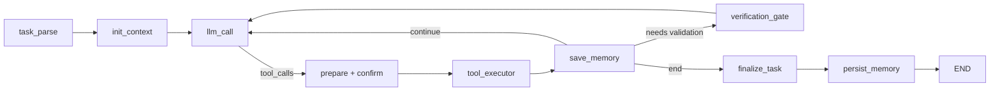

---

## Z8. 第一批节点：任务从 pending 进入 running

### 源码位置

- `enterprise_agent/core/agent/nodes.py:task_parse_node`
- `enterprise_agent/core/agent/nodes.py:init_context_node`
- `enterprise_agent/core/agent/nodes.py:plan_task_node`

### 关键代码块一：解析任务

```python
async def task_parse_node(state):
    request = (
        state.get("current_user_request")
        or _last_user_request(state.get("messages", []))
    )
    return {
        "current_user_request": request,
        "task_status": transition_task_status(
            state.get("task_status"),
            TaskStatus.RUNNING,
        ),
        "execution_phase": ExecutionPhase.PARSING.value,
        "current_task": {
            "request": request[:10000],
            "trace_id": state.get("trace_id", ""),
        },
    }
```

关键不是自然语言解析算法，而是：

- 为旧 checkpoint 提供从 messages 回退提取 request 的能力；
- 用状态机完成 `pending → running`；
- 把本轮任务和整个 session 分开。

### 关键代码块二：初始化本轮临时字段

```python
result = {
    "task_token_count": 0,
    "pending_tool_calls": [],
    "tool_execution_records": [],
    "tool_call_count": 0,
    "round_count": 0,
    "changed_files": [],
    "validation_results": [],
    "verification_attempts": 0,
    "retrieved_memory_context": "",
}
```

这些字段必须每个用户任务重新开始；否则上一个任务修改过文件或消耗过工具，会污染下一次任务。

`session_token_count` 是例外：旧会话需要继续累计，而不是每个任务归零。

### 关键代码块三：召回长期记忆

```python
if settings.ENABLE_LONG_TERM_MEMORY and user_id and current_request:
    memory = get_long_term_memory(user_id)
    pattern_candidates = await memory.search_patterns(query=current_request)
    conversation_candidates = await memory.search_conversations(
        query=current_request,
        role="task_summary",
    )
```

完整源码还会：

- 判断是否在问“你记得我什么”；
- 过滤 Legacy/disabled 内容；
- 记录候选、排名、过滤原因和注入 token；
- 把通过的内容写进 `retrieved_memory_context`；
- 召回失败时只记 Trace，不让主任务失败。

### `plan_task_node` 容易被误解

```python
async def plan_task_node(state):
    return {"execution_phase": ExecutionPhase.PLANNING.value}
```

它只是显式标记 planning 阶段。这里没有独立 Planner 模型，真正的计划仍由后面的主模型决定，并可通过 `todo_update` 持久化为工作清单。

---

## Z9. 调模型前：压缩旧工具输出，动态绑定可用工具

### 源码位置

- `enterprise_agent/core/agent/nodes.py:pre_llm_microcompact_node`
- `enterprise_agent/core/agent/nodes.py:get_llm_with_tools`
- `enterprise_agent/core/agent/llm_factory.py:get_llm`

### 关键代码块一：microcompact

```python
report = ctx_mgr.microcompact_with_report(
    messages,
    keep_last=settings.MICROCOMPACT_KEEP_LAST,
    trace_id=state.get("trace_id"),
    user_id=state.get("user_id"),
)
return {
    "messages": report["changed_messages"],
    "token_count": report["tokens_after"],
}
```

它不调用模型总结，只缩减旧工具大输出，保留近期对话骨架。节点只返回
带原 message ID 的变更项，由 `add_messages` 原位更新，不会重复追加。

> [!NOTE]
> 旧工具正文只有在真实 artifact 已落盘时才会被替换。如果写入失败，
> 节点保留原消息并记录 error Trace，不生成虚假的恢复路径。

### 关键代码块二：权限决定模型能看见什么

```python
allowed_tools = get_tools_for_permissions(
    permissions or [],
    enable_multi_agent=(
        execution_mode == "multi_agent"
        and settings.ENABLE_MULTI_AGENT
    ),
)
llm_with_tools = get_llm().bind_tools(allowed_tools)
```

这是第一道工具权限：

```text
权限列表
  → 过滤工具
  → bind_tools
  → 模型只能从允许集合中选择
```

executor 之后还会再检查一次。两次检查不是重复：

- bind 阶段减少模型误选；
- execute 阶段防止伪造工具名、旧 checkpoint 或框架异常绕过。

### Provider 选择

```python
providers = {
    "anthropic": _get_anthropic_llm,
    "glm": lambda: _get_openai_compatible_llm("glm"),
    "deepseek": _get_deepseek_llm,
    "openai": lambda: _get_openai_compatible_llm("openai"),
    "mimo": _get_mimo_llm,
}
return providers[settings.LLM_PROVIDER.lower()]()
```

Agent 节点不需要知道具体 SDK。它只依赖 LangChain 的统一 ChatModel 接口。

---

## Z10. `llm_call_node`：模型只产生“文本”或“工具申请”

### 源码位置

- `enterprise_agent/core/agent/nodes.py:llm_call_node`

### 关键代码块一：预算先于模型调用

```python
if session_tokens_used >= settings.SESSION_TOKEN_BUDGET:
    budget_scope = "Session"
elif task_tokens_used >= settings.TASK_TOKEN_BUDGET:
    budget_scope = "Task"

if budget_scope:
    return {
        "messages": [{"role": "assistant", "content": failure_reason}],
        "pending_tool_calls": [],
        "should_end_after_save": True,
        "task_status": transition_task_status(..., TaskStatus.FAILED),
    }
```

超预算后不会“再调用一次模型让它总结”。否则预算限制本身会被最后一次调用突破。

### 关键代码块二：构造唯一系统提示

```python
lc_messages = _convert_to_langchain_messages(messages)
lc_messages.insert(
    0,
    SystemMessage(content=_build_runtime_system_prompt(state)),
)
```

这里组合：

- 固定 Agent 行为规范；
- 当前运行环境；
- 可用 Skill；
- Single/Multi 模式约束；
- 本轮临时召回的长期记忆。

召回内容由 `_build_runtime_system_prompt()` 作为参考数据合并到唯一
`SystemMessage`，不伪装成新的 `HumanMessage`。它也不直接写回
`messages`，避免进入 checkpoint 后在未来每一轮永久重复。系统提示同时
声明，记忆中的历史 `[User Request]` 只是证据，不是当前或“上一条”待执行请求。

### 关键代码块三：调用和重试

```python
for attempt in range(MAX_LLM_RETRIES):
    try:
        response = await get_llm_with_tools(...).ainvoke(lc_messages)
        break
    except Exception as exc:
        error_msg = str(exc).lower()
        non_retryable = any(
            code in error_msg
            for code in ("401", "403", "400", "404", "invalid", "unauthorized")
        )
        if non_retryable or attempt == MAX_LLM_RETRIES - 1:
            raise
        await asyncio.sleep(RETRY_BASE_DELAY * (2 ** attempt))
```

401、403、400、404 等永久错误不会盲目重试；网络波动等瞬时错误才指数退避。

### 关键代码块四：把工具申请写入 State

```python
tool_calls = [
    {
        "id": tc.get("id", ""),
        "name": tc.get("name", ""),
        "args": tc.get("args", {}),
    }
    for tc in response.tool_calls
]

return {
    "messages": [response_dict],
    "pending_tool_calls": tool_calls,
    "task_token_count": task_token_count,
    "session_token_count": session_token_count,
    "round_count": round_count,
    "should_end_after_save": not tool_calls,
}
```

### 最关键的认知

模型没有在这里直接读写文件。

```text
模型输出：
{
  "name": "read_file",
  "args": {"path": "calculator.py"}
}

这只是申请，不是执行结果。
```

真正执行要经过后面的权限、风险、确认和 executor。

---

## Z11. 模型之后怎样分流：`route_after_llm`

### 源码位置

- `enterprise_agent/core/agent/nodes.py:route_after_llm`

### 关键代码块

```python
if state.get("task_status") == TaskStatus.FAILED.value:
    return "save_memory"

if state.get("pending_tool_calls"):
    return "tool_call"

if state.get("round_count", 0) >= settings.MAX_AGENT_ROUNDS:
    return "save_memory"

if state.get("token_count", 0) >= get_context_manager().token_threshold:
    return "compress"

return "save_memory"
```

### 判断顺序为什么不能随便换

`pending_tool_calls` 必须早于轮次上限：

```text
模型最后一轮已经产生 tool_use
如果先因 round_count 结束
  → tool_use 没有对应 tool_result
  → Provider 消息协议被破坏
```

因此即使刚好达到最大轮次，也要先让已经产生的工具申请得到成功、失败、拒绝或拦截结果。

---

## Z12. ToolContract：在执行前给每个工具一份平台规则

### 源码位置

- `enterprise_agent/core/agent/tools/contracts.py:ToolContract`
- `enterprise_agent/core/agent/tools/contracts.py:TOOL_CONTRACTS`
- `enterprise_agent/core/agent/tools/__init__.py:get_tools_for_permissions`

### 关键代码块

```python
@dataclass(frozen=True)
class ToolContract:
    name: str
    risk: RiskLevel
    timeout_seconds: int
    max_retries: int = 0
    idempotent: bool = False
    requires_confirmation: bool = False
    side_effect: str = "none"
```

例如：

```python
"read_file": safe + idempotent
"write_file": review + confirmation + filesystem_write
"delete_paths": dangerous + confirmation + filesystem_delete
"bash": review + confirmation + process
```

### 每个字段解决什么问题

| 字段 | 平台问题 |
|---|---|
| `risk` | UI、Trace 和策略如何描述风险 |
| `timeout_seconds` | 工具挂住多久必须终止 |
| `max_retries` | 最多重试几次 |
| `idempotent` | 重放是否可能重复副作用 |
| `requires_confirmation` | 是否进入 HITL |
| `side_effect` | 是否修改文件、进程或 Agent 状态 |

### 参数级风险

同一个 `bash` 不能永远是同一风险：

```text
pytest -q                → safe
git commit ...           → review
rm -rf ...               → dangerous，交给 Shell 硬策略拦截
```

`tool_requires_confirmation()` 对 Shell 的策略是：

```python
if tool_name in {"bash", "background_run"}:
    return resolve_tool_risk(tool_name, tool_args) == RiskLevel.REVIEW
```

dangerous Shell 不弹出“批准后执行”的按钮，而是继续到 executor，由 `validate_command()` 硬拦截。批准权不能覆盖平台不可执行策略。

---

## Z13. HITL：先把状态写成 waiting，再调用 `interrupt()`

### 源码位置

- `enterprise_agent/core/agent/nodes.py:prepare_tool_execution_node`
- `enterprise_agent/core/agent/nodes.py:tool_confirm_node`

### 关键代码块一：提前写等待状态

```python
needs_confirmation = any(
    tool_requires_confirmation(call["name"], call.get("args", {}))
    for call in registered_pending
)

if needs_confirmation:
    return {
        "task_status": transition_task_status(
            state.get("task_status"),
            TaskStatus.WAITING_CONFIRMATION,
        ),
        "confirmation_deadline": deadline.isoformat(),
    }
```

必须在 `interrupt()` 之前返回这次更新。这样 checkpoint 对外显示：

```text
task_status = waiting_confirmation
pending_tool_calls = [...]
confirmation_deadline = ...
```

### 关键代码块二：真正暂停

```python
user_response = interrupt({
    "type": "tool_confirmation",
    "tools": tool_descriptions,
    "deadline": state.get("confirmation_deadline"),
})
```

第一次执行到这里时：

- 节点暂停；
- LangGraph 保存 checkpoint；
- `graph.astream()` 产生 `__interrupt__` update；
- 当前 SSE 返回 `interrupt` 事件。

恢复后，同一个节点从头重放；这次 `interrupt()` 返回 `Command(resume=...)` 携带的数据。

### 关键代码块三：批准或拒绝

批准：

```python
return {
    "pending_tool_calls": approved_calls,
    "task_status": transition_task_status(..., TaskStatus.RUNNING),
    "confirmation_deadline": None,
}
```

拒绝：

```python
return {
    "pending_tool_calls": [],
    "messages": [
        {
            "role": "tool",
            "content": "Tool execution rejected by user.",
            "tool_call_id": tool_id,
        },
        {
            "role": "user",
            "content": "<tool_rejected>...modify your approach...</tool_rejected>",
        },
    ],
}
```

拒绝不一定让任务失败。Agent 可以收到拒绝结果后选择只读方案、缩小操作范围，或向用户解释无法继续。

### 为什么每个 tool_use 都必须有 tool_result

许多模型 Provider 要求消息协议严格成对：

```text
assistant tool_use(id=abc)
tool tool_result(tool_call_id=abc)
```

所以即使拒绝，也要补一条 tool result；不能只清空 `pending_tool_calls`。

---

## Z14. 恢复：`Command(resume=...)` 从 checkpoint 继续

### 源码位置

- `enterprise_agent/api/routes/chat.py:chat_stream_resume`

### 关键代码块

```python
await _require_owned_session(session_id, user_id, db)
config = {"configurable": {"thread_id": session_id}}

snapshot = await graph.aget_state(config)
trace_id = snapshot.values.get("trace_id")
if not trace_id:
    raise HTTPException(
        status_code=409,
        detail="The interrupted task checkpoint has expired and cannot be resumed.",
    )

resume_payload = {
    "approved": approved and not confirmation_expired,
    "approved_ids": approved_ids or [],
}

graph.astream(
    Command(resume=resume_payload),
    config=config,
    stream_mode=["messages", "updates"],
)
```

### 逐句解析

1. 恢复前重新检查 session 归属；旧页面不能替其他用户恢复任务。
2. 相同 `thread_id` 找回原 Redis checkpoint。
3. checkpoint 已过期时返回 409，而不是凭请求参数重新执行工具。
4. 后端重新计算是否超时，不能信任客户端声称“我在截止前点了批准”。
5. `Command(resume=...)` 把决定交回暂停的 `interrupt()`。

### 恢复不是重新发起任务

```text
错误理解：
resume → 再次调用 /chat/stream → 新建 trace

真实实现：
resume → 同一 thread_id 的 checkpoint
       → 同一 trace_id
       → 继续暂停节点
```

---

## Z15. Executor：平台最终决定工具是否真的执行

### 源码位置

- `enterprise_agent/core/agent/nodes.py:tool_executor_node`
- `enterprise_agent/core/agent/tools/workspace.py:resolve_path`
- `enterprise_agent/core/agent/tools/file_ops.py:_atomic_write_text`
- `enterprise_agent/core/agent/tools/shell.py:validate_command`
- `enterprise_agent/core/agent/tools/shell.py:bash`

### 关键代码块一：第二次权限检查

```python
all_tool_map = {tool.name: tool for tool in ALL_TOOLS}
allowed_tools = get_tools_for_permissions(state.get("permissions", []), ...)
tool_map = {tool.name: tool for tool in allowed_tools}

if tool_name not in all_tool_map:
    error_code = "unknown_tool"
elif tool_name not in tool_map:
    error_code = "permission_denied"
```

未知工具和无权限工具都会形成规范化失败记录，并写入 Trace；它们不会导致 KeyError 后整图崩溃。

### 关键代码块二：工具预算

```python
tool_call_count += 1
if tool_call_count > settings.MAX_TOOL_CALLS_PER_TASK:
    task_status = transition_task_status(task_status, TaskStatus.FAILED)
    failure_reason = "Tool-call budget exhausted ..."
```

次数由平台计数，不采用模型在最终回答里自报的数字。

### 关键代码块三：超时和有限重试

```python
result = await asyncio.wait_for(
    tool.ainvoke(tool_input),
    timeout=contract.timeout_seconds,
)
```

```python
if attempt < max_attempts - 1 and _should_retry_tool(tool_name, exc):
    await asyncio.sleep(delay)
```

只有幂等只读工具遇到可恢复错误才自动重试。`write_file`、`bash` 等副作用工具不会因为异常而盲目执行第二遍。

### 关键代码块四：Workspace 路径

```python
workdir = get_user_workspace(user_id).resolve()
resolved = (workdir / path).resolve()

if not resolved.is_relative_to(workdir):
    raise ValueError(f"Path escapes workspace: {path}")
```

先规范化，再判断是否仍在用户 Workspace 内，能够拦住：

```text
../../etc/passwd
workspace/subdir/../../../secret
指向 Workspace 外部的路径
```

### 关键代码块五：文件原子写入

```python
with NamedTemporaryFile(dir=path.parent, delete=False) as handle:
    handle.write(content)
    handle.flush()
    os.fsync(handle.fileno())

os.replace(temp_name, path)
```

不是直接对目标文件覆盖写。进程在写到一半时崩溃，原文件仍保持完整；只有临时文件完整落盘后才原子替换。

### 关键代码块六：Shell 硬策略

```python
error = validate_command(command)
if error:
    return {
        "stderr": error,
        "exit_code": 1,
        "error_code": "policy_blocked",
    }

subprocess.run(
    command,
    cwd=get_user_workspace(),
    timeout=settings.COMMAND_TIMEOUT_SECONDS,
    env=_safe_subprocess_environment(workdir),
)
```

`validate_command()` 拦截路径穿越、敏感路径、`rm`、inline code、危险 Git、命令替换等；执行环境不继承模型/API 凭据。

### 关键代码块七：形成统一结果

```python
final_record = normalize_tool_result(
    tool_name=tool_name,
    tool_call_id=tool_id,
    raw_result=result,
    duration_ms=duration_ms,
    attempt_count=attempt + 1,
)
execution_records.append(final_record.to_dict())
```

最终 State 不只保存一段字符串，而是保存：

```text
tool_name / tool_call_id / status / ok / output
duration_ms / attempt_count / error_code / exit_code
```

这是 Trace、指标、验证门和失败诊断的共同证据源。

---

## Z16. 从工具结果回到模型：让 Agent 观察并继续

### 源码位置

- `enterprise_agent/core/agent/nodes.py:tool_executor_node`
- `enterprise_agent/core/agent/nodes.py:route_after_tool`

### 关键代码块一：把工具结果变成消息

```python
tool_result_messages.append({
    "role": "tool",
    "content": result,
    "tool_call_id": tool_id,
})

return {
    "messages": tool_result_messages,
    "pending_tool_calls": [],
    "tool_execution_records": execution_records,
    "changed_files": sorted(changed_files),
    "validation_results": validation_results,
}
```

这一步完成 Agent 最基本的闭环：

```text
模型提出动作
  → 平台执行
  → 工具输出进入 messages
  → 下一轮模型观察结果
  → 决定下一步
```

### 修改和验证证据怎样被识别

```python
if final_record.ok and tool_name in {"write_file", "edit_file"}:
    changed_files.add(tool_input["path"])

if tool_name == "bash" and _is_validation_command(tool_input["command"]):
    validation_results.append({
        "command": tool_input["command"],
        "ok": final_record.ok,
        "exit_code": final_record.exit_code,
    })
```

对于贯穿任务，State 可能依次变成：

```text
read_file(calculator.py)
  changed_files = []

edit_file(calculator.py)
  changed_files = ["calculator.py"]

bash("pytest -q tests/test_calculator.py")
  validation_results = [{"ok": true, ...}]
```

### `route_after_tool` 的关键分支

```python
if task_status in {"failed", "cancelled"}:
    return "end"

if should_end_after_save:
    if _needs_verification(state) and attempts < max_attempts:
        return "verify"
    return "end"

if should_compress:
    return "manual_compress"

return "llm_call"
```

只要任务还未结束，默认重新进入 `pre_microcompact`。
`route_after_microcompact` 会用重算后的活动上下文 token 估算做二次判断：
若微压缩已足够，进入 `llm_call`；若仍达有效阈值，才进入
`compress_context`。这既保证廉价清理先于摘要模型调用，也形成真正的多轮
Agent 循环，而不是单次 Function Calling。

---

## Z17. 验证门：模型说“修好了”为什么还不能 succeeded

### 源码位置

- `enterprise_agent/core/agent/nodes.py:_needs_verification`
- `enterprise_agent/core/agent/nodes.py:verification_gate_node`
- `enterprise_agent/core/agent/nodes.py:finalize_task_node`

### 关键代码块一：判断是否缺验证

```python
def _needs_verification(state):
    code_changes = any(
        _is_code_file(path)
        for path in state.get("changed_files", [])
    )
    return code_changes and not _has_successful_validation(state)
```

只有改动代码文件且没有任何成功验证时才进入 gate。纯解释任务或只改普通文本不会被强制要求跑测试。

### 关键代码块二：把验证要求重新送回模型

```python
return {
    "execution_phase": ExecutionPhase.VALIDATING.value,
    "verification_attempts": attempts,
    "should_end_after_save": False,
    "messages": [{
        "role": "user",
        "content": (
            "<verification-required>"
            "Code files were modified, but no successful validation is recorded. "
            "Run the narrowest relevant test, build, lint, or compile command now."
            "</verification-required>"
        ),
    }],
}
```

注意这里不是平台替 Agent 随便运行全量测试，而是要求模型根据仓库选择最窄、最相关的验证。

### 关键代码块三：最终收口

```python
elif state.get("execution_mode") == "multi_agent" and not successful_delegate:
    final_status = FAILED
elif _needs_verification(state):
    final_status = FAILED
else:
    final_status = SUCCEEDED
```

因此成功至少需要满足：

- 没有进入 failed/cancelled；
- 没耗尽轮次；
- Multi 模式确实有成功委派；
- 代码变更确实有成功验证。

### 真实失败恢复

如果第一次 pytest 失败：

```text
validation_results += [{ok: false, exit_code: 1}]
  → 工具结果返回模型
  → 模型读取断言和 traceback
  → 再次 edit_file
  → 再次 pytest
  → validation_results += [{ok: true, exit_code: 0}]
  → 最终允许 succeeded
```

失败过一次并不可怕；无法观察失败、无法继续修复、没有最终成功证据才是可靠性问题。

---

## Z18. 任务结束：Trace、长期记忆和 MySQL 各保存什么

### 源码位置

- `enterprise_agent/core/agent/nodes.py:finalize_task_node`
- `enterprise_agent/core/agent/nodes.py:persist_memory_node`
- `enterprise_agent/observability/trace_store.py`
- `enterprise_agent/api/routes/chat.py:chat_stream`
- `enterprise_agent/api/services/chat_history.py:update_assistant_message`

### 关键代码块一：终态

```python
return {
    "task_status": final_status,
    "execution_phase": ExecutionPhase.SUMMARIZING.value,
    "task_finished_at": _utc_now_iso(),
    "failure_reason": failure_reason,
    "todos": terminalize_open_work_items(state, final_status),
}
```

失败或取消时，仍在 pending/in_progress 的 Todo 和本轮创建的持久任务会被收口，避免界面长期显示“执行中”。

### 关键代码块二：长期记忆只在终态后评估

```python
task_context = {
    "task_status": state.get("task_status"),
    "tool_execution_records": state.get("tool_execution_records", []),
    "changed_files": state.get("changed_files", []),
    "validation_results": state.get("validation_results", []),
    "trace_id": state.get("trace_id"),
}

_schedule_memory_flush(
    accumulator_state,
    task_context,
)
```

`save_memory_node` 只是积累当前任务内容；`persist_memory_node` 才在任务终态后把权威证据交给准入策略。失败、取消或一次性噪声不应自动成为长期知识。

### 关键代码块三：SSE finally 持久化助手正文

```python
finally:
    await _persist_stream_segment(
        message_id=assistant_message_id,
        user_id=user_id,
        content="".join(assistant_parts) + assistant_suffix,
        status=assistant_status,
    )
    _cancel_events.pop(session_id, None)
    await quota_lease.release()
```

`finally` 保证：

- 正常完成写 `completed`；
- HITL 暂停写 `interrupted`；
- 用户取消写 `cancelled`；
- 异常写 `failed`；
- 并发额度租约一定尝试释放。

### 三类持久数据最终分工

| 位置 | 保存什么 | 生命周期 |
|---|---|---|
| MySQL | 用户可见会话和聊天正文 | 长期、可列表 |
| Redis checkpoint | LangGraph State、待确认工具、下一节点 | 有 TTL、用于恢复 |
| Chroma | 通过准入的可复用偏好/任务经验 | 长期、可召回 |
| JSON Trace | 节点、模型、工具、HITL、耗时、token、错误 | 当前单进程审计基线 |

---

## Z19. 用一张状态表跟踪完整修复任务

不要只看最终回答。按节点观察 State：

| 时刻 | 节点 | 关键字段 |
|---|---|---|
| T0 | `_task_input` | `pending`、只有用户消息 |
| T1 | `task_parse` | `running`、保存 `current_task` |
| T2 | `init_context` | 计数归零、恢复 session 累计 token、召回记忆 |
| T3 | 第一次 `llm_call` | 申请 `read_file` |
| T4 | `tool_executor` | 文件内容成为 tool message |
| T5 | 第二次 `llm_call` | 申请读取测试或运行 pytest |
| T6 | pytest 失败 | `validation_results[-1].ok=false` |
| T7 | 第三次 `llm_call` | 根据失败信息申请 `edit_file` |
| T8 | `prepare_tool_execution` | `waiting_confirmation` |
| T9 | 用户批准/resume | 回到 `running` |
| T10 | `tool_executor` | `changed_files=["calculator.py"]` |
| T11 | 第四次 `llm_call` | 申请最窄 pytest |
| T12 | pytest 成功 | `validation_results[-1].ok=true` |
| T13 | 最后一次 `llm_call` | 返回文字总结，没有 tool call |
| T14 | `finalize_task` | `succeeded` |
| T15 | `persist_memory` | 将终态证据交给准入策略 |
| T16 | SSE finally | MySQL 助手消息完成、额度租约释放 |

这个表就是面试中回答“Agent 如何完成闭环”的骨架。

---

## Z20. 真正调试时的后端断点线路

第一次不要打几十个断点。按下面顺序跑一遍：

| 顺序 | 断点函数 | 你要观察什么 |
|---:|---|---|
| 1 | `chat_stream` | user、permissions、session、trace |
| 2 | `_task_input` | 第一份 State 是否完整 |
| 3 | `task_parse_node` | pending 是否合法转 running |
| 4 | `init_context_node` | 临时字段是否重置，记忆是否注入 |
| 5 | `llm_call_node` | 输入消息、可用工具、tool_calls |
| 6 | `route_after_llm` | 为什么进入 tool_call/save/compress |
| 7 | `prepare_tool_execution_node` | 风险和 waiting 状态 |
| 8 | `tool_confirm_node` | interrupt 前后返回值 |
| 9 | `tool_executor_node` | 权限、contract、原始结果、规范化记录 |
| 10 | `route_after_tool` | 为什么继续、验证或结束 |
| 11 | `verification_gate_node` | changed_files 和 validation_results |
| 12 | `finalize_task_node` | 最终状态和失败原因 |
| 13 | `persist_memory_node` | 准入证据是否来自终态 |
| 14 | `chat_stream.generate().finally` | MySQL 状态和租约是否收口 |

### 不调用外部模型也能练习

1. 阅读 `tests/core/test_graph.py`，手画图边。
2. 阅读 `tests/core/execution/test_state_machine.py`，列出所有非法迁移。
3. 阅读 `tests/core/tools/test_contracts.py`，解释为什么危险 Shell 不可批准。
4. 阅读 `tests/core/tools/test_workspace.py`，构造三个路径穿越输入。
5. 阅读 `tests/core/execution/test_lifecycle_nodes.py`，复述验证门怎样阻止虚假成功。
6. 用 Platform benchmark 跑确定性流程：

```bash
uv run python -m benchmarks.run \
  --backend platform \
  --mode single \
  --no-artifacts
```

---

# 第一部分：先看懂整个项目

## 1. 项目解决什么问题

普通聊天应用大致是：

```text
用户输入 → 调用模型 → 返回文本
```

Coding Agent 多了真实副作用：

- 读取企业代码；
- 写入和删除文件；
- 运行 Shell、测试、构建；
- 保存上下文和长期记忆；
- 暂停等待人工确认；
- 失败后恢复；
- 让管理员审计发生过什么。

因此，本项目的核心价值不是“多调几个工具”，而是建立一个服务端控制面：

```text
模型负责：理解、推理、规划、选择工具、综合结果
平台负责：身份、权限、Workspace、风险、确认、执行、恢复、Trace、预算
```

如果把模型比作一名远程工程师，平台更像门禁、操作台、审计系统和施工规范的组合。工程师可以申请操作，但不能自己拆掉门禁。

### 1.1 与个人本机 Coding Agent 的区别

| 问题 | 个人本机工具 | 本项目 |
|---|---|---|
| 谁使用 | 单个开发者 | 多个内网用户 |
| 文件边界 | 通常是本机目录 | 每用户独立 Workspace |
| 身份 | 操作系统用户 | JWT + MySQL 实时角色 |
| 高风险操作 | 本机提示或全局信任 | 参数级风险 + HITL + 执行器硬拦截 |
| 恢复 | 本地会话 | Redis LangGraph checkpoint |
| 对话正文 | 本地记录 | MySQL 持久化 |
| 长期记忆 | 产品自行决定 | Chroma 准入、隔离、召回回执 |
| 审计 | 日志为主 | 统一 Trace 与指标 |

### 1.2 学完后你应该能回答

- 为什么不能只靠系统提示告诉模型“不要做危险操作”？
- 为什么 Coding Agent 的成功必须包含可执行验证？
- 为什么企业内网项目仍然需要权限、脱敏和审计？

---

## 2. 四层心智模型

先把项目压缩成四层：

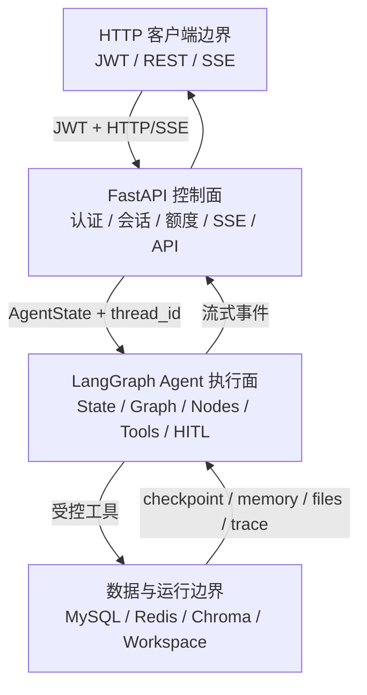

### 2.1 HTTP 客户端边界

负责：

- 携带 JWT 发起请求；
- 发送用户消息和执行模式；
- 消费 SSE 增量、工具和中断事件；
- 提交批准、拒绝、恢复或取消。

本文不展开任何前端组件。后端只信任经过认证、归属校验和策略校验的请求，不依赖客户端展示状态作为任务事实。

### 2.2 FastAPI 控制面

负责：

- 验证用户；
- 校验会话归属；
- 判断 Single/Multi 是否允许；
- 检查额度；
- 创建 Trace；
- 构造 AgentState；
- 启动或恢复 LangGraph；
- 把图事件转换为 SSE；
- 持久化聊天正文。

核心源码：

- `enterprise_agent/api/main.py`
- `enterprise_agent/api/middleware/auth.py`
- `enterprise_agent/api/routes/chat.py`
- `enterprise_agent/api/services/chat_history.py`

### 2.3 LangGraph Agent 执行面

负责：

- 维护任务状态；
- 组织模型和工具循环；
- 暂停等待确认；
- 控制轮次、工具和 token；
- 强制修改后验证；
- 形成真实终态；
- 触发长期记忆准入。

核心源码：

- `enterprise_agent/core/agent/state.py`
- `enterprise_agent/core/agent/graph.py`
- `enterprise_agent/core/agent/nodes.py`
- `enterprise_agent/core/execution/state_machine.py`
- `enterprise_agent/core/agent/tools/`

### 2.4 数据与运行边界

负责：

- MySQL：用户、会话、聊天正文、额度、管理员审计；
- Redis：LangGraph checkpoint 和临时恢复数据；
- Chroma：经过治理的长期记忆；
- Workspace：用户代码、任务板、Trace、恢复删除区。

### 2.5 最重要的阅读原则

先按下面顺序阅读：

```text
入口 → 请求 → State → Graph → Nodes → Tools → HITL → 验证 → Trace/Memory
```

暂时跳过：

- 管理员路由的每个 CRUD；
- `team.py` 的完整消息总线细节；
- Chroma 的每个查询辅助函数；
- CSS 和视觉样式。

这些内容不是不重要，而是不属于第一次理解主链路的关键路径。

---

## 3. 仓库地图

```text
enterprise-controlled-coding-agent/
├── enterprise_agent/
│   ├── api/                    # FastAPI 控制面
│   ├── core/
│   │   ├── agent/              # AgentState、Graph、Nodes、Tools、LLM
│   │   └── execution/          # 七态任务状态机与 Redis 暂停控制
│   ├── memory/                 # 长期记忆准入、召回、衰减
│   ├── observability/          # Trace 存储与指标
│   ├── auth/                   # JWT、权限和邮件
│   ├── models/                 # SQLAlchemy 模型
│   ├── admin/                  # 额度、审计、Shared Skill
│   └── db/                     # MySQL、Redis、Chroma 初始化
├── tests/                      # 后端回归
├── benchmarks/                 # Platform / Memory / Agent 评测
├── migrations/                 # Alembic 迁移
├── docker/                     # Compose、API 与网关镜像
├── shared_skills/              # 内置共享 Skill
└── docs/                       # 当前文档和历史开发日志
```

### 3.1 一条最短阅读路径

如果你只有两小时，按这个顺序：

1. `config/settings.py`
2. `api/main.py`
3. `api/routes/chat.py` 中 `_task_input()` 与 `chat_stream()`
4. `core/agent/state.py`
5. `core/execution/state_machine.py`
6. `core/agent/graph.py`
7. `core/agent/nodes.py` 中 `llm_call_node()`、`tool_executor_node()` 和两个 route
8. `core/agent/tools/contracts.py`
9. `core/agent/tools/workspace.py`
10. `observability/trace_store.py`

---

# 第二部分：从启动入口开始

## 4. Python 进程从哪里启动

源码定位：

- `pyproject.toml`
- `enterprise_agent/api/main.py`

`pyproject.toml` 定义：

```toml
[project.scripts]
serve = "enterprise_agent.api.main:run"
```

因此：

```text
uv run serve
  → 导入 enterprise_agent.api.main
  → 调用 run()
  → uvicorn 启动 FastAPI app
```

`run()` 只负责启动 Uvicorn。真正的依赖初始化在 FastAPI `lifespan()` 中完成。

### 4.1 lifespan 启动顺序

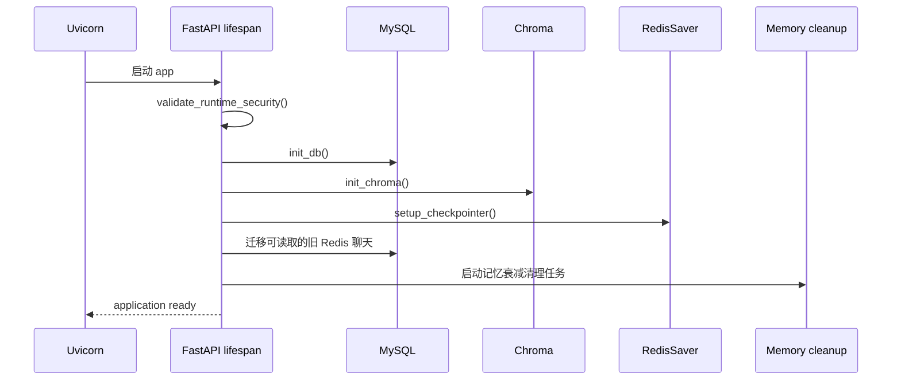

主要步骤：

1. 检查生产安全配置，拒绝默认 JWT 密钥等危险配置；
2. 初始化 MySQL；
3. 初始化 Chroma 和本地 embedding；
4. 初始化 Redis LangGraph checkpointer；
5. 尝试把仍可读取的旧 checkpoint 消息迁移到 MySQL；
6. 启动长期记忆清理任务；
7. 注册关闭时的 flush、连接池释放和清理任务取消。

### 4.2 路由注册

`api/main.py` 注册：

- `/auth/*`
- `/admin/*`
- `/chat/*`
- `/sessions/*`
- `/workspace/*`
- `/memory/*`
- `/tasks/*`

这里要建立一个认识：**FastAPI 路由是 Agent 外面的控制边界。** LangGraph 不应该自己决定当前用户是谁，也不应该自己从请求头读取 JWT。

### 4.3 输入、输出与失败

| 项目 | 内容 |
|---|---|
| 输入 | `.env`、Settings、数据库和 Redis/Chroma 配置 |
| 输出 | 可提供 HTTP/SSE 的 FastAPI app |
| 典型失败 | 默认生产密钥、MySQL 不可达、Redis checkpointer 初始化失败、embedding 缓存缺失 |
| 健康证据 | `/health` 实际查询 MySQL 和 Redis |

### 4.4 对应测试

- `tests/config/test_settings.py`
- `tests/smoke/test_local_baseline.py`
- `scripts/smoke_test.py`
- `scripts/docker_smoke_test.sh`

### 4.5 学完后你应该能回答

- `uv run serve` 最后调用了哪个函数？
- FastAPI app 能导入，是否等于 MySQL、Redis、模型都可用？
- 为什么 runtime security 放在 lifespan，而不是模块导入时直接执行？

---

## 5. 后端 HTTP/SSE 边界

本文从 FastAPI 接收到请求的位置开始，不分析客户端实现。后端公开三类与主任务直接相关的操作：

| 操作 | 后端入口 | 作用 |
|---|---|---|
| 启动任务 | `POST /chat/stream` | 建立任务、运行 Graph、输出 SSE |
| 恢复任务 | `POST /chat/stream/resume` | 用同一 checkpoint 继续 HITL |
| 取消任务 | `POST /chat/stream/cancel` | 停止活动流或清理中断状态 |

### 5.1 Docker/Nginx 下的请求

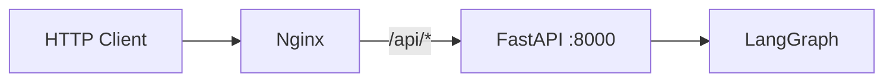

Nginx 要为 SSE 关闭不合适的代理缓冲，否则模型虽然持续输出，客户端却可能长时间收不到增量。安全事实仍由 FastAPI、LangGraph checkpoint 和 Trace 决定，而不是由客户端是否显示某个状态决定。

### 5.2 学完后你应该能回答

- 为什么外部客户端不能直接调用文件工具？
- 为什么刷新后聊天应从 MySQL 恢复，而不是依赖 Redis？
- `interrupt` SSE 事件和普通文本 delta 有什么区别？

---

# 第三部分：一次请求如何进入 Agent

## 6. 同步接口与 SSE 接口

源码定位：

- `api/routes/chat.py:chat_completion`
- `api/routes/chat.py:chat_stream`

| 接口 | 执行方式 | 适用场景 |
|---|---|---|
| `POST /chat/completions` | `graph.ainvoke()`，等待最终结果 | 简单客户端、测试、非流式调用 |
| `POST /chat/stream` | `graph.astream()`，同时监听 messages/updates | 客户端实时文本、工具状态、HITL |

两者共享：

- 模式校验；
- 会话归属；
- 额度租约；
- MySQL 聊天持久化；
- Trace；
- 相同生产 Agent Graph。

差别主要在结果怎样交付，而不是使用两套 Agent。

---

## 7. `/chat/stream` 的完整顺序

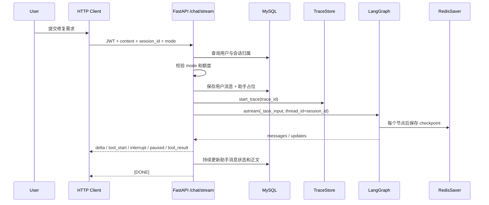

### 7.1 请求进入图之前的控制

`chat_stream()` 依次完成：

1. `_validate_request_mode()`
   检查 `single_agent` 或 `multi_agent` 是否与服务端开关、当前权限和用户自然语言意图一致。

2. `_require_owned_session()`
   supplied `session_id` 必须属于当前用户；找不到时统一返回 404，避免泄漏其他用户会话是否存在。

3. `acquire_task_quota()`
   检查日任务、日/月 token 和并发限制，并持有一个需要在所有退出路径释放的租约。

4. `_resolve_chat_session()`
   没有 session 时创建 MySQL Session；已有 session 时再次验证。

5. `_prepare_durable_turn()` 与 `start_turn()`
   把用户消息和助手占位消息写入 MySQL。

6. `_start_task_trace()`
   创建独立 `trace_id`，记录请求摘要、用户、会话和执行模式。

7. `set_current_user_id()`
   设置 ContextVar，使后续 Workspace 工具知道当前用户。

### 7.2 `_task_input()` 构造什么

它只构造一趟任务启动所需的最小状态：

```python
{
    "session_id": "...",
    "trace_id": "...",
    "user_id": 1,
    "permissions": ["tools:basic", "tools:shell"],
    "execution_mode": "single_agent",
    "current_user_request": "定位并修复减法测试",
    "task_status": "pending",
    "execution_phase": "parsing",
    "task_started_at": "...",
    "messages": [
        {"role": "user", "content": "定位并修复减法测试"}
    ],
}
```

其他字段由图中的 `init_context_node()` 初始化或从 Redis checkpoint 恢复。

### 7.3 为什么 `session_id` 也是 `thread_id`

调用图时使用：

```python
config = {"configurable": {"thread_id": session_id}}
```

RedisSaver 用 `thread_id` 找到这段对话的 Agent checkpoint。因此：

- `session_id` 是产品层会话标识；
- `thread_id` 是 LangGraph checkpoint key；
- 当前实现让二者相同，减少映射层；
- 读取或恢复 checkpoint 前仍必须先查 MySQL 会话归属。

不能因为知道一个 Redis thread ID 就允许读取它。

---

## 8. SSE 传输的不是一种事件

`graph.astream(..., stream_mode=["messages", "updates"])` 返回两类数据：

### 8.1 messages 模式

用于：

- 模型文本 token/delta；
- 模型刚产生的 tool call。

对外 SSE 事件：

| SSE | 含义 |
|---|---|
| `{"delta": "..."}` | 助手文本增量 |
| `tool_start` | 模型已经提出一个工具调用 |

### 8.2 updates 模式

用于：

- 某个节点返回了哪些状态更新；
- 是否出现 `__interrupt__`；
- `tool_executor` 形成的权威执行结果。

对外 SSE 事件：

| SSE | 含义 |
|---|---|
| `task_started` | 一趟新任务已建立，包含 trace_id |
| `interrupt` | typed `tool_confirmation` 已暂停，等待用户确认 |
| `paused` | typed `user_pause` 已在安全边界 checkpoint，可 Continue |
| `tool_result` | 规范化工具结果与摘要 |
| `tool_end` | 工具卡片终态 |
| `cancelled` | 用户主动取消 |
| `[DONE]` | 当前流正常完成 |

`tool_start` 只说明“模型申请了工具”，不说明工具成功。最终绿色/失败状态必须来自 `tool_executor` 的规范化执行记录。

### 8.3 流断开和异常

无论正常完成、中断、取消还是异常，`finally` 都会：

- 把已经生成的助手片段写入 MySQL；
- 更新消息状态；
- 清理 request-local cancellation event；
- 释放额度租约。

这类 `finally` 很重要。SSE 是长连接，如果只在成功路径结算资源，HTTP 客户端断开一次就可能泄漏并发额度。

### 8.4 对应测试

- `tests/api/test_chat_history.py`
- `tests/api/test_chat_history_persistence.py`
- `tests/api/test_chat_task_security.py`

### 8.5 学完后你应该能回答

- 为什么工具卡片不能在收到 `tool_start` 后直接显示成功？
- 为什么助手消息要先创建占位记录？
- 为什么 SSE 结束和 Agent 任务成功不是完全相同的概念？

---

# 第四部分：AgentState 与状态机

## 9. AgentState 是什么

源码定位：

- `core/agent/state.py:AgentState`

LangGraph 节点不是通过全局变量相互传递结果，而是：

```text
读取当前 state
  → 做一小步工作
  → 返回一组 state 更新
  → LangGraph 合并更新并 checkpoint
```

可以把 AgentState 理解为“这趟任务的共享白板”，但它比普通字典多两个约束：

- 字段含义必须稳定，否则旧 checkpoint 无法恢复；
- 某些字段有 reducer，决定新旧值怎样合并。

### 9.1 `messages` 为什么有 `add_messages`

定义类似：

```python
messages: Annotated[List[Dict], add_messages]
```

`add_messages` 告诉 LangGraph：

- 节点返回的新消息要追加/合并；
- 不是用一个新列表粗暴覆盖全部历史；
- LangChain 消息 ID 等语义也能被正确处理。

其他普通字段通常使用“新值覆盖旧值”。

---

## 10. State 字段分组

| 分组 | 代表字段 | 作用 |
|---|---|---|
| 身份与会话 | `session_id/user_id/permissions/execution_mode` | 决定租户、权限和模式 |
| 当前请求 | `current_user_request/current_task` | 只表示本趟任务，不依赖第一条历史消息 |
| 生命周期 | `trace_id/task_status/execution_phase/failure_reason` | 状态机和 Trace 的权威任务状态 |
| 消息 | `messages` | 用户、助手、工具及控制消息 |
| Todo/任务 | `todos/created_task_ids` | 计划和持久任务收敛 |
| 上下文 | `context_summary/token_count/transcript_path` | 压缩和恢复 |
| 工具 | `pending_tool_calls/tool_results/tool_execution_records` | 模型申请与真实执行结果 |
| 预算 | `round_count/tool_call_count/task_token_count/session_token_count` | 防止无限循环和成本失控 |
| 验证 | `changed_files/validation_results/verification_attempts` | 代码修改后强制验证 |
| HITL | `confirmation_deadline` | 确认超时 |
| 长期记忆 | `memory_accumulator/retrieved_memory_context` | 当前任务积累和临时召回 |

### 10.1 典型状态快照

模型申请修改文件、等待确认时，关键字段可能是：

```python
{
    "task_status": "waiting_confirmation",
    "execution_phase": "executing",
    "pending_tool_calls": [
        {
            "id": "call_123",
            "name": "edit_file",
            "args": {
                "path": "calculator.py",
                "old_text": "return a + b",
                "new_text": "return a - b",
            },
        }
    ],
    "confirmation_deadline": "2026-07-23T...",
    "changed_files": [],
    "validation_results": [],
}
```

注意：此时 `changed_files` 仍为空，因为工具还没有真正执行。

---

## 11. 三种容易混淆的状态

### 11.1 会话状态

MySQL `SessionStatus`：

```text
active / archived / deleted
```

它描述“一个聊天会话是否还显示和可用”。

### 11.2 Agent 任务状态

`AgentState.task_status` 使用字符串保存七种值，对应
`enterprise_agent/core/execution/state_machine.py:TaskStatus`；合法迁移由
`transition_task_status` 统一校验：

```text
pending / running / paused / waiting_confirmation / succeeded / failed / cancelled
```

它描述“一条用户请求的执行结果”。

> [!IMPORTANT]
> `paused` 表示用户 Pause 请求已在安全边界被 Agent 确认并写入
> RedisSaver checkpoint；`waiting_confirmation` 只表示敏感工具在等待
> HITL 决策。两者使用不同 typed interrupt，而 `cancelled` 仍是不可恢复终态。

### 11.3 Todo 或持久任务状态

Todo 和 `.tasks/` 任务板描述 Agent 计划中的工作项。它们不是 LangGraph 自身的运行状态。

一个 active 会话可以先后运行很多 succeeded/failed Agent 任务。不能因为某次任务 failed 就把整个会话标记 deleted。

---

## 12. 七态状态机

源码定位：

- `core/execution/state_machine.py`

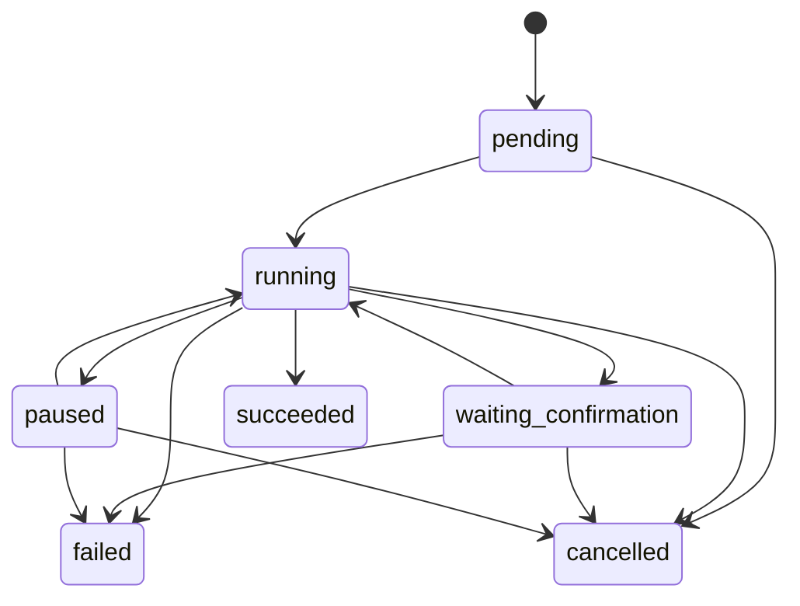

### 12.1 为什么同状态更新允许通过

LangGraph 从 interrupt 恢复时，节点可能从头重新执行。网络重试也可能让状态更新重复发生。

所以：

```text
running → running
```

应当是幂等的，而不是报错。

但：

```text
succeeded → running
```

必须拒绝，否则已结束任务可能被错误复活。

### 12.2 checkpoint 保存什么

RedisSaver 保存 AgentState 和图执行位置，所以能恢复：

- 消息；
- 待执行工具；
- 任务状态；
- token/工具计数；
- 确认 deadline；
- Todo；
- 验证记录。

它不应作为永久聊天正文来源。用户可见消息由 MySQL 保存。

### 12.3 对应测试

- `tests/core/execution/test_state_machine.py`
- `tests/core/execution/test_lifecycle_nodes.py`
- `tests/core/test_state.py`

### 12.4 学完后你应该能回答

- `waiting_confirmation` 为什么不是终态？
- 为什么 Redis checkpoint 不能代替 MySQL 聊天表？
- 一个节点恢复后重复把状态写成 running，为什么不会失败？

---

# 第五部分：LangGraph 主执行图

## 13. Graph 在哪里创建

源码定位：

- `core/agent/graph.py:build_agent_graph`
- `core/agent/graph.py:build_simple_agent_graph`
- `core/agent/graph.py:_traced_node`

生产图使用 RedisSaver；simple graph 主要用于隔离测试和 benchmark，可注入其他 checkpointer，并省略部分后台/收件箱路径。

每个节点先经过 `_traced_node()` 包装：

- 记录节点耗时和状态；
- 普通异常记录 error；
- `GraphInterrupt` 记录为正常的 `interrupted`，而不是错误；
- `finalize_task` 后结束 Trace。

---

## 14. 完整执行图

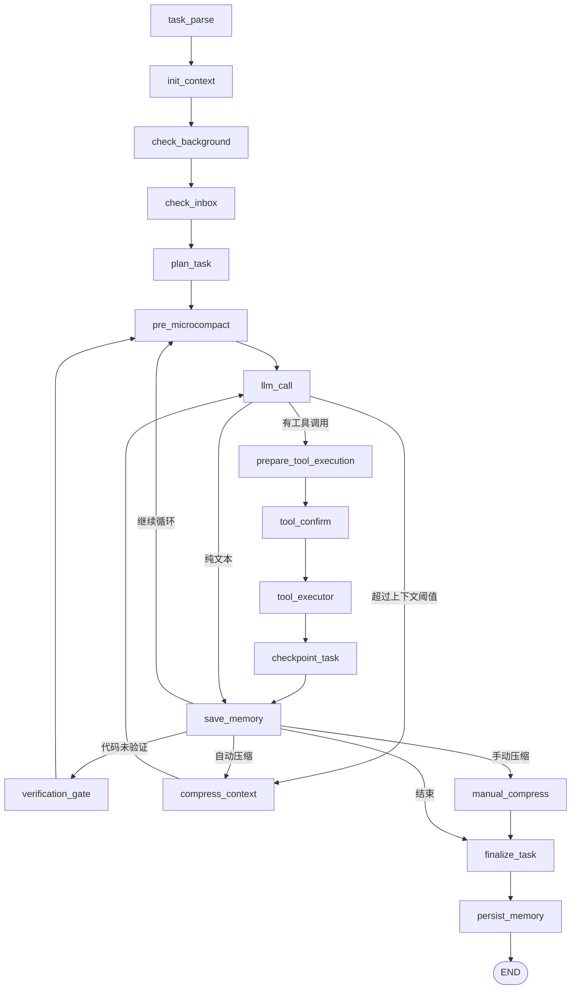

---

## 15. 节点输入输出总表

| 节点 | 主要输入 | 核心处理 | 主要输出/下一步 |
|---|---|---|---|
| `task_parse` | 请求、pending 状态 | 捕获本次请求并进入 running | `current_task`、parsing |
| `init_context` | 历史消息、用户、旧 state | 重置本任务瞬态字段、恢复 Todo、召回长期记忆 | token、工具/预算初值、memory context |
| `check_background` | session | 取走完成的后台结果 | 注入控制消息或空更新 |
| `check_inbox` | lead inbox | 取走 teammate 消息 | 注入 inbox 控制消息 |
| `plan_task` | 当前 state | 标记 planning 阶段 | phase=planning |
| `pre_microcompact` | messages | 清理旧工具大结果 | 压缩后的 messages/token |
| `llm_call` | messages、权限、memory、预算 | 绑定工具并调用模型 | 文本或 pending tool calls |
| `prepare_tool_execution` | pending calls | 预计算确认需求和 deadline | running/waiting_confirmation |
| `tool_confirm` | pending calls、resume data | interrupt 或筛选批准工具 | 可执行/拒绝后的 calls/results |
| `tool_executor` | pending calls、permissions | 执行、规范化、计数、Trace | tool results、changed files、validation |
| `checkpoint_task` | tool 后 state | 显式标记 checkpointing | phase=checkpointing |
| `save_memory` | 本轮文本/工具结果 | 累积任务级记忆素材 | accumulator |
| `verification_gate` | changed/validation | 注入必须验证的控制消息 | phase=validating |
| `compress_context` | 大上下文 | 保存 transcript 并生成摘要 | summary + 精简消息 |
| `manual_compress` | 用户主动压缩 | 保存 transcript、替换历史并继续当前 invocation | llm_call |
| `finalize_task` | 全部执行证据 | 决定 succeeded/failed/cancelled | 终态、失败原因、finished_at |
| `persist_memory` | 已终态任务 | 执行长期记忆准入和写入 | 记忆回执，END |

---

## 16. 节点逐组解析

### 16.1 `task_parse_node`

解决的问题：不用 LLM 就能确定本次任务边界。

输入：

- `current_user_request`；
- 或消息中最后一个 user/human；
- pending 任务状态。

处理：

- pending → running；
- 记录 started_at；
- 创建 `current_task` 摘要；
- 清空旧失败原因。

失败边界：非法状态迁移会被状态机拒绝。

### 16.2 `init_context_node`

这是每次任务开始最复杂的节点之一。

它做两类看似相反的事：

1. **恢复会话级上下文**：历史 messages、Todo、session token；
2. **重置任务级瞬态数据**：本任务工具结果、轮次、changed files、验证次数。

它还会：

- 按真实消息重新估算 token；
- 检索当前请求相关的 Active 长期记忆；
- 把召回内容放入 `retrieved_memory_context`；
- 记录候选、过滤和注入 Trace。

召回块不会写入 messages，因此不会被 Redis 永久反复 replay。

### 16.3 `plan_task_node`

它的名字容易造成误解。

当前实现只做：

```python
{"execution_phase": "planning"}
```

它不是一个独立 Planner LLM，也不在这里生成详细计划。真正的任务分析和 Todo 规划发生在后续主模型调用中。

面试时应诚实表达：

> 项目有显式 planning 阶段和可观察状态，但没有为了形式再调用一个独立 Planner 模型。

### 16.4 `check_background_node` 与 `check_inbox_node`

它们把异步世界产生的新信息注入主 Agent：

- 后台命令完成结果；
- teammate 给 lead 的消息。

如果没有通知，返回空更新，不增加无意义消息。

### 16.5 `pre_llm_microcompact_node`

工具输出经常比模型文本大。比如一次 pytest 可能产生几万字符。

microcompact 的目标不是总结整段对话，而是：

- 保留最近重要上下文；
- 把已有可恢复 artifact 的旧工具结果替换为路径和校验和；
- 保留“调用过什么、结果状态是什么”等骨架；
- 重新估算 token。

它发生在每次模型调用前，成本低于完整 LLM 摘要。

当前顺序是：

```text
完整工具结果 → 先解析 status/exit_code
                 → 脱敏、独立存储限长、原子落 artifact
                 → 限长的 ToolMessage + receipt
                 → 较旧正文替换为真实 artifact handle
                 → 重算活动上下文 token
```

这个顺序还修复了一个容易忽略的错误：如果先从中间截断 Bash JSON，
`normalize_tool_result` 就可能看不到尾部的非零 `exit_code`，把失败命令误判为成功。

### 16.6 `llm_call_node`

这是模型决策点，详细见第六部分。

它可能返回：

- 纯文本：准备结束；
- 工具调用：进入工具链；
- 因 token 超限触发压缩；
- 因预算/异常标记失败。

### 16.7 `prepare_tool_execution_node`

它在可能 interrupt 之前先写入：

- waiting_confirmation；
- confirmation deadline；
- 哪些工具需要确认的 Trace。

为什么不把这些全部放在 `tool_confirm_node`？

因为 `interrupt()` 会暂停节点，平台需要在暂停前已经有可恢复、可展示的状态。

### 16.8 `tool_confirm_node`

它把 pending calls 分成：

- 不需要确认的调用；
- 需要确认的调用；
- 未注册调用。

未注册调用不会直接执行，而是交给 executor 形成可追踪的 `unknown_tool` 失败。

第一次执行到 `interrupt()` 时图暂停；恢复时节点从头重放，`interrupt()` 返回用户的 resume data。

### 16.9 `tool_executor_node`

它不只是 `tool.invoke(args)`。

执行前：

- 检查工具是否注册；
- 检查当前 permissions 是否允许；
- 检查工具次数预算；
- 解析契约与参数风险。

执行中：

- 按契约超时；
- 只对幂等、瞬时失败的工具有限重试；
- 捕获异常；
- 截断输出。

执行后：

- 生成 `ToolExecutionRecord`；
- 记录 Trace；
- 更新 changed files；
- 识别验证命令及 exit code；
- 更新 Todo/任务/多 Agent 证据。

### 16.10 `checkpoint_task_node`

当前函数本身只把 phase 标成 `checkpointing`。

真正的数据持久化由编译图挂载的 RedisSaver 在节点边界自动完成。这个节点的意义是让执行流程和 Trace 显式呈现“工具完成后形成检查点”。

### 16.11 `save_memory_node` 与 `persist_memory_node`

名字也容易混淆：

- `save_memory_node`：把每轮用户、助手和工具动作累积到当前任务的 memory accumulator；
- `persist_memory_node`：任务已经 finalization 后，再按准入策略决定是否写 Chroma。

失败任务不会因为中途 `save_memory` 就自动成为长期记忆。

### 16.12 `verification_gate_node`

如果修改了代码文件，却没有成功验证，它注入一条内部控制消息：

```text
代码已经修改，但没有成功验证。现在运行最窄的相关测试、构建、Lint 或编译。
```

最多触发 `VERIFICATION_MAX_ATTEMPTS` 次。耗尽后仍无证据，最终任务失败。

### 16.13 `finalize_task_node`

它按确定性规则判断终态：

1. 已 failed/cancelled：保持终态；
2. 轮次耗尽且没有正常结束证据：failed；
3. Multi 模式没有成功 `delegate_task`：failed；
4. 修改代码但无成功验证：failed；
5. 否则：succeeded。

它还会收敛 failed/cancelled 任务留下的 Todo 和持久任务。

### 16.14 `compress_context_node` 与 `manual_compress_node`

完整压缩会：

- 把原始上下文保存到 transcript；
- 调模型生成结构化摘要；
- 保留最近必要消息；
- 注入“继续下一项具体行动”的控制信息。

手动压缩和自动压缩都会真正替换旧历史，并返回 `llm_call` 从 continuation packet
继续同一次任务；手动操作不是 Stop，也不会在只生成摘要后提前结束。

---

## 17. 两个路由函数

路由函数必须是纯判断，不能偷偷修改 state。

### 17.1 `route_after_llm`

伪代码：

```python
if task_failed:
    return "save_memory"
if provider_context_overflow_recovery_requested:
    return "compress"
if pending_tool_calls:
    return "tool_call"
if max_rounds:
    return "save_memory"
return "save_memory"
```

顺序很重要：工具调用优先于轮次终止，保证模型发出的 tool call 一定得到 tool result，避免破坏消息协议。

### 17.2 `route_after_tool`

伪代码：

```python
if failed_or_cancelled:
    return "end"
if model_text_finished:
    if code_needs_verification and attempts_left:
        return "verify"
    return "end"
if max_rounds:
    return "end"
if manual_compress_requested:
    return "manual_compress"
return "pre_microcompact"  # 先做 artifact-backed 清理，再判断是否完整压缩
```

### 17.3 对应测试

- `tests/core/test_graph.py`
- `tests/core/test_nodes.py`
- `tests/core/execution/test_lifecycle_nodes.py`

### 17.4 学完后你应该能回答

- 为什么 `plan_task_node` 不等于一个 Planner Agent？
- `save_memory` 为什么不代表已经写入 Chroma？
- `checkpoint_task_node` 本身没写 Redis，checkpoint 从哪里来？
- 为什么 route 函数不能修改 state？

---

# 第六部分：模型调用

## 18. LLM Factory

源码定位：

- `core/agent/llm_factory.py:get_llm`
- `core/agent/llm_factory.py:get_llm_for_subagent`

主入口根据 `LLM_PROVIDER` 选择：

- Anthropic；
- DeepSeek；
- OpenAI-compatible Provider；
- 其他已经适配的兼容 endpoint。

统一返回 LangChain `BaseChatModel`，因此上层节点不需要知道具体 SDK。

### 18.1 Provider 抽象的意义

```text
Settings
  → LLM Factory
  → BaseChatModel
  → bind_tools()
  → ainvoke()
```

优点：

- 节点逻辑不绑定某家 SDK；
- benchmark 可记录 provider/model；
- 私有兼容 endpoint 可复用 OpenAI 协议。

边界：

- 不同 Provider 的 token usage 字段和错误类型仍有差异；
- `TASK_TOKEN_BUDGET=1_000_000` 是平台预算，不代表任意模型都支持 100 万上下文；
- 公网 endpoint 会让发送给模型的上下文离开内网。

---

## 19. 系统提示怎样组成

源码定位：

- `core/agent/nodes.py:get_llm_with_tools`
- `core/agent/nodes.py:_build_environment_info`
- `core/agent/nodes.py:_build_available_skills`
- `core/agent/nodes.py:_build_execution_mode_info`

系统提示包含：

- 工程 Agent 的角色和完成标准；
- 当前操作系统和 Shell 规则；
- Workspace 相对路径要求；
- Todo、验证和汇报要求；
- 可用 Skill；
- Single/Multi 模式边界；
- 长期记忆使用约束；
- 安全策略提醒。

动态提示只能帮助模型做出更好的申请，不能替代执行器策略。

---

## 20. 工具怎样绑定给模型

```text
state.permissions
  → get_tools_for_permissions()
  → 根据 execution_mode 移除/开放 Multi 工具
  → llm.bind_tools(allowed_tools)
```

这是第一层权限：模型看不到不允许的工具。

executor 还会再次检查权限，这是第二层权限。双重检查用于防止：

- 旧 checkpoint 带有已经撤权的 tool call；
- 模型返回未知工具；
- JWT/数据库角色在任务中途变化；
- 上层绑定逻辑发生遗漏。

---

## 21. 消息怎样转换

内部 state 里既可能有普通字典，也可能有 LangChain Message 对象。

`nodes.py` 中的转换函数负责：

- user/human → HumanMessage；
- assistant/ai → AIMessage；
- tool result → ToolMessage；
- Provider content block → 可处理文本；
- 将模型返回再转换回可 checkpoint 的形式。

如果工具调用没有对应 ToolMessage，很多模型 Provider 会拒绝下一次请求。因此工具调用失败时也必须返回规范化 tool result，不能直接丢掉。

---

## 22. `llm_call_node` 的四种结果

### 22.1 返回工具调用

写入：

- `pending_tool_calls`；
- `should_end_after_save=False`；
- round/token 计数；
- AIMessage。

下一步：`prepare_tool_execution`。

### 22.2 返回纯文本

写入：

- 助手消息；
- `should_end_after_save=True`。

下一步：先经过 `save_memory`，再由 route 判断验证或结束。

### 22.3 模型瞬时失败

执行有限重试并记录：

- retry count；
- model error；
- duration；
- token（若能取得）。

超过限制后任务进入失败路径。

### 22.4 预算耗尽

节点不会无限继续调用模型，而是形成可追踪失败/终止原因。

### 22.5 Trace 记录

模型事件包含：

- 输入/输出摘要；
- provider/model；
- duration；
- input/output/total tokens；
- retry；
- error。

不应默认把完整原始 prompt 和模型响应无限写入 Trace。

### 22.6 对应测试

- `tests/core/test_nodes.py`
- `tests/observability/test_trace_integration.py`
- `tests/config/test_settings.py`

### 22.7 学完后你应该能回答

- 为什么 Provider 适配放在 factory，而不是写进节点？
- 模型工具列表为什么还要在 executor 再检查一次？
- 平台 token budget 和模型 context window 为什么不是一回事？

---

# 第七部分：工具运行时与安全链路

## 23. 工具从实现到执行

源码定位：

- `core/agent/tools/__init__.py`
- `core/agent/tools/contracts.py`
- 各工具模块

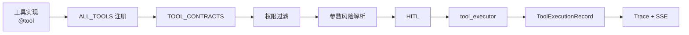

启动时 `validate_tool_contracts(ALL_TOOLS)` 检查：

- 每个可执行工具都有契约；
- 契约名称与实际工具一致；
- 不允许新增工具后忘记补安全元数据。

---

## 24. ToolContract

一个契约包含：

| 字段 | 含义 |
|---|---|
| `name` | 唯一工具名 |
| `risk` | safe/review/dangerous |
| `timeout_seconds` | 平台超时 |
| `max_retries` | 最大重试 |
| `idempotent` | 重放是否安全 |
| `requires_confirmation` | 是否进入 HITL |
| `side_effect` | 文件、进程、任务、Agent 消息等副作用 |

例子：

| 工具 | 风险 | 幂等 | 确认 | 原因 |
|---|---:|---:|---:|---|
| `read_file` | safe | 是 | 否 | 只读 |
| `write_file` | review | 否 | 是 | 修改文件 |
| `edit_file` | review | 否 | 是 | 修改文件 |
| `delete_paths` | dangerous | 否 | 是 | 删除但可恢复 |
| `bash` | review + 参数动态判断 | 否 | 视参数 | 命令风险差异大 |
| `delegate_task` | review | 否 | 是 | 新模型调用和成本 |
| `list_skills` | safe | 是 | 否 | 只读元数据 |

风险等级和是否确认不是同一个字段。比如 `delete_paths` 风险高，但它是专用、可恢复、精确路径工具，仍可以在明确确认后执行；危险 Shell 命令则由参数策略直接拦截。

---

## 25. 权限过滤

`get_tools_for_permissions()` 把权限映射为工具：

- `tools:basic`
- `tools:shell`
- `tools:advanced`
- 兼容旧类别权限
- `tools:all`

然后：

- 去重；
- 根据 `ENABLE_MULTI_AGENT` 移除 Multi 工具；
- 返回给模型绑定。

executor 根据当前 state permissions 重新生成允许集合。越权调用形成：

```text
status=blocked
error_code=permission_denied
```

而不是被当成成功。

---

## 26. ToolExecutionRecord

规范化记录包含：

```python
{
    "tool_name": "bash",
    "tool_call_id": "call_123",
    "status": "success | error | blocked | timeout | rejected",
    "ok": True,
    "output": "...",
    "duration_ms": 35,
    "attempt_count": 1,
    "error_code": None,
    "exit_code": 0,
}
```

它解决两个问题：

1. 模型需要一个可读 tool result；
2. 平台需要结构化指标、Trace 和对外 API 状态。

原工具可以继续返回模型友好的字符串，executor 会把它归一化成内部记录。

---

## 27. Workspace 隔离

源码定位：

- `core/agent/tools/workspace.py`

核心思想：

```text
当前 user_id
  → WORKSPACE_BASE/user_<id>
  → get_user_workspace()
  → resolve_path()
  → 目标必须仍位于该目录内
```

还会拒绝：

- `..` 路径穿越；
- `.env`；
- `.git`；
- SSH/云凭据；
- 私钥；
- Agent 自身保护目录。

ContextVar 让同一进程中的工具知道当前 user/session，但 API 在进入图前必须正确设置。

边界：路径解析能保护文件工具，不等于给任意子进程提供内核级文件系统隔离。

---

## 28. 文件工具

源码定位：

- `core/agent/tools/file_ops.py`

### 28.1 `read_file`

- 只接受 Workspace 相对路径；
- 可限制读取行数；
- 总输出受 `TOOL_OUTPUT_MAX_CHARS` 限制。

### 28.2 `write_file`

- 写临时文件；
- flush/fsync；
- `os.replace` 原子替换；
- 重新读取并返回验证预览。

原子写入避免任务超时或进程崩溃留下半个源文件。

### 28.3 `edit_file`

- 要求 `old_text` 精确存在；
- 只替换一次；
- 原子写入；
- 返回修改附近上下文。

它不是通用 patch 解析器，因此模型必须先读文件，提供精确旧文本。

### 28.4 `delete_paths`

- 只允许精确路径；
- 拒绝通配符、绝对路径、重叠父子路径；
- 移动到 `.agent/trash/<operation_id>/items/`；
- 写 recovery manifest；
- 部分失败时尝试回滚。

所以它比让模型运行 `rm` 更可审查、可恢复、可追踪。

---

## 29. Shell 工具

源码定位：

- `core/agent/tools/shell.py`

执行前：

1. 使用 `shlex` 拆分命令和控制符；
2. 检查每个命令段；
3. 拒绝嵌套 Shell、命令替换、inline code、外传工具和破坏性 Git；
4. 拒绝绝对、home、父目录和敏感路径；
5. 参数级解析 safe/review/dangerous；
6. 设置凭据净化后的环境。

执行时：

- cwd 是用户 Workspace；
- POSIX 显式使用 Bash；
- 捕获 stdout/stderr；
- 限制时间和输出；
- 返回 JSON：stdout、stderr、exit_code。

### 29.1 为什么有时 Bash 会“执行失败”

必须区分：

| 类型 | 例子 | 含义 |
|---|---|---|
| `policy_blocked` | `rm`、绝对路径、`python -c` | 平台主动拒绝 |
| `nonzero_exit` | pytest 发现测试失败 | 命令执行了，但程序返回非零 |
| `timeout` | 长任务超过限制 | 进程被超时处理 |
| `permission_denied` | 普通用户申请高级工具 | 权限不足 |
| runtime error | 命令不存在、依赖缺失 | 运行环境问题 |

“工具失败”不一定是系统 Bug。恢复 benchmark 就故意先执行一次失败测试，再修复并复测。

### 29.2 Shell 的真实安全边界

当前是用户态命令策略，不是 sandbox。工作区脚本如果被允许执行，仍可能尝试操作操作系统或网络。

生产增强需要：

- 每任务 rootless 容器；
- 只挂载目标 Workspace；
- seccomp/AppArmor；
- CPU/内存/进程限制；
- 出站网络策略；
- 临时凭据。

---

## 30. 其他工具组

| 模块 | 作用 | 第一次阅读重点 |
|---|---|---|
| `task.py` | Todo 和 `.tasks` 持久任务板 | Todo 与任务状态不要混淆 |
| `background.py` | 后台进程、通知、取消和回收 | session 隔离与进程组 |
| `skills.py` | 发现、加载和刷新 Skill | Skill 是提示/流程知识，不是 Python 魔法插件 |
| `context_tools.py` | 压缩、transcript、上下文状态 | 工作记忆与长期记忆区别 |
| `memory.py` | 主动 `search_memory` | 必须复用 Active/相关性门槛 |
| `subagent.py` | 有界 specialist 委派 | Multi 基线 |
| `team.py` | 实验性 teammate/message bus | 第一次可后读 |

### 30.1 对应测试

- `tests/core/tools/test_contracts.py`
- `tests/core/tools/test_workspace.py`
- `tests/core/tools/test_file_ops.py`
- `tests/core/tools/test_shell.py`
- `tests/core/tools/test_task.py`
- `tests/core/tools/test_skills.py`
- `tests/core/tools/test_subagent.py`

### 30.2 学完后你应该能回答

- ToolContract 为什么同时需要 risk、idempotent 和 side_effect？
- 模型看不到某工具，为什么 executor 仍要校验权限？
- `policy_blocked` 与程序 exit code 非零有什么区别？
- 为什么删除使用专用工具而不是批准 `rm`？

---

# 第八部分：HITL、中断与恢复

## 31. HITL 主流程

源码定位：

- `nodes.py:prepare_tool_execution_node`
- `nodes.py:tool_confirm_node`
- `api/routes/chat.py:chat_stream_resume`
- `api/routes/chat.py:confirm_tool`
- `api/routes/chat.py:get_pending_confirmation`

> [!IMPORTANT]
> 当前有两种独立中断：HITL 使用 typed `tool_confirmation`，用户主动 Pause
> 使用 typed `user_pause`。两者都由 RedisSaver 保存 checkpoint，但恢复 API
> 与 payload 不可混用。红色 Stop 执行 `/chat/stream/cancel`，任务会进入
> 不可恢复的 `cancelled`。

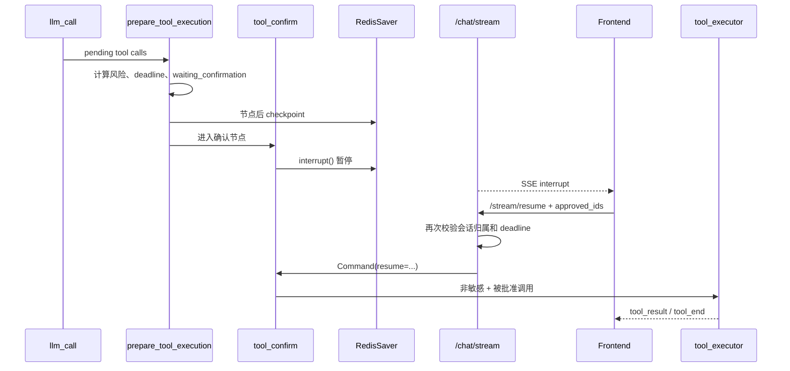

---

## 32. Approve、Reject 和 Partial Approve

resume payload：

```python
{
    "approved": True,
    "approved_ids": ["call_123"],
}
```

处理原则：

- 非敏感工具继续执行；
- 敏感工具只有 ID 被批准才执行；
- 未批准工具生成 rejected tool result；
- Reject All 不能只让客户端停止显示确认，必须恢复图并明确拒绝；
- 后续又产生新的 review 调用，会再次出现新 interrupt。

所以“Approve Current Batch”只批准当前批次，不是给整个会话永久关闭 HITL。

---

## 33. 确认超时

`prepare_tool_execution_node` 写入 `confirmation_deadline`。

超时时：

1. 调度任务恢复图；
2. resume payload 设为未批准；
3. reason=`confirmation_timeout`；
4. 工具形成 rejected 结果；
5. 图继续形成真实终态；
6. Trace 记录超时。

这样任务不会永久卡在 waiting_confirmation。

---

## 34. 取消任务

`request_task_cancellation()` 处理两种情况：

### 34.1 SSE 正在运行

- 设置当前 Trace 对应的 cancel event；
- 生成器检测后停止；
- 标记 cancelled，并在 checkpoint 中幂等追加 Assistant cancellation tombstone；
- 清理后台进程管理器；
- 将对应 MySQL assistant 行收敛为 `cancelled`，并防止晚到的 SSE finally 将它回退为 `interrupted`。

Tombstone 不会删除被终止的用户问题：保留它才能正确回答
“我刚才问了什么”；但它会把消息序列从错误的 `Human → Human`
闭合为 `Human → Assistant(cancelled) → Human`，防止模型继续执行上一个请求。

### 34.2 图正停在 interrupt

- `tool_confirmation` 用拒绝 payload 恢复，`user_pause` 用 `action=cancel`
  恢复；
- 清理未完成 interrupt；
- 收敛工具、Todo 和 Trace；
- 不让 checkpoint 永久处于悬挂状态。

### 34.3 用户 Pause/Continue：已实现的协作式暂停

#### 为什么 RedisSaver 不会自动带来暂停按钮

RedisSaver 解决的是“节点执行完或 interrupt 发生后，图状态保存在哪里”。它不会：

- 自动给状态机增加 `paused`；
- 自动产生 Pause/Resume API；
- 在任意 Python、模型或工具调用中间抢占执行；
- 把当前的 Stop/Cancel 终态改成可恢复暂停；
- 自动处理多副本之间的暂停控制信号。

因此本项目在 RedisSaver 之上另外实现了
`core/execution/pause_control.py`、七态状态机、安全边界 pause gate、typed
`user_pause` interrupt 和独立 Pause/Status/Continue API。

当前代码的真实语义是：

```text
HITL：
prepare_tool_execution 写 waiting_confirmation
→ RedisSaver checkpoint
→ tool_confirm 调用 interrupt()
→ /stream/resume 使用 Command(resume=...)

用户 Pause：
→ /stream/pause 写入精确到 user + session + trace 的 Redis 请求
→ pause_*_gate 在安全边界写 paused 并 checkpoint
→ user_pause_* 调用 interrupt(type=user_pause)
→ /stream/continue 校验同一 Trace 并 Command(resume=...)

红色 Stop：
前端中止 SSE
→ /stream/cancel
→ Redis checkpoint 写入 task_status = cancelled + Assistant tombstone
→ MySQL assistant 行幂等收敛为 cancelled
→ 不允许恢复为 running
```

#### 当前实现流程

当前实现把“控制请求”和“图 checkpoint”分开：

```text
用户点击暂停
→ Pause API 校验 user_id、session_id、trace_id
→ Redis 以 SET NX EX 写入精确绑定 user + session + trace 的 pause_requested
→ Agent 在下一节点安全边界读取控制标记
→ pause_*_gate 将 task_status 写成 paused，并记录 pause metadata
→ pause_*_gate 节点完成，RedisSaver 保存完整 checkpoint
→ 对应的 user_pause_* 节点调用 interrupt(type="user_pause")
→ SSE 向前端发送 paused，界面显示“已暂停”
→ 用户点击继续
→ Continue API 再次校验用户、会话、trace 和 interrupt 类型
→ Redis SET NX EX 获取该 trace 的短期 resume lock
→ Command(resume={"action": "continue", "trace_id": trace_id})
→ interrupt 返回，task_status 从 paused 转回 running
→ user_pause_* 清除该 trace 的 pause_requested
→ 从保存的图位置继续
```

这里特意把“写 `paused` 并保存 checkpoint”放在 `interrupt()` 之前。原因是
`interrupt()` 后面的代码直到恢复时才会执行；如果先 interrupt、再设置 paused，
暂停期间 Redis 和前端反而看不到权威的 paused 状态。正确做法与现有
`prepare_tool_execution → tool_confirm` 两节点模式相同。

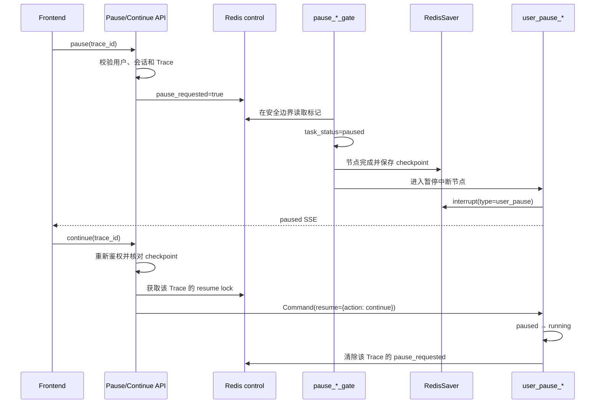

#### 必须明确的边界

- `pause_requested` 已绑定 `user_id + session_id + trace_id`，不会让迟到的请求
  错误暂停同一会话的下一条任务。
- 安全检查点已覆盖首轮/下一轮 LLM、工具派发、确认后工具执行、
  工具 checkpoint、验证、压缩和最终收敛前。
- 模型或前台工具正在阻塞时，只能等它返回下一安全边界；这叫协作式暂停，不是
  强制抢占。
- 需要立即停止 Shell 进程时应走 Cancel/进程组终止，而不是把 Pause 偷换成 Kill。
- 暂停不应结算为任务终态，也不应关闭 Todo、写入长期记忆或释放全部恢复证据。
- Continue 会核对 checkpoint 内的 `trace_id` 和 `user_pause` interrupt 类型，
  防止恢复旧任务或误消费 HITL 中断。
- 控制标记存在 Redis 共享后端；单进程的 `_cancel_events` 仍只用于终止当前
  SSE 执行，不是 Pause 的权威状态。
- Pause 通过 `SET NX EX` 幂等写入，Continue 通过短期 Redis resume lock 防止
  双重 `Command(resume=...)`；过期或不匹配的 checkpoint 返回明确 `409`。

#### 已有回归覆盖

- `running → paused → running` 和 `paused → cancelled` 合法迁移；
- 非暂停状态、错误 Trace、跨用户恢复全部拒绝；
- Graph 拓扑中的 pause gate 覆盖 LLM 前、工具前、工具后等安全边界；
- 重复 Pause 幂等，重复 Continue 被 resume lock 拒绝；
- `paused` 在 typed interrupt 前已由 RedisSaver checkpoint，且 Continue 必须使用同一 Trace；
- 缺失 checkpoint、错误 Trace 或非本用户会话会返回明确失败；
- `user_pause` 与 `tool_confirmation` 两类 interrupt 不会互相消费；
- 前端在请求发出后先显示 `Pausing`，只有收到 `paused` SSE 才显示已暂停。
- 输入框始终只有一个主按钮：运行中为 Stop，暂停后为 Continue；Pause 和暂停后的
  Cancel 位于 Execution mode 控制条，避免两个同等级图标造成语义混淆。
- Pause 请求返回前若用户先 Stop，前端会按 session、Trace 和当前状态丢弃迟到的
  Pause 响应，已取消任务不会重新显示为 paused。

---

## 35. 为什么恢复前必须重新鉴权

暂停可能持续几分钟。在这期间：

- 用户可能被停用；
- 管理员可能降级角色；
- 会话可能被删除；
- token 可能属于另一个用户。

因此 `/stream/resume`、`/stream/pause`、`/stream/status`、`/stream/continue`、
`/confirm`、`/pending_confirm`、取消等路由都先查 MySQL 会话归属，再访问
Redis checkpoint 或该 Trace 的精确控制键。

---

## 36. 三类结果矩阵

| 场景 | task_status | 工具结果 | Trace |
|---|---|---|---|
| 批准 review 工具 | waiting → running | 执行后 success/error | approved + tool |
| 用户拒绝 | waiting → running/终态 | rejected | rejected |
| 确认超时 | waiting → running/failed | rejected | confirmation_timeout |
| dangerous Shell | 通常保持执行流程 | blocked/policy_blocked | safety interception |
| 用户取消 | cancelled | 未执行调用关闭 | cancelled |
| 用户主动暂停 | paused → running | 已开始调用到安全边界才停，后续调用保留 | pause_requested + task_paused + resume_requested + task_resumed |

### 36.1 对应测试

- `tests/api/test_chat_task_security.py`
- `tests/core/execution/test_pause_control.py`
- `tests/core/execution/test_pause_nodes.py`
- `tests/core/execution/test_lifecycle_nodes.py`
- `tests/core/test_nodes.py`
- `tests/core/test_graph.py`
- `frontend/tests/ChatPanel.spec.js`

### 36.2 学完后你应该能回答

- interrupt 后为什么节点会从头重放？
- Approve All 为什么还可能再次弹确认？
- 取消一个等待确认的任务，为什么要先拒绝式恢复？
- 为什么只有 RedisSaver 还不够，项目仍需要 Redis control、pause gate 和 typed interrupt？
- 为什么 `paused` 必须在独立节点中先 checkpoint，再进入 `interrupt()`？

---

# 第九部分：验证门、上下文和成本

## 37. 修改后验证门

平台跟踪：

- `changed_files`
- `validation_results`
- `verification_attempts`

### 37.1 哪些文件算代码

包括常见：

- Python、JavaScript、TypeScript、Vue；
- Java、Go、Rust、C/C++；
- Shell、SQL、YAML/TOML；
- Dockerfile、Makefile、package.json、pyproject.toml。

### 37.2 哪些命令算验证

通过命令标记识别：

- pytest/unittest；
- Ruff、mypy、pyright、compileall；
- npm/pnpm/yarn test/build/lint；
- cargo test、go test；
- make test、Gradle、Maven 等。

只有：

```text
命令属于验证类型 + 工具执行成功 + exit_code=0
```

才形成成功验证记录。

### 37.3 真实修复例子

```text
read_file(calculator.py)
read_file(test_calculator.py)
edit_file(...)
pytest -q test_calculator.py
```

如果 pytest 失败：

- validation_results 记录失败；
- Agent 可读取错误并继续修复；
- 不能直接 succeeded。

如果模型输出“已经修复”但没跑测试：

- route_after_tool 进入 verification_gate；
- 最多提示两次；
- 最终仍无验证则 failed。

---

## 38. 三类预算

当前主要限制：

| 限制 | 默认值 | 目的 |
|---|---:|---|
| `MAX_AGENT_ROUNDS` | 20 | 防止模型无限循环 |
| `MAX_TOOL_CALLS_PER_TASK` | 25 | 防止工具失控 |
| `TASK_TOKEN_BUDGET` | 1,000,000 | 单任务模型用量上限 |
| `SESSION_TOKEN_BUDGET` | 1,000,000 | 单会话累计模型用量上限 |
| `CONFIRMATION_TIMEOUT_SECONDS` | 300 | 防止永久等待 |

平台预算是安全阈值，不是性能目标。设置 100 万不意味着应该让每个任务消耗 100 万 token。

---

## 39. 三种上下文缩减

### 39.1 microcompact

- 每轮模型前运行；
- 不额外调用总结模型；
- 主要清理旧工具大输出；
- 保留最近消息和工具骨架。

#### 39.1.1 当前实现：artifact-first

主工具运行时按以下顺序处理：

```text
工具输出产生
→ 脱敏并执行单文件/单任务大小限制
→ 原子写入 .agent/tool-artifacts/<trace_id>/<tool_call_id>-<sha16>.txt
→ 记录 checksum、原始/存储字符数、截断/脱敏状态
→ messages 只保留受限预览与真实 artifact 路径
→ microcompact 再替换更旧的消息正文
→ 必要时授权读取 artifact 的指定范围并重新注入模型
```

较旧工具正文最终变为：

```text
[tool output compacted;
 artifact: .agent/tool-artifacts/<trace_id>/<tool_call_id>-<sha16>.txt;
 sha256=<digest>; original_chars=<count>]
```

这能同时满足两个目标：

- **控制上下文成本**：模型默认只看结论、关键错误和定位线索；
- **保留可追溯证据**：系统可按需读取原始/受限原始 artifact，而不是依赖一个
  不一定存在的 transcript。

当前已落地：

- artifact 路径由服务端根据用户、Trace 和 tool call 生成，不能接受模型指定的任意路径；
- 写入前脱敏，采用临时文件、`fsync`、`os.replace`、600/700 权限和独立大小上限；
- Trace 只记录路径、校验和、大小和摘要，不重复塞入整段大输出；
- artifact 保存失败时，microcompact 保留旧正文并写 error Trace，不伪造路径；
- “受限原始输出”不承诺保存密钥、无限输出或所有二进制字节。

`read_tool_artifact(path, sha256, offset_bytes, limit_bytes)` 已提供带用户 Workspace
归属、受控根路径、SHA-256 和 UTF-8 边界校验的分页读取；通用 `read_file`/Shell
不能直接绕过它读取 Agent 运行目录。仍待补的生产能力是 artifact 过期回收、
集中授权策略，以及脱离 Workspace 的防篡改集中存储。

### 39.2 自动完整压缩

- microcompact 后的活动上下文估计达到有效阈值；若配置
  `MODEL_CONTEXT_WINDOW_TOKENS`，有效阈值取显式上限与模型窗口比例的较小值；
- 保存 transcript；
- 从 `AgentState` 确定性构造目标、Todo、改动文件、验证和失败证据；
- 调模型生成辅助性运行摘要；
- 给摘要完整输入与 Provider 输出设置上限，并为下一次主模型调用预留 10%（至少
  1,024 token）增长空间；Provider 若仍报告窗口超限，只恢复压缩一次；
- 使用 `RemoveMessage(REMOVE_ALL_MESSAGES)` 真正替换 checkpoint 里的旧历史；
- 摘要调用的 token/耗时进入 Trace 和任务/会话预算。

当 continuation budget 极小时，确定性事实区会逐级裁剪，最终只保留经过验证的
transcript handle，并设置 `continuation_packet_truncated=true`。这是诚实降级，
不是声称所有原事实仍在模型窗口里。

### 39.3 手动压缩

- 模型/用户显式调用 compress；
- 保存 transcript 和摘要；
- 真正替换旧消息后回到 `llm_call`，继续当前 invocation。

### 39.4 为什么 transcript 不是长期记忆

transcript 只为当前长任务恢复服务。它可能包含：

- 中间错误；
- 临时输出；
- 未验证猜测；
- 一次性要求。

因此不能自动写入 Chroma。

### 39.5 对应测试

- `tests/core/test_nodes.py`
- `tests/core/test_context.py`
- `tests/core/test_tool_artifacts.py`
- `tests/core/execution/test_lifecycle_nodes.py`
- `tests/core/tools/test_contracts.py`
- `tests/observability/test_trace_integration.py`

当前回归已覆盖先落盘后清理、跨用户隔离、非法 ID/符号链接、原子写、
校验和、脱敏、长 Bash 失败的 `exit_code`、真实 reducer 替换、摘要遗漏时的确定性
事实区、Trace receipt、SHA 校验以及 UTF-8 安全范围读取。保留期、集中授权与
防篡改集中存储仍是待办。

### 39.6 学完后你应该能回答

- 自动 re-read 文件为什么不等于运行测试？
- microcompact 与完整摘要的成本差异是什么？
- 为什么 artifact 是“受限原文”而不是无上限原始字节？
- artifact-first 为什么必须先原子落盘，再修改 messages？
- 为什么任务 token 和 session token 要分开累计？

---

# 第十部分：记忆与 Trace

## 40. 三层“记忆”不要混淆

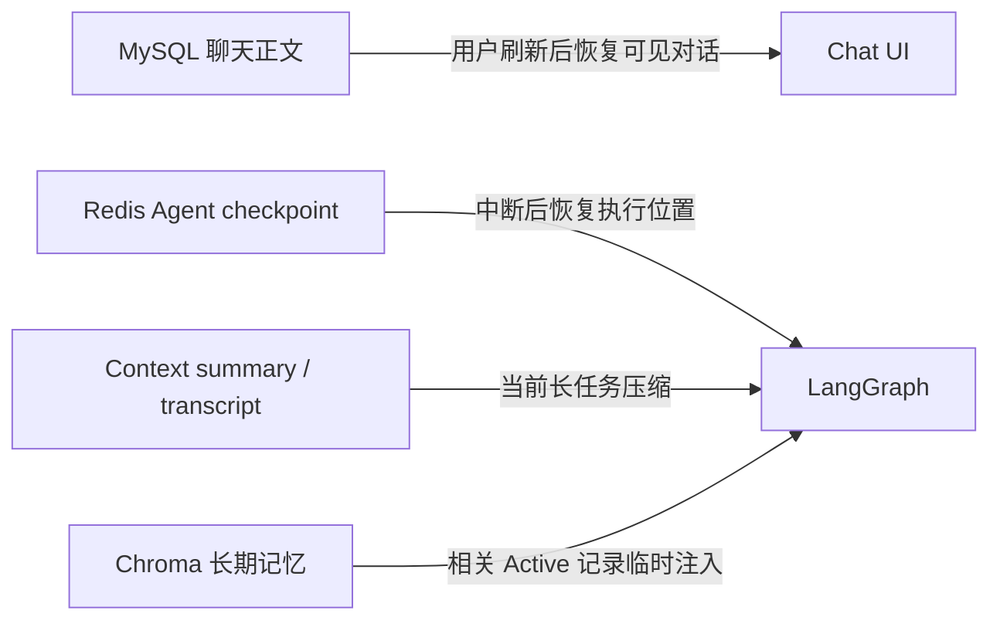

| 类型 | 保存什么 | 生命周期 |
|---|---|---|
| MySQL 聊天 | 用户/助手可见正文 | 持久 |
| Redis checkpoint | State + 图位置 | 短期恢复 |
| Context summary/transcript | 当前长任务工作记忆 | 当前任务/Workspace |
| Chroma 长期记忆 | 通过准入的工程结果和显式偏好 | 跨会话 |

---

## 41. 长期记忆写入

源码定位：

- `memory/policy.py`
- `memory/long_term.py`
- `nodes.py:persist_memory_node`

准入流程：

```text
任务 finalization
  → 是否 succeeded
  → 是否工程任务或明确“请记住”
  → 是否有文件/工具/验证等持久证据
  → 是否达到质量阈值
  → 是否与 Active 记录重复
  → 写入 Chroma 或记录拒绝原因
```

默认拒绝：

- 失败/取消任务；
- 普通聊天；
- 一次性小说创作；
- 只有 Todo/委派、没有工程证据；
- 未验证结论；
- 近重复记录。

---

## 42. 长期记忆召回

`init_context_node()` 在每个用户任务开始时：

1. 先识别“刚才/上一条/previous message”等当前会话近指问题；命中时跳过 Chroma，只使用当前 checkpoint 历史；
2. 其他请求才查询 pattern 和 task outcome；
3. 应用 Active、retrieval_enabled 和相关性门槛；
4. 中文查询也必须通过向量距离硬门槛，再进行去通用词的词法重排；
5. 只取少量高相关候选并更新 retrieval count；
6. 生成临时 `<long_term_memory>` 块，将它并入唯一系统消息；
7. 记录候选、过滤或 `recent_conversation_reference` 跳过 Trace。

模型主动调用 `search_memory` 时也必须使用相同门槛，不能成为旁路。

### 42.1 四个证据层级

| 概念 | 能否证明 | 含义 |
|---|---|---|
| Stored | 能 | 写入 Chroma |
| Recalled | 能 | 通过检索门槛 |
| Injected | 能 | 放入模型上下文 |
| Applied | 当前不能可靠归因 | 模型真的依据它正确行动 |

Memory 6/6 证明小型数据集上的检索/过滤，不证明 Applied。

---

## 43. Trace

源码定位：

- `observability/trace_store.py`
- `api/routes/tasks.py`

Trace 文件位于用户 Workspace：

```text
.agent/traces/<trace_id>.json
```

### 43.1 Trace 事件

| 类型 | 示例 |
|---|---|
| task | created、finished |
| node | start/success/error/interrupted |
| model | provider、tokens、duration、retry |
| tool | risk、args summary、status、exit code |
| confirmation | requested、approved、rejected、timeout |
| budget | round/tool/token limit |
| context | compact/transcript |
| memory_retrieval | candidates、filters、injected IDs |

### 43.2 脱敏

写盘前递归处理：

- API Key；
- Authorization；
- Cookie/JWT；
- Password/Secret；
- bearer token；
- 超长字符串。

### 43.3 六类核心指标

- 任务成功率；
- 工具成功率；
- 平均耗时；
- 平均 token；
- 人工介入率；
- 安全拦截数。

此外还有 memory injection 等辅助指标。

### 43.4 如何用 Trace 调试

遇到失败，按顺序看：

1. task status/failure_reason；
2. 最后一个失败或 interrupted 节点；
3. 对应 model/tool event；
4. error_code 或 exit_code；
5. retry 和预算；
6. changed_files 与 validation_results；
7. 是否出现确认超时或取消。

### 43.5 当前边界

JSON Trace 适合：

- 单进程本地展示；
- benchmark；
- 可移植调试。

多副本生产环境应迁移到集中 SQL、ClickHouse 或 OpenTelemetry，并使用分布式确认调度。

### 43.6 对应测试

- `tests/memory/test_policy.py`
- `tests/memory/test_memory.py`
- `tests/api/test_memory_routes.py`
- `tests/observability/test_trace_store.py`
- `tests/observability/test_trace_integration.py`
- `tests/api/test_task_trace_routes.py`

### 43.7 学完后你应该能回答

- Redis、MySQL 和 Chroma 分别解决什么问题？
- Recalled 为什么不能证明 Applied？
- 一次任务失败时，如何用 Trace 找到根因？

---

# 第十一部分：Single 与 Multi-Agent

## 44. 模式在哪里校验

请求包含：

```text
mode=single_agent | multi_agent
```

FastAPI 会检查：

- mode 是否有效；
- 服务端是否开启 Multi；
- 当前数据库角色是否有 advanced 权限；
- 用户明确要求多智能体时，是否错误选择了 Single。

不允许静默降级成“主 Agent 在一段文本里角色扮演多个 Agent”。

---

## 45. `delegate_task` 与 `task_create`

| 工具 | 真实含义 |
|---|---|
| `task_create` | 在 `.tasks` 中创建一个工作项 |
| `delegate_task` | 真正调用一个独立 specialist 模型上下文 |
| `spawn_teammate` | 实验性团队消息总线中的 Agent |

创建三条 task 不等于创建三个 Agent。

### 45.1 specialist 为什么独立

它拥有：

- 独立消息上下文；
- 明确角色；
- 有界轮次；
- 默认不拥有主 Agent 的全部副作用工具；
- 返回给 lead 的结果摘要。

主 Agent负责：

- 决定是否委派；
- 综合 specialist 输出；
- 执行受控工具；
- 对最终任务负责。

### 45.2 Multi 成功门

Multi 模式最终成功前必须存在：

```text
tool_name=delegate_task and ok=true
```

否则 `finalize_task_node` 将任务标为 failed，避免“界面选择了 Multi，但实际没有委派”的虚假结果。

### 45.3 当前评测边界

- 保留的真实 single-Agent：8/10；
- 三个 `delegation_suitable` 用例已定义；
- single/multi 对照尚未完成；
- 不宣称 Multi 提高成功率或效率。

### 45.4 对应测试

- `tests/core/tools/test_subagent.py`
- `tests/core/tools/test_team.py`
- `tests/api/test_chat_task_security.py`
- `tests/benchmark/test_benchmark_runner.py`

### 45.5 学完后你应该能回答

- 为什么不默认打开所有多 Agent 工具？
- task_create 为什么不算委派？
- 多 Agent 带来的额外成本和失败面有哪些？

---

# 第十二部分：用测试验证你的理解

## 46. 源码与测试对应表

| 源码区域 | 对应测试 | 主要证明 |
|---|---|---|
| Settings/启动 | `tests/config`、`tests/smoke` | 配置、安全启动、图可编译 |
| AgentState/Graph | `tests/core/test_state.py`、`test_graph.py` | 字段与图边 |
| Nodes/路由 | `tests/core/test_nodes.py`、`execution/` | 生命周期、验证、恢复 |
| Tool Contract | `tests/core/tools/test_contracts.py` | 注册、风险、规范化 |
| Workspace/File | `test_workspace.py`、`test_file_ops.py` | 租户路径、原子写入、删除 |
| Shell/Background | `test_shell.py`、`test_background.py` | 风险解析、超时、进程组 |
| Chat/SSE/历史 | `tests/api/test_chat_*` | 归属、持久化、取消 |
| Memory | `tests/memory`、`tests/db/test_chroma.py` | 准入、召回、级联删除 |
| Trace | `tests/observability`、task routes | 事件、脱敏、指标、API |
| Admin | `tests/admin`、admin security | 额度、Skill、实时角色 |

---

## 47. 不调用外部模型的验证命令

```bash
uv run pytest -q
uv run ruff check enterprise_agent migrations tests benchmarks scripts
uv run python scripts/smoke_test.py
uv run python -m benchmarks.run --backend platform --mode single --no-artifacts
```

### 47.1 smoke 能证明什么

- 应用可导入；
- 图可编译；
- Workspace 文件读写；
- safe Shell；
- dangerous Shell 拦截；
- API 路由加载。

不能证明：

- 外部模型可达；
- MySQL/Redis/Chroma 持久服务完整运行；
- Agent 自主完成任务。

---

## 48. 三类 benchmark

| Backend/套件 | 是否调用聊天模型 | 当前结果 | 正确解释 |
|---|---:|---:|---|
| Platform | 否 | 10/10 | 工具、策略、状态、评测器 |
| Memory | 否 | 6/6 | 小型检索与过滤 |
| Agent single | 是 | 8/10 | 一次 DeepSeek 自主执行 |
| Agent multi | 是 | 待测 | 尚无收益结论 |

`benchmarks/v1/cases.json` 每个用例包含：

- category；
- fixtures；
- prompt；
- platform steps；
- assertions；
- delegation_suitable。

阅读一个 case 时分别看：

1. Workspace 初始状态是什么；
2. Agent 收到什么；
3. 允许哪些工具；
4. 最终断言什么；
5. 中间失败是否是预期恢复步骤。

---

## 49. 手动追踪一次真实任务

选择一个小仓库，执行：

> 阅读测试和实现，定位失败原因，做最小修改，运行最窄相关测试，并汇报证据。

检查清单：

- [ ] 请求创建独立 trace_id；
- [ ] state 从 pending 进入 running；
- [ ] Agent 先读代码/测试；
- [ ] 文件修改触发 HITL；
- [ ] 批准后工具产生权威结果；
- [ ] changed_files 包含目标文件；
- [ ] Shell exit code 被记录；
- [ ] validation_results 有成功证据；
- [ ] task_status=succeeded；
- [ ] MySQL 能刷新恢复助手正文；
- [ ] Trace 能解释节点、工具、耗时、token；
- [ ] 长期记忆只在准入通过时写入。

---

## 50. 学习练习

### 练习 A：只看图，不跑模型

在纸上写出：

```text
llm_call 返回 edit_file
```

之后会经过的每个节点和状态变化。

### 练习 B：解释失败

运行一个故意失败的 pytest，区分：

- tool execution success；
- command exit code 非零；
- validation failed；
- task 是否仍可恢复。

### 练习 C：解释确认

回答：

- 为什么 read_file 不弹窗？
- 为什么 edit_file 弹窗？
- 为什么 `rm` 不是“弹窗后执行”？

### 练习 D：读一条 Trace

找到最后一个失败 event，并反推：

- 哪个节点；
- 哪个工具；
- 参数风险；
- 是否重试；
- 是否有人为介入；
- 最终 failure_reason。

---

# 第十三部分：七天阅读路线

## 第 1 天：入口和请求链

必读：

- `config/settings.py`
- `api/main.py`
- `api/middleware/auth.py`
- `api/routes/chat.py`

需要回答：

- 服务怎样启动？
- FastAPI dependencies 怎样完成鉴权？
- `/chat/stream` 在进入 Graph 前完成哪些检查？

练习：

```bash
uv run python scripts/smoke_test.py
```

面试表达：

> 外部客户端只访问认证后的控制面，不能直接获得宿主机文件或进程权限。

---

## 第 2 天：Chat 路由、State 和状态机

必读：

- `api/routes/chat.py` 中 `_task_input()`、`chat_stream()`
- `core/agent/state.py`
- `core/execution/state_machine.py`

需要回答：

- session_id、thread_id、trace_id 有什么区别？
- MySQL 和 Redis 各保存什么？
- waiting_confirmation 为什么不是失败？

练习：

为“读取文件”请求手写一份最小初始 AgentState。

面试表达：

> 会话生命周期、任务生命周期和 Todo 状态彼此独立，避免 UI、checkpoint 和业务状态混用。

---

## 第 3 天：Graph、Nodes 和路由

必读：

- `core/agent/graph.py`
- `nodes.py` 中节点签名和两个 route

需要回答：

- 文本响应和工具调用分别走哪条边？
- checkpoint_task 与 RedisSaver 的关系是什么？
- plan_task 是否调用独立模型？

练习：

不用看本文，自己画出 LangGraph 主流程。

面试表达：

> 显式节点和边让暂停、恢复、验证和逐步 Trace 可测试，代价是 state schema 和 checkpoint 兼容更复杂。

---

## 第 4 天：Tools、Workspace、Shell 和 HITL

必读：

- `tools/__init__.py`
- `tools/contracts.py`
- `tools/workspace.py`
- `tools/file_ops.py`
- `tools/shell.py`
- `nodes.py:tool_confirm_node`

需要回答：

- risk、confirmation 和 executor block 有何区别？
- 为什么权限检查有两层？
- 当前 Shell 为什么不能称为 sandbox？

练习：

阅读 `test_shell.py`，把每个拒绝案例按 policy_blocked、permission、runtime 分类。

面试表达：

> 危险操作不能只依赖 Prompt，而要经过确定性权限、参数策略、HITL 和执行器防线。

---

## 第 5 天：验证、上下文、记忆和 Trace

必读：

- `nodes.py:verification_gate_node`
- `core/agent/context.py`
- `memory/policy.py`
- `memory/long_term.py`
- `observability/trace_store.py`

需要回答：

- 为什么重新读取文件不算测试？
- Stored/Recalled/Injected/Applied 有什么区别？
- 如何从 Trace 找出一次任务失败原因？

练习：

打开 canonical Agent JSON 报告，定位两个失败用例的最后事件。

面试表达：

> 我把模型能力、平台可靠性和记忆检索拆成不同评测口径，避免用一个数字夸大系统能力。

---

## 第 6 天：后端 SSE、恢复和 Trace 回放

必读：

- `api/routes/chat.py:chat_stream`
- `api/routes/chat.py:chat_stream_resume`
- `api/routes/chat.py:request_task_cancellation`
- `api/routes/tasks.py`
- `observability/trace_store.py`

需要回答：

- `messages` 和 `updates` 两种 stream mode 分别提供什么？
- `/stream/resume` 为什么不是重新发起任务？
- 取消等待确认的任务为什么需要拒绝式恢复？

练习：

阅读 `tests/api/test_chat_task_security.py`，分别追踪批准、拒绝、超时和取消的后端分支；再通过任务详情 API 查看一条 Trace。

面试表达：

> SSE 只负责传输事件，任务事实来自 checkpoint、规范化工具记录和 Trace，而不是客户端自行猜测。

---

## 第 7 天：测试、benchmark 和五分钟口述

必读：

- `tests/README.md`
- `benchmarks/README.md`
- `benchmarks/v1/cases.json`
- `docs/portfolio-guide.md`

需要回答：

- Platform 10/10 为什么不是 Agent 10/10？
- single 8/10 的两个失败说明什么？
- 为什么 Multi 目前没有收益结论？

练习：

```bash
uv run python -m benchmarks.run --backend platform --mode single --no-artifacts
```

然后脱离文档，用五分钟讲清：

1. 项目问题；
2. 一次任务主链；
3. 工具安全；
4. HITL/恢复；
5. Trace/评测；
6. 当前限制。

---

# 附录

## A. 常用术语

| 术语 | 通俗解释 |
|---|---|
| Agent | 能反复观察、决策、调用工具并根据结果继续工作的模型系统 |
| LangGraph | 用状态图组织 Agent 节点、边、暂停和 checkpoint |
| AgentState | 图中所有节点共享的任务状态 |
| Node | 完成一小步工作的函数 |
| Route | 根据 state 决定下一条边 |
| Checkpoint | 可恢复的图状态和执行位置 |
| SSE | 服务端持续向 HTTP 客户端发送事件的单向流 |
| HITL | Human in the Loop，关键操作等待人工决定 |
| ToolContract | 工具的风险、超时、重试、确认和副作用元数据 |
| Idempotent | 重复执行仍不会产生额外副作用 |
| Trace | 一趟任务从请求到终态的结构化执行证据 |
| microcompact | 不调用总结模型的轻量上下文清理 |
| artifact | 工具输出在模型预览/微压缩前落盘的受限、脱敏、带校验和证据 |
| transcript | 完整/手动压缩前原子保存的规范化当前任务上下文 |
| Active Memory | 允许参与召回的高质量长期记忆 |
| Legacy Memory | 可查看/删除，但不能自动注入的旧记录 |

## B. 五分钟项目讲解框架

```text
第 1 分钟：为什么企业内网 Coding Agent 需要服务端控制面
第 2 分钟：FastAPI → AgentState → LangGraph 主循环
第 3 分钟：ToolContract → 权限 → 风险 → HITL → 执行器
第 4 分钟：验证门、Checkpoint、Trace 和记忆治理
第 5 分钟：真实 8/10、Platform 10/10、当前安全/Multi 边界
```

## C. 最容易讲错的十件事

1. 不要说 `plan_task_node` 是独立 Planner Agent。
2. 不要说 `checkpoint_task_node` 自己把数据写进 Redis。
3. 不要说 `save_memory_node` 已经把内容写入 Chroma。
4. 不要说 SSE `[DONE]` 自动证明任务 succeeded。
5. 不要说工具返回字符串中有“成功”就算 Tool success。
6. 不要说 Approve 可以绕过 dangerous Shell 策略。
7. 不要说 Redis 是聊天历史的永久来源。
8. 不要说 Memory recalled 等于模型 applied。
9. 不要说当前 Shell 是内核级 sandbox。
10. 不要说 Multi-Agent 已经被证明优于 Single。

## D. 下一步继续阅读

- [系统架构](../ARCHITECTURE.md)
- [工具与能力矩阵](capability-matrix.md)
- [长期记忆治理](memory-governance.md)
- [Benchmark 设计](../benchmarks/README.md)
- [作品集与面试指南](portfolio-guide.md)
- [管理员控制台](admin-console.md)

当你能不看本文回答每章末尾的问题，并能从一个 `trace_id` 反向解释整条执行链时，就真正完成了“从会用这个项目到理解这个项目”的第一阶段。
