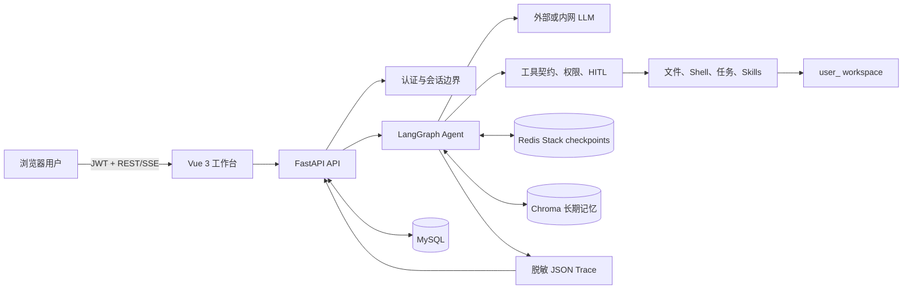
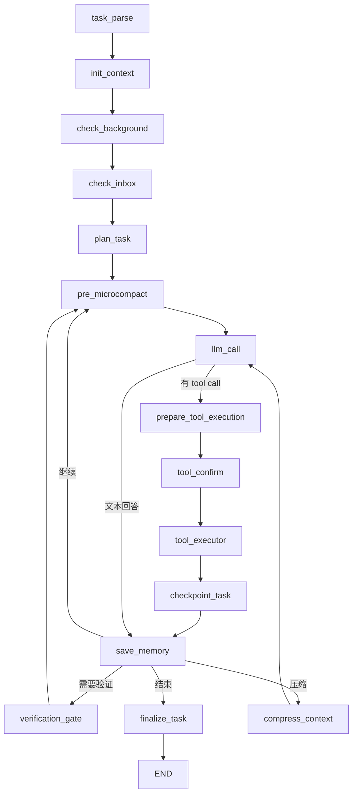

# Mini Claude Code 后端项目现状、架构拆解与学习指南

> 适用分支：`feature/portfolio-hardening`
>
> 代码核对日期：2026-07-16
>
> 阅读对象：主要依靠 vibe coding 完成项目、希望开始真正理解和接管代码的人

## 0. 先说结论

这个项目目前最准确的定位是：

> **一个已经打通端到端流程、完成本地 MVP 工程加固，但尚未达到生产级安全和运维成熟度的企业内网 Coding Agent 原型。**

它已经明显超过“FastAPI 调一下大模型”的演示项目。当前后端具备：

- 用户注册、登录、JWT、刷新令牌和密码重置；
- MySQL 会话元数据与用户归属校验；
- FastAPI REST API 与 SSE 流式输出；
- LangGraph 有状态 Agent 工作流；
- Redis checkpoint、暂停、恢复和取消；
- 文件、Shell、任务、Skills、后台任务和多 Agent 工具；
- 工具契约、权限过滤、人工确认、预算和修改后验证门；
- 用户级 workspace 隔离和一批安全拦截；
- Chroma 长期记忆、重要性评分、模式提取和衰减清理；
- 本地脱敏 Trace、任务回放和指标聚合；
- Docker Compose 四服务交付基线；
- 292 个通过的测试和一套 10 用例离线 benchmark。

但它还不能被描述为“已经可以安全部署到企业生产环境”，主要原因是：

- Shell 只是应用层策略，不是容器或内核级沙箱；
- Trace 和确认超时调度仍以单进程本地实现为主；
- 数据库还使用 `create_all()`，没有 Alembic 迁移；
- 真实模型 single/multi Agent benchmark 尚未完成；
- 当前测试语句覆盖率约为 51%，核心 API、节点、上下文和记忆路径仍有明显未覆盖分支；
- 当前 hardening 成果主要还在未提交工作区中，没有形成可回滚的 Git 提交历史。

因此，理解项目进度时不要只问“功能有没有”，而要分成三层：

| 层次 | 当前状态 | 怎么理解 |
|---|---|---|
| 功能完整度 | 已有可用的本地 MVP | 浏览器、API、Agent、工具、记忆和 Trace 已连通 |
| 工程可靠性 | 本地基线较扎实 | 测试、Ruff、smoke、离线 benchmark 和历史 Docker 验收有证据 |
| 生产成熟度 | 尚未完成 | 缺真正进程隔离、多副本基础设施、迁移和真实模型长期验证 |

一句话记忆：**功能框架已经搭好，工程加固做了一轮，接下来重点不是继续堆功能，而是提交收口、真实验证和生产化。**

---

## 1. 这个项目到底解决什么问题

普通 Coding Agent 往往直接运行在开发者电脑上，拥有较大的文件和命令权限。这个项目想解决的是另一类问题：

- 代码希望留在企业内网；
- Agent 统一运行在企业服务器；
- 每个用户只能操作自己的 workspace；
- 敏感工具需要审批；
- 会话、任务、记忆和执行证据能够被平台管理；
- 模型可以切换成企业允许的外部或内部 OpenAI-compatible endpoint。

所以这个项目的核心价值不是“聊天”，而是：

```text
把大模型的工程操作能力放进一个可认证、可限制、可暂停、可恢复、可审计的平台中。
```

### 1.1 它与普通聊天机器人的区别

普通聊天机器人通常是：

```text
用户问题 -> LLM -> 文本答案
```

本项目是一个闭环：

```text
用户任务
  -> 身份和会话校验
  -> 恢复 Agent 状态
  -> 模型判断下一步
  -> 调用文件/Shell/任务等工具
  -> 必要时等待人工确认
  -> 检查结果并继续推理
  -> 修改代码后要求验证
  -> 记录 Trace 和长期记忆
  -> 返回最终状态和答案
```

模型不是直接调用操作系统。模型只能生成结构化 tool call，平台再决定这个工具：

- 用户有没有权限；
- 风险是什么；
- 是否需要确认；
- 超时多久；
- 能不能重试；
- 最终结果怎样标准化和记录。

这层平台控制才是项目的主要工程含量。

---

## 2. 先建立一张全局地图



### 2.1 每个基础设施各自保存什么

| 存储 | 保存内容 | 不保存什么 |
|---|---|---|
| MySQL | 用户、会话元数据、预留 API Key/工具日志表 | 不保存完整对话消息 |
| Redis Stack | LangGraph checkpoints、刷新令牌黑名单、密码重置码 | 不承担长期语义检索 |
| Chroma | 任务摘要、历史对话语义向量、用户偏好/工作流模式 | 不负责会话强一致状态 |
| 用户 workspace | 项目文件、`.tasks/`、`.transcripts/`、`.team/`、`.agent/traces/` | 不应存放平台密钥 |
| 进程内存 | 活跃 SSE 取消事件、确认超时任务、部分 manager/cache | 重启后不能保证继续存在 |

这里最容易混淆的点是：**MySQL Session、LangGraph AgentState、任务运行状态和 `.tasks/` 任务板不是同一个东西。**

### 2.2 四种“状态”必须分清

| 状态概念 | 代码位置 | 作用 |
|---|---|---|
| 对话 Session | `models/session.py` | 一段长期对话容器，状态为 active/archived/deleted |
| AgentState | `core/agent/state.py` | 当前 LangGraph thread 的消息、工具、预算、todos 等完整状态 |
| Task run | `core/execution/state_machine.py` | 一次用户请求的 pending/running/waiting/succeeded/failed/cancelled 生命周期 |
| Operational task | `core/agent/tools/task.py` | Agent 自己维护的 `.tasks/task_*.json` 工作项 |

一个 Session 可以连续承载多个用户请求；每个用户请求生成一个新的 `trace_id` 和 task run。

---

## 3. 后端目录逐层拆解

```text
enterprise_agent/
├── api/
│   ├── main.py                 FastAPI 应用、生命周期、路由、健康检查
│   ├── middleware/auth.py      JWT 身份与权限依赖
│   ├── routes/auth.py          注册、登录、刷新、密码重置
│   ├── routes/chat.py          对话、SSE、暂停恢复、取消、会话
│   ├── routes/workspace.py     文件树、上传下载、移动删除、VSCode URL
│   ├── routes/memory.py        长期记忆查看与删除
│   └── routes/tasks.py         Trace 列表、回放与指标
├── auth/
│   ├── jwt_handler.py          JWT 和 bcrypt
│   ├── permissions.py          角色权限映射
│   └── email.py                SMTP/开发日志验证码
├── config/settings.py          所有环境变量和执行预算
├── models/                     SQLAlchemy ORM 模型
├── db/
│   ├── mysql.py                async SQLAlchemy engine/session
│   ├── redis.py                普通 Redis 客户端
│   └── chroma.py               Chroma client 和本地 embedding
├── core/
│   ├── agent/
│   │   ├── state.py            LangGraph 状态结构
│   │   ├── graph.py            节点和边的拓扑
│   │   ├── nodes.py            每个执行节点的业务逻辑
│   │   ├── llm_factory.py      多模型 Provider 工厂
│   │   ├── context.py          microcompact、完整压缩和 transcript
│   │   └── tools/              所有模型可调用工具
│   └── execution/
│       └── state_machine.py    task run 六状态合法转换
├── memory/                     累积、评分、模式、衰减、Chroma 封装
└── observability/
    └── trace_store.py          脱敏 Trace 和指标聚合
```

如果只想抓住后端主线，最重要的五个文件是：

1. `api/routes/chat.py`：请求怎样进入和离开系统；
2. `core/agent/state.py`：执行中到底保存了什么；
3. `core/agent/graph.py`：Agent 下一步会走到哪里；
4. `core/agent/nodes.py`：每一步具体做什么；
5. `core/agent/tools/contracts.py`：工具怎样被治理。

---

## 4. 一条真实请求怎样跑完整个后端

下面用“请读取项目并修改一个 bug，然后运行测试”来串起整个系统。

### 第 1 步：前端发送请求

前端通常调用：

```http
POST /chat/stream
Authorization: Bearer <access_token>
Content-Type: application/json

{
  "session_id": "...",
  "content": "请修复这个 bug 并运行测试",
  "stream": true
}
```

主入口是 `api/routes/chat.py::chat_stream()`。

### 第 2 步：验证用户和 Session 归属

FastAPI dependency 会：

1. 验证 JWT；
2. 从 token 取得 `user_id` 和权限；
3. 再查 MySQL，确认用户存在且启用；
4. 如果带了 `session_id`，确认 Session 属于当前用户；
5. 没有 Session 时创建新的 MySQL Session。

这一步很重要，因为 Redis checkpoint 使用 `session_id` 作为 `thread_id`。如果只校验 JWT、不校验 Session 归属，攻击者可能尝试读取别人的 checkpoint。

### 第 3 步：创建 task run 和 Trace

每个用户请求会创建新的 `trace_id`，Trace 初始状态是：

```text
task_status = pending
execution_phase = parsing
```

Trace 写在：

```text
<用户 workspace>/.agent/traces/<trace_id>.json
```

### 第 4 步：用 Session ID 恢复 LangGraph 状态

调用 Graph 时会传入：

```python
config = {"configurable": {"thread_id": session_id}}
```

`AsyncRedisSaver` 会按这个 thread 恢复旧消息和 AgentState，然后在节点执行后继续 checkpoint。

### 第 5 步：进入显式执行阶段

当前 Graph 主链是：



这些节点对应六个逻辑阶段：

```text
parsing -> planning -> executing -> checkpointing -> validating -> summarizing
```

### 第 6 步：初始化上下文和长期记忆

`init_context_node()` 会：

- 判断是不是新 Session；
- 清理或恢复 Todo/后台任务；
- 根据已有消息重新估算上下文 token；
- 重置本次 task 的轮次、工具数、修改文件和验证记录；
- 新 Session 首条请求时，从 Chroma 检索相关任务摘要和用户模式；
- 将记忆作为 `<long_term_memory>` 块放到首条用户消息前面。

注意：Redis checkpoint 是“会话连续性”，Chroma 是“跨会话语义记忆”，两者作用不同。

### 第 7 步：调用模型

`llm_call_node()` 会：

- 检查本次 task token 预算；
- 构造唯一的 SystemMessage；
- 注入当前 OS、Shell、workspace 和可用 Skills；
- 根据 JWT 权限只绑定允许的工具；
- 调用配置的 LLM；
- 对临时模型错误做最多 3 次退避重试；
- 记录模型耗时、token、重试次数、输出摘要和 tool call；
- 更新 round count 和 task token count。

当前 Provider 工厂支持：Anthropic、DeepSeek、GLM、OpenAI 和 MiMo。

### 第 8 步：工具权限和人工确认

工具不是一个简单 Python 函数列表。每个工具都在 `tools/contracts.py` 中声明：

- 风险级别；
- timeout；
- 最大重试次数；
- 是否幂等；
- 是否需要确认；
- 副作用类别。

权限会执行两次过滤：

1. 模型绑定工具时，只让模型看到有权限的工具；
2. 真正执行 tool call 时再次检查，防止伪造或旧 checkpoint 绕过。

敏感工具会进入 `tool_confirm_node()`，通过 LangGraph `interrupt()` 暂停。前端收到 `interrupt` SSE 事件后让用户批准、部分批准或拒绝，再调用 `/chat/stream/resume`。

如果用户一直不操作，当前进程内 timeout task 会在截止时间后自动拒绝，并让任务进入失败状态。

### 第 9 步：执行工具并标准化结果

`tool_executor_node()` 会：

- 设置当前 user/session ContextVar；
- 再次按权限取得工具表；
- 执行同步或异步工具；
- 使用工具契约 timeout；
- 只对幂等工具的临时错误重试；
- 将不同工具的字符串结果统一成 `ToolExecutionRecord`；
- 统计工具调用数；
- 记录变更文件；
- 识别 pytest/build/lint 等验证命令；
- 写入 Trace。

框架不会盲目重试 `write_file`、`edit_file` 或 `bash`，因为有副作用的工具重复执行可能造成二次修改。

### 第 10 步：修改后验证门

如果 Agent 修改了代码文件，但没有成功的测试、构建、lint 或 compile 记录，`verification_gate_node()` 会插入一条内部要求，让模型继续运行最小相关验证。

默认最多提醒 2 次。最终仍没有成功验证时，任务不会被包装成成功，而会以 failed 结束。

这让“模型说已经修好”变成“平台需要看到验证证据”。

### 第 11 步：保存记忆和 Trace

`save_memory_node()` 不再每轮保存碎片，而是把整个 task 的：

- 原始请求；
- assistant 关键回答；
- 工具动作；
- 压缩前上下文；

先累积起来，在任务边界生成结构化 task summary。达到重要性阈值后才存入 Chroma；更高重要性时再提取 preference/workflow/shortcut。

内部总结和重要性评估放到后台 task，避免这些内部 LLM token 混入用户 SSE。

### 第 12 步：结束和回放

`finalize_task_node()` 根据真实条件设置：

- `succeeded`；
- `failed`；
- `cancelled`。

Trace 会记录最终耗时、结果摘要和错误。前端通过 `/tasks` 和 `/tasks/{trace_id}/trace` 展示执行时间线。

---

## 5. 各核心模块应该怎样理解

### 5.1 配置与启动：`settings.py` + `api/main.py`

`settings.py` 是全局控制面，主要配置可以分成七组：

| 配置组 | 典型配置 | 控制什么 |
|---|---|---|
| API | `API_HOST`、`API_PORT`、`CORS_ORIGINS` | 服务监听和跨域 |
| 数据库 | `MYSQL_*`、`REDIS_*`、`CHROMA_*` | 三类持久化连接 |
| 模型 | `LLM_PROVIDER`、`LLM_API_KEY`、`MODEL_ID` | LLM 工厂 |
| Workspace | `WORKSPACE_BASE`、VSCode 配置 | 用户项目目录和打开方式 |
| 执行预算 | `MAX_AGENT_ROUNDS`、`MAX_TOOL_CALLS_PER_TASK`、`TASK_TOKEN_BUDGET` | 防无限循环和失控成本 |
| 安全确认 | `ENABLE_TOOL_CONFIRMATION`、`CONFIRMATION_TIMEOUT_SECONDS` | HITL 行为 |
| 记忆 | 阈值、衰减、embedding、清理周期 | Chroma 长期记忆 |

FastAPI lifespan 的启动顺序是：

1. 检查生产 JWT secret；
2. 初始化 MySQL 表；
3. 初始化 Chroma 和本地 embedding；
4. 初始化 RedisSaver 所需索引；
5. 启动记忆衰减后台任务。

关闭时会等待记忆 flush、停止清理任务并关闭 Redis/MySQL 连接。

你需要知道：`api/main.py` 的 import 成功不代表服务能启动。真正启动还依赖 MySQL、Redis Stack、Chroma 目录、embedding 模型和合法配置。

### 5.2 认证、角色和会话

#### 已实现

- bcrypt 密码哈希；
- access/refresh JWT；
- refresh token jti 轮换和 Redis 黑名单；
- 用户启用状态二次查询；
- 注册、登录、忘记密码、重置密码；
- Session 用户归属检查；
- free/admin 权限生成。

#### 需要注意

- `Permission` 中定义了 pro 能力，但当前登录逻辑实际上只生成 free 或 admin；
- `CHAT_STREAMING` 等权限没有形成完整的 endpoint entitlement 体系；
- `APIKey` 和 `ToolUsageLog` ORM 已存在，但还没有完整产品流程接入；
- 没有组织、项目、团队级 RBAC，当前主要是 user 级隔离。

### 5.3 API 层

主要路由：

| 前缀 | 作用 |
|---|---|
| `/auth` | 注册、登录、刷新、密码重置 |
| `/chat` | 非流式、SSE、resume、cancel、确认兼容接口 |
| `/sessions` | Session 创建、列表、历史和软删除 |
| `/workspace` | 文件管理和 VSCode 打开链接 |
| `/memory` | 长期记忆与模式管理 |
| `/tasks` | task run、Trace 和指标 |

`chat.py` 超过一千行，是当前 API 层最复杂、也最应该继续拆分的文件。它同时承担：

- Session 解析；
- task 初始化；
- SSE 序列化；
- 模型 token 事件过滤；
- interrupt 解析；
- 确认 timeout；
- cancel；
- 历史消息转换；
- task 终态兜底。

后续可以拆成 session service、task service、SSE adapter 和 confirmation coordinator。

### 5.4 AgentState 与 Graph

`AgentState` 可以按五组理解：

| 状态组 | 代表字段 |
|---|---|
| 身份与会话 | `session_id`、`user_id`、`permissions` |
| task 生命周期 | `trace_id`、`task_status`、`execution_phase`、时间和失败原因 |
| 模型上下文 | `messages`、`token_count`、`context_summary`、transcript |
| 工具执行 | pending calls、results、records、count、changed files、validation |
| 控制与记忆 | round、budgets、todos、confirmation deadline、memory accumulator |

LangGraph 最值得理解的不是“画图”，而是三个机制：

1. reducer：`messages` 使用 `add_messages` 自动合并；
2. conditional edge：根据 state 决定继续、压缩、验证还是结束；
3. checkpointer：节点之间状态写入 Redis，interrupt 后能够 resume。

### 5.5 上下文管理

项目有两层压缩：

- microcompact：每次 LLM 前清理较旧工具结果，保留最近关键消息；
- full compact：token 超阈值时保存 transcript，用 LLM 生成摘要并替换消息。

Transcript 放在 workspace 的 `.transcripts/`。它是压缩备份，不是长期记忆；长期记忆在 Chroma。

### 5.6 工具系统

当前工具大致分为：

| 类别 | 工具 |
|---|---|
| 文件 | `read_file`、`write_file`、`edit_file` |
| Shell | `bash`、`background_run`、`check_background` |
| 任务 | `todo_update`、`task_create/get/update/list/claim` |
| Skills | `list_skills`、`load_skill`、`reload_skills` |
| 上下文 | `compress`、transcript 查询、context status |
| 记忆 | `search_memory` |
| 多 Agent | subagent task、teammate 和消息总线工具 |

多 Agent 代码已经存在，但 `ENABLE_MULTI_AGENT=false` 是默认值。当前策略是先建立可靠 single-Agent baseline，再比较多 Agent 是否真的改善质量，而不是默认增加成本和权限面。

### 5.7 Workspace 和文件安全

用户目录是：

```text
<WORKSPACE_BASE>/user_<user_id>/
```

`resolve_path()` 会：

- 将相对路径拼到用户目录；
- 调用 `resolve()` 消除 `..` 和符号路径影响；
- 用 `is_relative_to()` 拒绝逃出 workspace 的目标。

Agent 文件工具还会拒绝 `.env`、`.git`、SSH/cloud credential 和私钥后缀。写文件使用临时文件、`fsync` 和 `os.replace` 原子替换。

需要区分两类用户：

- 人类用户通过 workspace API 管理自己的文件；
- 模型通过更严格的 Agent file tool 访问文件。

### 5.8 Shell 安全边界

当前 Shell 策略会拒绝：

- 危险二进制和典型破坏命令；
- 多行命令、命令替换和嵌套 shell；
- 绝对路径、`..`、敏感路径；
- heredoc、here-string、部分重定向绕过；
- Python/Node inline code；
- `git clean` 和 `git reset --hard`；
- curl/wget/ssh/scp 等直接传输工具；
- 子进程继承模型、JWT 和数据库密钥。

但是 `subprocess.run(..., shell=True)` 仍在 API 所在主机/容器内运行。应用层黑名单无法等价于：

- mount namespace；
- seccomp/AppArmor；
- 独立 UID/容器；
- CPU、内存和进程数限制；
- 网络 egress policy。

因此正确说法是“有多层防御的受控 Shell baseline”，不能说“安全沙箱已经完成”。

### 5.9 记忆系统

记忆分三层：

```text
Redis checkpoint：当前对话的完整状态
Chroma task summary：跨会话可检索的任务结果
Chroma user pattern：偏好、工作流和习惯
```

写入流程：

```text
多轮消息/工具动作
  -> MemoryAccumulator
  -> 生成结构化 task summary
  -> 规则 + 可选 LLM 重要性评估
  -> 达到阈值后写入 Chroma
  -> 高重要性内容再提取用户模式
```

读取流程：

```text
新 Session 首条请求
  -> 语义搜索相关 task summaries 和 patterns
  -> 注入 <long_term_memory>
```

当前不足是 task outcome、project fact、user preference 还没有强类型分表/分集合治理，主要靠 role 和 metadata 区分。

### 5.10 Trace 与指标

Trace 事件包括：

- task 创建/结束；
- Graph node；
- model 调用、token、retry；
- tool 参数摘要、结果、风险、耗时；
- confirmation；
- budget；
- context compact；
- error 和终态。

Trace 会递归脱敏 password、secret、API key、Authorization 和类似字符串，并限制内容长度。

`/tasks/metrics` 只从 terminal traces 计算：

- task success rate；
- tool success rate；
- average duration；
- average tokens；
- human intervention rate；
- safety interceptions。

但 JSON 文件 + 进程锁只适合本地或单实例。生产多副本应迁移到数据库或 OpenTelemetry-compatible backend。

### 5.11 部署结构

当前 Compose 包含：

| 服务 | 作用 |
|---|---|
| `frontend` | Nginx + Vue 静态资源 + `/api` 反代 |
| `api` | 非 root Python/FastAPI/LangGraph |
| `mysql` | 用户和 Session |
| `redis` | Redis Stack checkpoint 和辅助状态 |

Chroma 嵌入在 API 进程内，数据目录使用持久卷。workspace、Chroma、Redis、MySQL 和 Hugging Face cache 都有持久化配置。

---

## 6. 当前进度的证据化评估

### 6.1 2026-07-16 当前验证

在当前工作区直接使用 `.venv` 运行：

```text
.venv/bin/python -m pytest -q
-> 292 passed in 7.83s

.venv/bin/ruff check enterprise_agent tests benchmarks scripts
-> All checks passed!

.venv/bin/python scripts/smoke_test.py
-> 7 项检查全部为 true
```

smoke 验证了：

- workspace 文件创建；
- write/read 自动验证；
- 安全 Shell；
- 危险 Shell 拦截；
- LangGraph 编译；
- API 路由导入。

它没有验证：

- 外部 LLM；
- MySQL/Redis 真服务；
- Chroma 首次模型下载；
- 浏览器交互；
- Docker 当前机器重新构建。

### 6.2 测试覆盖率

当前 `pytest-cov` 汇总：

```text
TOTAL 4669 statements, 2292 missed, 51% covered
```

覆盖较强的区域包括：

- workspace：96%；
- Trace store：96%；
- task 状态机：94%；
- Skills：92%；
- task tools：90%；
- Shell：89%；
- tool contracts：86%；
- file tools：84%；
- background tools：82%。

覆盖较弱的区域包括：

- memory accumulator：当前 coverage 采集结果为 0%；
- context manager：19%；
- memory/importance/decay/pattern：约 20% 左右；
- subagent：21%；
- LLM factory：28%；
- chat API 和 workspace API：约 36%–37%；
- Agent nodes：44%；
- team tools：39%。

这个覆盖结果受模块导入时机和 mock 方式影响，不能机械等价于代码质量，但它清楚说明：**测试数量很多，不代表主链每个分支都已经充分覆盖。**

### 6.3 离线 benchmark

仓库中的最新 checked-in platform single 报告是：

| 指标 | 结果 |
|---|---:|
| 最终 task assertions | 10/10 |
| tool success rate | 80.0% |
| 平均步骤 | 1.9 |
| 平均耗时 | 84.8 ms |
| 人工介入率 | 20.0% |
| 安全拦截 | 1 |
| 模型 token | 0 |

它只证明工具、状态、策略、恢复和 evaluator 的确定性平台路径。它没有调用 LLM，所以不能写成“Agent 成功率 100%”。

### 6.4 Git 交付状态

当前分支为：

```text
feature/portfolio-hardening
```

但当前 HEAD 与 `feature/cross-platform-dev` 指向同一个提交，hardening 工作主要存在于工作区：

```text
76 个 modified/untracked 状态项（包含本次新增/更新的说明文档）
```

这意味着功能虽然能运行，但版本管理还没有收口：

- 无法通过提交快速回滚某一阶段；
- 新机器 checkout 当前 HEAD 得不到全部 hardening 功能；
- code review 很难按主题进行；
- 后续继续 vibe coding 容易把不相关变更混在一起。

这是当前最优先的工程管理问题之一。

### 6.5 成熟度矩阵

| 领域 | 当前结论 | 下一道门槛 |
|---|---|---|
| FastAPI/API | 本地 MVP 完成 | 拆分 chat service，补 endpoint 集成测试 |
| Agent 执行 | 核心闭环完成 | 真实模型 benchmark 和故障注入 |
| 工具治理 | 契约和权限 baseline 完成 | 更强策略引擎和审计持久化 |
| Workspace | 用户路径隔离完成 | 项目/组织级租户模型和配额 |
| Shell | 应用层加固完成 | rootless 临时容器 + egress/resource policy |
| 记忆 | 功能链路完成 | 强类型记忆、持久化重启测试、治理策略 |
| Trace | 单机 baseline 完成 | 集中式存储和分布式调度 |
| 数据库 | 原型可用 | Alembic、备份恢复、secret manager |
| 测试 | 本地回归较强 | 提升主链覆盖率、服务级/浏览器级自动化 |
| 多 Agent | 代码存在、默认关闭 | 真实对照实验和成本/安全证据 |
| Docker | 历史四服务验收通过 | 生产 Compose/K8s、TLS、监控、演练 |

---

## 7. 目前最重要的缺口和风险

### P0：先保护已经做出的成果

1. 将当前工作区变更按主题审查和提交；
2. 在提交前确认 `.env`、本地 workspace、Chroma 数据和密钥没有进入 Git；
3. 建立可重复的 fresh clone 验收；
4. 为数据库引入 Alembic，停止依赖生产环境 `create_all()`。

### P1：证明 Agent 真的能工作

1. 在明确数据外发范围后运行真实 single-Agent 10 用例；
2. 分析失败 case，而不是只看总分；
3. single 稳定后再运行 3 个适合委派的 multi-Agent case；
4. 记录模型、配置、token、延迟、费用和原始报告。

### P1：补最关键的自动化测试

优先补：

- `chat.py` SSE、resume、cancel 的完整集成路径；
- `nodes.py` token/tool budget 和 verification gate 的组合分支；
- memory accumulator/background flush；
- Redis checkpoint 进程重启恢复；
- Chroma 磁盘重启后的隔离与检索；
- 本地 Compose 的自动浏览器 E2E。

### P2：生产安全

1. 每个任务使用临时 rootless 容器；
2. 限制 CPU、内存、PID、磁盘和执行时间；
3. 默认关闭网络，只按域名/用途放行；
4. seccomp/AppArmor；
5. workspace mount 最小化；
6. 将 Trace、确认 timeout 和 task coordination 迁移到集中式后端。

### P2：代码结构

- 拆分 `chat.py` 和 `nodes.py`；
- 将存储、策略、执行器抽成稳定 interface；
- 统一 Session、task run、operational task 的命名；
- 删除或实现未接入的 APIKey/ToolUsageLog；
- 明确 free/pro/admin 的产品权限和 endpoint enforcement。

---

## 8. 你需要掌握哪些知识

如果你希望从“会让 AI 改代码”升级到“能判断 AI 改得对不对”，建议掌握下面八块。

### 8.1 Python 基础与异步

至少理解：

- module/import 和包结构；
- class、dataclass、Enum、TypedDict；
- exception 和上下文管理；
- `async def`、`await`、`asyncio.create_task()`；
- ContextVar 为什么适合请求上下文；
- 同步函数放进异步服务可能怎样阻塞 event loop。

在本项目中重点看：`chat.py`、`nodes.py`、`background.py`。

### 8.2 FastAPI

要掌握：

- router 和 dependency injection；
- Pydantic request/response schema；
- HTTP 状态码；
- lifespan；
- `StreamingResponse` 和 SSE；
- 全局异常处理；
- auth dependency 怎样组合。

学会后应能回答：“一个 `/chat/stream` 请求在哪一步验证用户、在哪一步开始返回数据？”

### 8.3 LangChain 与 LangGraph

这是后端最核心的专项知识：

- LangChain message 类型；
- tool schema 和 `bind_tools()`；
- StateGraph、node、edge、conditional edge；
- reducer；
- checkpointer 和 thread_id；
- `interrupt()` / `Command(resume=...)`；
- 为什么工具结果必须对应 tool call ID。

学会后应能手画出本项目 Graph，并解释“用户批准工具后为什么能从原位置继续”。

### 8.4 数据库与状态

要掌握：

- SQLAlchemy async session；
- ORM relationship 和 transaction；
- Redis key、TTL、blacklist、checkpoint；
- Chroma collection、embedding、metadata filter 和 vector distance；
- 强一致状态与语义记忆的区别。

学会后应能解释：“为什么完整消息不放 MySQL，为什么 Chroma 不能代替 Redis checkpoint？”

### 8.5 身份、权限与多租户安全

要掌握：

- JWT access/refresh token；
- 密码哈希与 token rotation；
- RBAC；
- tenant ownership check；
- 路径穿越；
- TOCTOU、符号链接和原子写；
- defense in depth。

学会后应能定位：“一个用户可能在哪些入口尝试读到另一个用户的 Session、Trace 或 workspace？”

### 8.6 操作系统与进程安全

要掌握：

- cwd 和 filesystem boundary 不是一回事；
- shell parsing、redirection、substitution；
- subprocess environment；
- process group、signal、timeout 和僵尸进程；
- container namespace、cgroup、seccomp、AppArmor；
- 网络出站控制。

这是判断“受控 Shell”和“真正沙箱”的关键。

### 8.7 测试和可观测性

要掌握：

- pytest fixture、monkeypatch、mock 和 async test；
- unit/integration/E2E 的边界；
- coverage 不能证明业务正确；
- Trace、log、metric 的不同用途；
- deterministic benchmark 与真实模型 benchmark 的区别。

学会后应能解释：“为什么 292 tests passed 和 10/10 platform benchmark 仍不能证明真实 Agent 成功率？”

### 8.8 Docker、Linux 和 Nginx

要掌握：

- image、container、volume、network；
- Compose healthcheck 和 depends_on；
- 非 root 用户；
- Nginx 反向代理和 SSE buffering；
- macOS ARM 与 Linux AMD64 差异；
- 环境变量、secret 和持久卷备份。

---

## 9. 推荐学习顺序

不要直接从 1800 行的 `nodes.py` 第一行硬啃。建议按请求链路学习。

### 第 1 天：先跑起来并理解边界

阅读：

1. `README.md`；
2. `.env.example`；
3. `config/settings.py`；
4. `api/main.py`；
5. `docker/docker-compose.yml`。

目标：知道服务有哪些依赖、启动时发生什么、什么数据会持久化。

### 第 2 天：理解 HTTP 和身份

阅读：

1. `api/middleware/auth.py`；
2. `auth/jwt_handler.py`；
3. `auth/permissions.py`；
4. `models/user.py`、`models/session.py`；
5. `api/routes/auth.py`；
6. `api/routes/chat.py` 中 `_require_owned_session()` 到 `_task_input()`。

目标：能追踪一个 JWT 怎样变成 user_id 和权限。

### 第 3 天：理解 Agent 核心

阅读：

1. `core/agent/state.py`；
2. `core/execution/state_machine.py`；
3. `core/agent/graph.py`；
4. `nodes.py` 中 task parse、init context、LLM call 和两个 route 函数。

目标：能不看代码画出 Graph。

### 第 4 天：理解工具和安全

阅读：

1. `tools/contracts.py`；
2. `tools/__init__.py`；
3. `tools/workspace.py`；
4. `tools/file_ops.py`；
5. `tools/shell.py`；
6. `nodes.py::tool_confirm_node()` 和 `tool_executor_node()`。

目标：能解释 tool call 从模型生成到真正执行经过几道门。

### 第 5 天：理解记忆和上下文

阅读：

1. `core/agent/context.py`；
2. `memory/accumulator.py`；
3. `memory/long_term.py`；
4. `memory/importance.py`；
5. `memory/pattern_extractor.py`；
6. `memory/decay.py`。

目标：分清 checkpoint、transcript、task summary 和 pattern。

### 第 6 天：理解证据和交付

阅读：

1. `observability/trace_store.py`；
2. `api/routes/tasks.py`；
3. `tests/` 对应模块；
4. `benchmarks/README.md`；
5. `scripts/smoke_test.py`；
6. `scripts/docker_smoke_test.sh`。

目标：能判断一个“完成”结论用了什么证据，还有什么没有证明。

---

## 10. 日常开发命令

### 10.1 推荐方式：安装 uv 后

```bash
uv sync --frozen
uv run pytest -q
uv run ruff check enterprise_agent tests benchmarks scripts
uv run python scripts/smoke_test.py
uv run uvicorn enterprise_agent.api.main:app --reload
```

### 10.2 当前本机终端的实际情况

2026-07-16 检查时，当前 shell 的 PATH 中找不到 `uv`，但仓库已有可用 `.venv`。因此也可以：

```bash
.venv/bin/python -m pytest -q
.venv/bin/ruff check enterprise_agent tests benchmarks scripts
.venv/bin/python scripts/smoke_test.py
.venv/bin/python -m uvicorn enterprise_agent.api.main:app --reload
```

这只是当前终端环境差异，不是项目代码错误。长期仍建议让 `uv` 正常进入 PATH，以便 fresh clone 和 CI 使用统一命令。

### 10.3 本地服务调试

```bash
cp .env.example .env
# 替换 JWT_SECRET_KEY、LLM_API_KEY，并确认模型配置

docker compose -f docker/docker-compose.yml up -d mysql redis
.venv/bin/python -m uvicorn enterprise_agent.api.main:app --reload
npm run dev --prefix frontend
```

检查：

```bash
curl http://localhost:8000/health
```

### 10.4 全栈 Docker

```bash
docker compose -f docker/docker-compose.yml up --build -d
docker compose -f docker/docker-compose.yml ps
curl http://localhost:3000/api/health
```

不要把 `.env`、真实密钥、`.venv`、`node_modules`、workspace 数据或 Chroma 数据提交到 Git。

---

## 11. 修改需求时应该从哪里下手

| 你想改什么 | 先看哪些文件 |
|---|---|
| 新增一个 API | `api/main.py`、对应 `api/routes/*.py`、schemas、API tests |
| 新增一个 Agent 工具 | tool 实现、`tools/__init__.py`、`tools/contracts.py`、权限映射、tests |
| 修改 Agent 流程 | `state.py`、`graph.py`、`nodes.py`、graph/node tests |
| 修改权限 | `auth/permissions.py`、middleware、tool registry、route dependencies |
| 修改文件隔离 | `workspace.py`、file/workspace API、shell policy、security tests |
| 修改长期记忆 | accumulator、long_term、importance、pattern、memory routes/tests |
| 修改 SSE/HITL | `chat.py`、`tool_confirm_node()`、前端 API client/ChatPanel、route tests |
| 修改 Trace | `trace_store.py`、Graph wrapper、nodes tool/model events、tasks API/UI |
| 修改部署 | Dockerfile、Compose、Nginx、`.env.example`、smoke script、部署文档 |

新增工具时尤其不要只写一个 `@tool` 函数。完整改动至少包括：

1. 工具实现；
2. `ALL_TOOLS` 注册；
3. `TOOL_CONTRACTS` 元数据；
4. permission map；
5. confirmation/risk 设计；
6. normalized result 测试；
7. workspace/secret/timeout 边界测试；
8. 文档和开发日志。

---

## 12. 你现在应该形成的判断能力

完成这份指南后，你至少应该能独立回答：

1. 用户消息为什么同时涉及 MySQL Session 和 Redis thread？
2. 模型怎样知道有哪些工具，又为什么不能直接执行它们？
3. 工具权限在哪里过滤了两次？
4. LangGraph interrupt 为什么能够在确认后继续？
5. 修改代码后为什么可能以 failed 结束？
6. Redis checkpoint、Chroma memory 和 transcript 分别解决什么问题？
7. `resolve_path()` 能防什么，不能防什么？
8. 当前 Shell 为什么仍然不是生产沙箱？
9. Trace 如何避免直接保存密钥和完整上下文？
10. 292 tests、51% coverage、10/10 platform benchmark 各自说明什么？
11. 为什么真实 single-Agent benchmark 是下一阶段关键证据？
12. 为什么当前未提交工作区会成为交付风险？

如果这些问题还答不出来，就先不要继续增加新功能；沿着问题对应的文件做一次小实验，会比继续让 AI 大范围改代码更有效。

---

## 13. 建议的下一步顺序

### 第一优先级：整理 Git

- 保存当前完整 diff；
- 检查敏感信息；
- 按“执行状态与工具契约 / 安全 / Trace / benchmark / Docker / 前端”拆分提交；
- 确认每个提交都有对应验证；
- 推送 `feature/portfolio-hardening`。

### 第二优先级：做一次你亲自参与的真实 Agent 验收

选 3 个小任务先跑：

1. 只读理解项目；
2. 修改一个简单 bug 并跑测试；
3. 请求一个危险命令，确认平台能暂停或拒绝。

你需要亲眼观察：SSE、tool card、confirmation、Trace、changed files 和 validation result。

### 第三优先级：补主链测试

优先把覆盖率精力放在 chat、nodes、memory accumulator 和真实 Redis/Chroma restart，而不是为了数字给简单 getter 增加测试。

### 第四优先级：再谈生产部署

先做 Alembic、secret、backup/restore 和 task container sandbox，再考虑多副本、Kubernetes 和组织级 RBAC。

---

## 14. 最终评价

这个项目当前的亮点不只是技术栈多，而是已经开始形成一条相对完整的工程 Agent 控制链：

```text
认证 -> 租户边界 -> 有状态执行 -> 工具治理 -> 人工确认
-> 修改验证 -> 记忆 -> Trace -> benchmark -> Docker 交付
```

它已经足够作为一个有内容的个人项目、毕业设计基础或企业 Agent 平台原型，也足够用来学习 FastAPI、LangGraph、工具治理和多租户安全。

现在最需要避免的是继续用“功能数量”制造进度感。真正能让项目进入下一阶段的工作是：

1. 把当前成果提交并可重现；
2. 用真实模型和真实服务验证主链；
3. 补最薄弱的测试；
4. 把 Shell、Trace、迁移和密钥管理提升到生产级。

做到这四点后，项目才会从“完成度很高的本地原型”逐步变成“可以认真讨论企业试点”的系统。
