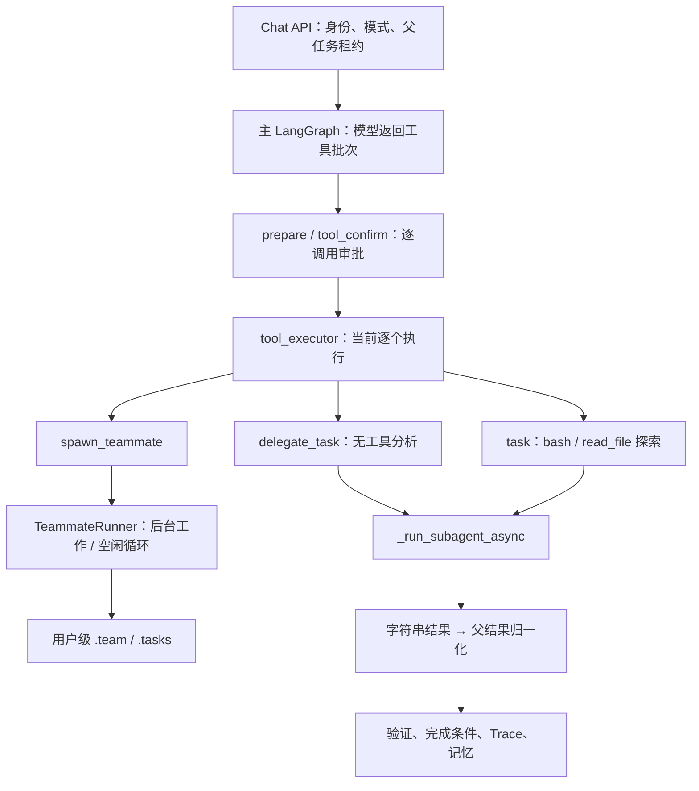

# 多智能体代码审查与下一步方案

> 本文保留修复前的审查与缺陷复现记录。2026-09-11 已实施方案 A，当前行为与验证见 [实施说明](multi-agent-plan-a.md)。旧缺陷探针仅用于历史复现，不适用于修复后的期望行为。

审查日期：2026-09-11。本次依据本地 `feature/container-agent-sandbox` 的工作区代码，包含已有未提交沙箱和上下文改动；不能只用 Git HEAD 代表审查版本。未操作服务器，未改运行实现。

## 结论

推荐沿用现有主 LangGraph，实现“主 Agent 负责修改与验证，有限数量的子 Agent 负责独立分析与探索”。需要统一的是子任务的执行契约、生命周期和可观测性，而不是把三个名称包进一个万能工具。

`delegate_task` 和 `task` 已经共用 `_run_subagent_async`。`spawn_teammate` 则是另一种持续运行、收消息、自动认领任务的模型。方案 A 应收敛前两者，并把后台队友工具移出该模式的模型工具列表；不应把后台队友直接改名成一次性委派，也不必先重写主图或引入新的队列平台。

当前代码中存在会误判委派成功、混淆会话归属的实际问题。应先解决这些问题，再增加并行度。此前“直接合并三个入口”的建议不够准确。

## 已审查的调用链

此次审查覆盖相关主链路，不表示逐行审计了整个仓库的每一个文件。

| 层次 | 主要代码 | 对方案的约束 |
| --- | --- | --- |
| 接入与权限 | `api/routes/chat.py`、`core/agent/tools/__init__.py` | Multi 需服务开关与用户权限共同允许；必须保持后端二次检查 |
| 主循环 | `core/agent/graph.py`、`nodes.py`、`state.py` | 保留现有解析、审批、执行、验证、最终完成、记忆持久化节点 |
| 一次性委派 | `tools/subagent.py` | 两个入口共用子循环；独立消息上下文，结果目前为字符串 |
| 后台队友 | `tools/team.py` | 独立 asyncio task，工作/空闲循环、消息、认领任务，另有生命周期 |
| 任务看板 | `tools/task.py` | `.tasks` 为文件型操作记录，不是可靠执行队列 |
| 取消与恢复 | `core/execution/interrupt_control.py`、`graph.py`、`api/main.py` | 复用父 trace、runner lease/fence；不能让子任务争抢父任务所有权 |
| 工具边界 | `tools/contracts.py`、`file_ops.py`、`shell.py`、`background.py` | 保留结果协议、审批、输出证据、路径与进程限制 |
| 工作区和容器 | `tools/workspace.py`、`workspace_lock.py`、`sandbox/executor.py`、`sandbox/workspace.py` | Python 文件工具是 API 进程内执行；Shell 使用过滤快照和容器后端 |
| 可观测性与额度 | `observability/trace_store.py`、`admin/quotas.py` | 子模型调用、Token、工具结果需要纳入真实统计 |
| 前端与历史 | `ChatPanel.vue`、`TraceViewer.vue`、chat 时间线记录器 | 需区分父子调用、调度与开始执行，兼容旧历史 |
| 验证基线 | 工具、生命周期、取消、Trace、API 与 ChatPanel 测试；`benchmarks/run.py` | 扩展已有测试和基准，不用单次演示宣称多 Agent 收益 |

以下代码路径中，后端简称均相对 `enterprise_agent/`；前端组件相对 `frontend/src/components/`。



## 具体发现及证据

### 1. 委派失败会被父执行器认作成功——已复现

- `tools/subagent.py:186` 的 `_run_subagent_async` 将模型异常转成 `Subagent error: ...`；初始化失败和无可见结果也返回字符串。
- `tools/contracts.py:312` 的 `normalize_tool_result` 不识别这些字符串，默认 `status=success`、`ok=True`。
- `nodes.py:1877` 的执行器和 `finalize_task_node` 用 `tool_name == delegate_task && ok` 判断真实委派是否成功。
- 离线探针让真实 `delegate_task` 调用一个抛异常的假模型，再交给真实父执行器，随后用于观察的假 `write_file` 确实被调用。两个记录均为成功。

这验证的是委派完成条件失效；探针直接进入执行节点，不表示绕过了生产 HITL 或用户权限检查。取消字符串同样会被归一化为成功，但父执行器另有取消检查，不能据此推断所有 Stop 都失效。

修改要求：子任务必须返回明确的成功、失败、超时、取消、预算耗尽及无有效结果状态；父完成条件读取已持久化的结构化结果。不能仅在失败字符串前加 `Error:`，也不能只新增一个现有归一化器不理解的 `status` 字段。

### 2. 当前工具批次按序执行；Multi 的前置条件绑定具体工具名

- `nodes.py:1944` 使用 `for tool_call in pending`，每个调用 `await` 完成后才执行下一个。
- 同一轮返回多个 `task`，不等于它们实际并行，尽管其工具描述建议并行调用。
- `nodes.py:2128` 附近的 Multi 前置检查在第一次成功 `delegate_task` 前阻止 `task`、`spawn_teammate`、进程工具和写操作；`bash ls` 也属于进程工具。
- 当前 `delegate_task` 是无工具 specialist，因此不能把它描述成已经可以自行读取代码的探索者。

修改要求：统一入口后仍区分“分析给定材料”和“读取证据探索”的能力。保留 Multi 必须发生真实委派的语义；允许必要的只读准备和子任务调度，写入前检查真实子结果，不靠一次无关委派解锁。是否采用建议仍由主 Agent 基于证据决定。

### 3. SAFE 风险分级不等于子 Agent 的只读文件权限

- `subagent._execute_subagent_tool` 与 `TeammateRunner._execute_tool` 用 `RiskLevel.SAFE` 判断允许的 Shell。
- 探针确认 `pytest -q`、`python3 -m py_compile sample.py`、`npm test` 都被分为 SAFE。这些命令可以执行项目代码或产生文件。
- `sandbox/executor.py` 的 `/workspace` 挂载为可写快照；在没有执行器错误码时会调用 `publish`。只读根文件系统并不使工作区只读。
- 本轮没有执行真实 Docker 写入探针；这里的边界判断来自风险分类运行结果与挂载/发布代码，不是新完成的容器隔离验收。

修改要求：方案 A 的探索优先使用专用受限文件读取、目录列举与搜索工具。确需 Shell 时，为子任务增加只读工作区挂载和禁止发布的执行策略，临时输出仅在允许的临时目录；策略由服务端决定。所有子文件工具应读取同一过滤快照/版本，不能 Shell 读快照而 Python 工具读变化中的原目录。

子权限应为“父授权 ∩ 子角色能力 ∩ 当前执行策略”。现有子循环按固定白名单取工具，没有显式接收这一权限交集；不能因为父亲有 advanced 权限就赋予子 Agent 额外 Shell 或记忆能力。目录授权、敏感文件过滤、禁网和 Docker 不可用时失败均继续保留。

### 4. 后台队友以用户为边界，不以当前任务为边界——已复现

- `team.py:948` 起三个缓存仅以 `user_id` 为键；队友、收件箱、计划没有独立的 session/trace 命名空间。
- `nodes.py:3151` 的 `check_inbox_node` 直接取用户 lead 收件箱并清空。
- 探针在同一用户的会话 A 发消息，会话 B 能从同一收件箱读走该消息；两个会话获得同一个 manager。

这是同一用户的跨会话串线，不是本次发现跨用户读取。方案 A 应采用 `(user_id, session_id, trace_id, child_id)` 归属；过期结果不得注入后续任务。

### 5. 重复 spawn 会丢失原队友的管理引用——已复现

- `TeammateManager.spawn` 在 `runner.start` 检查重名之前写入 `self.runners[name]`。
- 第二次创建同名队友返回“已经运行”，但 manager 已指向没有启动的新 runner。
- 探针停止新 runner 后，原 asyncio task 仍运行；最后显式停止并等待原任务，测试未遗留任务。

另外，队友已有循环间取消检查，不能称为完全不支持取消。但 API 停机清理未统一等待所有队友；模型调用中的取消、空闲期、父任务结束、重启后的状态恢复还没有完整的子任务闭环。

### 6. `.tasks` 适合看板，不能直接承担并行认领

- `TaskManager._next_id` 扫描文件取最大值加一；保存与读取不是原子事务。
- `TaskManager.claim` 无条件覆盖 owner，不检查原 owner、状态或租约。探针 A 认领后 B 再认领，owner 变为 B。
- 队友自动查找的是用户工作区内未认领任务，缺少父 trace 筛选。

应保留 `task_create/task_get/task_update` 的用户任务记录语义，新增内部子任务执行记录。这里的 `task` 委派工具与 `task_create` 看板工具是两回事。

### 7. 现有治理可以复用，但不能对整个执行节点直接 gather

已有值得保留的机制：按调用 ID 部分审批、拒绝/取消后补齐 ToolMessage、工具超时与执行停止事件、输出 Artifact、主任务状态机、父 runner fence、验证和记忆完成条件。

`AgentState` 除 messages 外多数字段没有并行合并 reducer；执行节点还累计工具记录、文件变更、验证结果、统计和证据读取状态。把整个节点放进 `asyncio.gather` 会带来覆盖和重复更新风险。

`subagent.py` 内部目前直接同步 `tool.invoke`，还会阻塞 async 循环。增加并行前应改为可等待调用，并确保取消同步执行线程时也能清理底层进程，不能把线程取消等同于进程终止。

### 8. Trace、Token 和前端尚未形成子任务维度

- 父 `llm_call_node` 记录模型使用量；两个子循环没有同等的 Token/Trace 累计链路。额度按 Trace Token 汇总，扩展并行前必须补齐子成本，避免多 Agent 统计少算。
- 子循环已有长输出 Artifact 支持，应保留，但使用 session 派生目录和 provider 调用 ID，需要增加明确子任务归属，避免多子上下文标识碰撞。
- `api/routes/chat.py:2321` 在模型消息流出现 tool_calls 时发 `tool_start`，执行结果则由 `tool_executor` 更新发出。这不是底层工具实际开始时间。
- `ChatPanel.vue` 主要使用 trace scope + tool_call_id 匹配卡片，`TraceViewer.vue` 是平铺事件。

应增加受控的子任务事件：父调用 ID、child ID、批次/轮次、事件序号、queued/running/terminal 状态。父工具结果保持一对一协议，子过程走独立事件。SSE、历史记录器、恢复回放、Trace、前端需一起调整。子模型内容不能无标识地混入主回复；现有消息流 metadata 筛选需补测试。

## 适配当前框架的实施拆分（尚未实施）

### 第一步：修正结果与确定入口

1. 定义内部 `ChildTaskRequest/ChildTaskResult`，含父归属、调用 ID、角色、能力、预算、终态、可见摘要、证据引用、用量、错误码。
2. 在 `core/execution/` 增加子任务运行服务；复用 `subagent.py` 中的固定系统规则、独立上下文、内容协议修复，工具模块只做适配。
3. 对模型保留一个 `delegate_task` 创建入口，服务端配置分析/探索能力；`task` 暂留显式兼容适配，不重复暴露给模型。
4. 从方案 A 工具集合移出 `spawn_teammate/send_message/broadcast/idle/...`。保留旧历史可读；旧 checkpoint 的待执行调用应在升级时明确终止或迁移，不能偷偷解释成新语义。
5. 修复失败字符串误判及硬编码完成条件。新增失败/无结果/超时/取消不能算完成的测试，再开启新版模式。

### 第二步：任务归属、取消和只读执行

1. 复用现有 Redis，增加 trace 下的子记录和原子状态转换；用父 trace + tool_call_id 作幂等关联。子记录、输出引用可恢复，asyncio task 句柄只存在进程内。
2. 父任务取消时，取消并等待已启动子任务，停止排队任务，调用现有沙箱清理；终态写入校验父 fence，晚到结果只能归属旧 trace，不能恢复父任务运行。
3. 服务重启：过期 running 子任务标记 interrupted/failed，确认资源回收后由主任务明确重试；不能声称自动续跑内存中的队友循环。
4. 默认分析子任务无工具；探索子任务使用受限只读工具和统一快照。需要 Shell 时先实现真实只读挂载/禁止 publish，再开放该能力。
5. 以主任务预算约束子任务总 Token、时长、轮次、并发数；避免每个子任务各拿一份完整父预算。提供者不返回 usage 时标明估算。

### 第三步：只并行独立委派，保留父图单一提交点

1. 经过现有 HITL 后，仅将同批独立委派加入有界调度器；建议初始上限 2，可配置。
2. 子协程产出独立结果，不直接修改父 AgentState。父执行器收齐后按原 tool_call_id 顺序生成 ToolMessage 并统一合并统计；UI 可按实际完成事件更新。
3. 若批次包含写入或其他副作用，将其视为串行边界；先等依赖的子结果返回主模型，再由主 Agent 发起修改，不能同轮并行猜测依赖关系。
4. 子失败返回明确局部失败，其他独立子任务可以完成；父任务根据证据决定重试、缩小目标或报告失败。用户 Stop 则停止全部该 trace 子任务。

### 第四步：展示与测量

1. 扩展现有 Trace 和 SSE，不另起监控系统。界面展示实际子任务、排队/执行状态、证据和耗时，不展示虚构的协作。
2. Token 计入父任务累计成本但不冒充主模型当前上下文长度；避免父子事件重复计费。只把经主 Agent 综合的结果送入现有最终记忆流程。
3. 在现有 `benchmarks` 的委派适用用例上，使用相同模型/数据、记录预算与版本，比较 Single/Multi 正确率、总 Token、时长与失败类型。原有 Single 分数不改写。

目前不要求 LangGraph 子图。先在现有 `tool_executor` 下实现有界子运行服务即可；需要逐个子步骤持久化恢复时再评估子图，不应把迁移框架当成解决当前缺陷的前提。

## 验收矩阵

| 验收项 | 必须观察到的结果 |
| --- | --- |
| 两个独立探索任务 | 实际执行时间有重叠，主写入发生在依赖结果返回之后 |
| 委派模型失败/空输出/预算耗尽 | 明确非成功；不能打开写入或最终完成条件 |
| 批次部分拒绝 | 被拒子任务不启动，每个调用仍有唯一结果 |
| 同用户两会话/两 trace | 状态、消息、取消、证据彼此不串线 |
| 排队、模型调用中、Shell 中取消 | 该 trace 子任务全部终止且资源清理确认；不影响其他 trace |
| 同名/重复调用、恢复重放 | 保留运行句柄；不会重复启动或重复提交终态 |
| 服务退出与重启 | 无孤儿执行资源；未完成子记录明确 interrupted，重试有边界 |
| Python 文件工具与子 Shell | 同一过滤只读视图；写入受阻，Shell 不发布，敏感文件不可见 |
| 子模型与内层工具事件 | 有父子归属、真实时序和用量；主回复不混入子流文本 |
| 框架回归 | 现有审批、ToolMessage 配对、取消、验证、Artifact、记忆与 Single 行为保持 |

## 本次验证与复现

后端相关回归：**229 passed**（2.78 秒）。

```bash
.venv/bin/python -m pytest -q \
  tests/core/tools/test_subagent.py tests/core/tools/test_team.py \
  tests/core/tools/test_contracts.py tests/core/tools/test_task.py \
  tests/core/execution tests/observability \
  tests/api/test_chat_task_security.py tests/api/test_task_trace_routes.py
```

前端当前时间线回归：在 `frontend/` 执行 `npm test -- tests/ChatPanel.spec.js`，**35 passed**。

离线缺陷探针及结果：

- [探针源码](release-evidence/multi-agent-audit-probe.py)
- [本次输出](release-evidence/multi-agent-audit-20260911.json)

```bash
PYTHONPATH=. .venv/bin/python docs/release-evidence/multi-agent-audit-probe.py
```

该探针断言的是当前缺陷能够复现，不是将缺陷视为正确行为的回归测试。模型替身、临时工作区、假写入观察工具、可清理的后台任务用于隔离外部影响；没有访问模型服务、生产服务器或实际数据库。实现修复时应将对应断言改成期望行为的正式回归测试。

本轮未运行真实多模型并行、Docker 子只读验证或服务重启集成测试；这些属于改造后的验收项。既有单 Agent 和沙箱验收不能替代这些验证。

## 工作区保护

本次仅新增审查说明、诊断探针及证据并更新当天日志。继续当前分支，未提交、未推送。

后续进入较大开发时按 AGENTS.md 从 develop 建 feature 分支；当前未提交沙箱/上下文实现是集成依赖，应先保存可核验补丁或源码快照，再在独立 worktree 中带入必要依赖，避免丢失用户改动或从裸 develop 开发出无法集成的版本。
